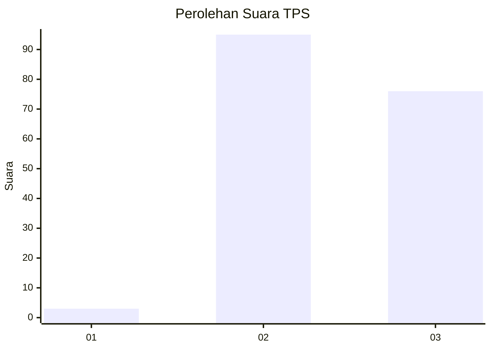
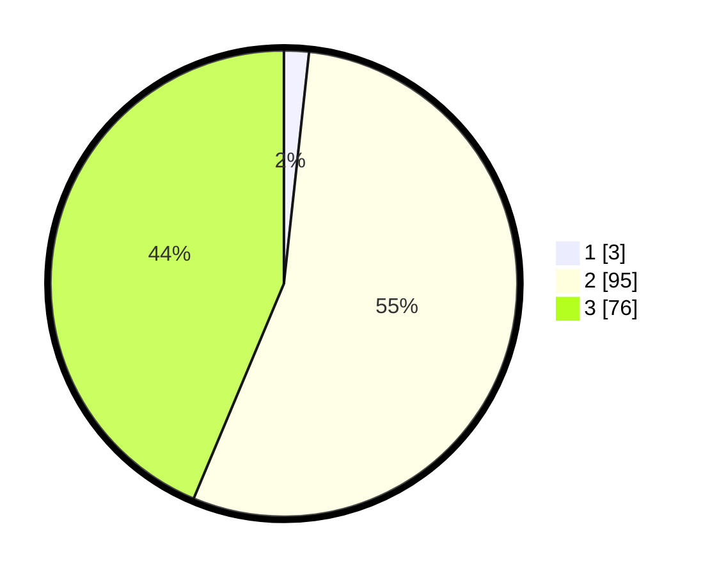

# Hasil

## Grafik

## Tabel

| No. | Nama Paslon    | Suara | Suara (raw) | Persentase |
|:--- |:-------------- | -----:| -----------:| ----------:|
| 1   | ANIES MUHAIMIN | 3     | [3][p-1]    | 1,72       |
| 2   | PRABOWO GIBRAN | 95    | [95][p-2]   | 54,60      |
| 3   | GANJAR MAHFUD  | 76    | [76][p-3]   | 43,68      |

[p-1]: https://github.com/gigit-pemilu/pemilu-2024-51-bali/blob/main/pilpres/hitung-suara/sub/51-bali/sub/02-tabanan/sub/05-tabanan/sub/2005-dauh-peken/sub/005-tps/sub/paslon-1.txt
[p-2]: https://github.com/gigit-pemilu/pemilu-2024-51-bali/blob/main/pilpres/hitung-suara/sub/51-bali/sub/02-tabanan/sub/05-tabanan/sub/2005-dauh-peken/sub/005-tps/sub/paslon-2.txt
[p-3]: https://github.com/gigit-pemilu/pemilu-2024-51-bali/blob/main/pilpres/hitung-suara/sub/51-bali/sub/02-tabanan/sub/05-tabanan/sub/2005-dauh-peken/sub/005-tps/sub/paslon-3.txt

## Foto C Plano

https://sirekap-obj-formc.kpu.go.id/8e68/pemilu/ppwp/51/02/05/20/05/5102052005005-20240214-141212--ca5ee3a0-51ae-4917-a68b-cc1362fa8e8f.jpg

https://sirekap-obj-formc.kpu.go.id/8e68/pemilu/ppwp/51/02/05/20/05/5102052005005-20240214-141629--b6d24997-696d-4fae-b329-4586b0d9ab05.jpg

https://sirekap-obj-formc.kpu.go.id/8e68/pemilu/ppwp/51/02/05/20/05/5102052005005-20240214-141800--b438a3a1-8f38-43d1-947c-7eff0996145a.jpg

## Metadata

| Key        | Value               |
| ---------- | ------------------- |
| Time Stamp | 2024-02-14 21:46:01 |

## DATA PEMILIH TETAP

Jumlah pemilih dalam DPT: **211**.
 * L: **107**.
 * P: **104**.

## DATA PENGGUNA HAK PILIH

Jumlah pengguna hak pilih dalam DPT: **179**.
 * L: **89**.
 * P: **90**.

Jumlah pengguna hak pilih dalam DPTb: **0**.
 * L: **0**.
 * P: **0**.

Jumlah pengguna hak pilih dalam DPK: **2**.
 * L: **2**.
 * P: **1**.

Jumlah pengguna hak pilih: **181**.
 * L: **90**.
 * P: **91**.

## JUMLAH SUARA SAH DAN TIDAK SAH

JUMLAH SELURUH SUARA SAH: **174**.

JUMLAH SUARA TIDAK SAH: **7**.

JUMLAH SELURUH SUARA SAH DAN SUARA TIDAK SAH: **181**.

