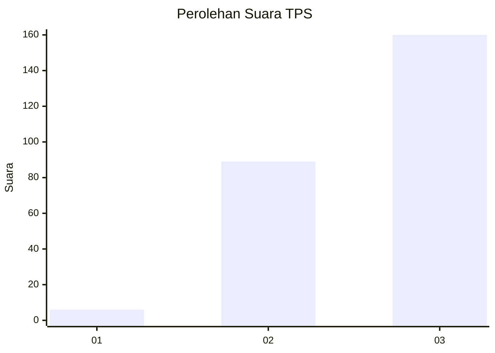
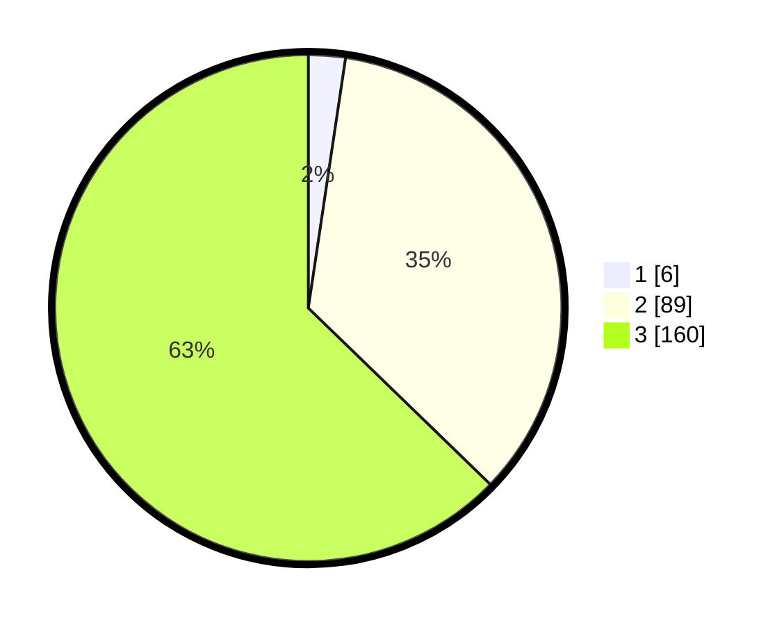

# Hasil

## Grafik

## Tabel

| No. | Nama Paslon    | Suara | Suara (raw) | Persentase |
|:--- |:-------------- | -----:| -----------:| ----------:|
| 1   | ANIES MUHAIMIN | 6     | [6][p-1]    | 2,35       |
| 2   | PRABOWO GIBRAN | 89    | [89][p-2]   | 34,90      |
| 3   | GANJAR MAHFUD  | 160   | [160][p-3]  | 62,75      |

[p-1]: https://github.com/gigit-pemilu/pemilu-2024-51-bali/blob/main/pilpres/hitung-suara/sub/51-bali/sub/02-tabanan/sub/05-tabanan/sub/2005-dauh-peken/sub/006-tps/sub/paslon-1.txt
[p-2]: https://github.com/gigit-pemilu/pemilu-2024-51-bali/blob/main/pilpres/hitung-suara/sub/51-bali/sub/02-tabanan/sub/05-tabanan/sub/2005-dauh-peken/sub/006-tps/sub/paslon-2.txt
[p-3]: https://github.com/gigit-pemilu/pemilu-2024-51-bali/blob/main/pilpres/hitung-suara/sub/51-bali/sub/02-tabanan/sub/05-tabanan/sub/2005-dauh-peken/sub/006-tps/sub/paslon-3.txt

## Foto C Plano

https://sirekap-obj-formc.kpu.go.id/12b0/pemilu/ppwp/51/02/05/20/05/5102052005006-20240214-235504--18e67245-028a-4f6c-9376-f90bf3dc55a7.jpg

https://sirekap-obj-formc.kpu.go.id/12b0/pemilu/ppwp/51/02/05/20/05/5102052005006-20240214-235916--032be046-d66b-4e39-8eef-170f1d3d49a5.jpg

https://sirekap-obj-formc.kpu.go.id/12b0/pemilu/ppwp/51/02/05/20/05/5102052005006-20240215-000944--778abc8d-ca32-4417-acf2-c9307a4e553f.jpg

## Metadata

| Key        | Value               |
| ---------- | ------------------- |
| Time Stamp | 2024-02-15 22:30:27 |

## DATA PEMILIH TETAP

Jumlah pemilih dalam DPT: **281**.
 * L: **138**.
 * P: **143**.

## DATA PENGGUNA HAK PILIH

Jumlah pengguna hak pilih dalam DPT: **256**.
 * L: **124**.
 * P: **132**.

Jumlah pengguna hak pilih dalam DPTb: **0**.
 * L: **0**.
 * P: **0**.

Jumlah pengguna hak pilih dalam DPK: **2**.
 * L: **0**.
 * P: **2**.

Jumlah pengguna hak pilih: **258**.
 * L: **124**.
 * P: **134**.

## JUMLAH SUARA SAH DAN TIDAK SAH

JUMLAH SELURUH SUARA SAH: **255**.

JUMLAH SUARA TIDAK SAH: **3**.

JUMLAH SELURUH SUARA SAH DAN SUARA TIDAK SAH: **258**.

