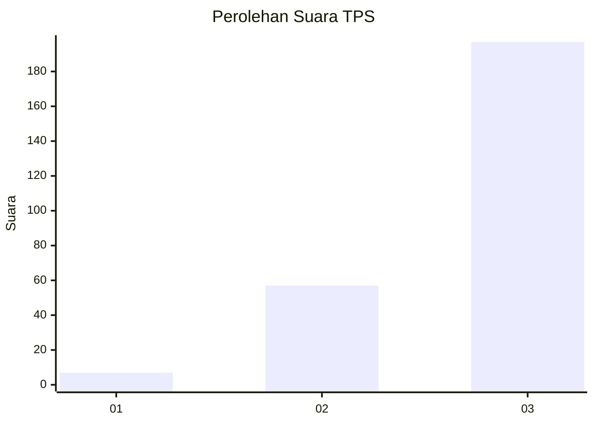
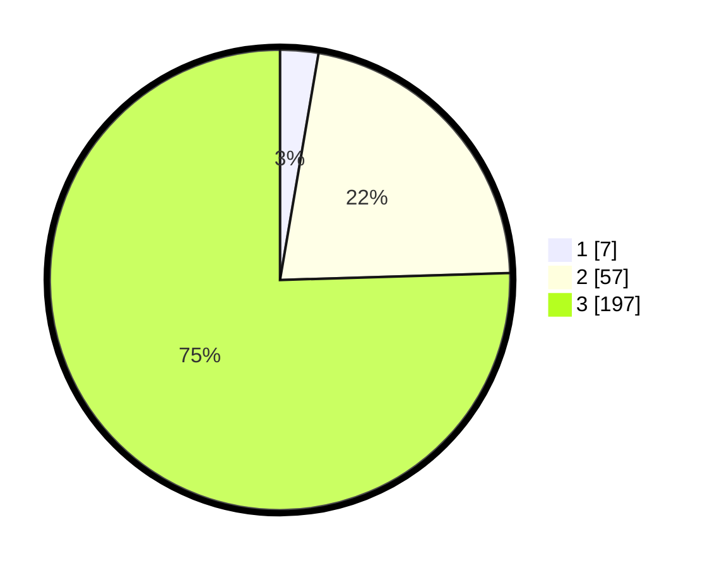

# Hasil

## Grafik

## Tabel

| No. | Nama Paslon    | Suara | Suara (raw) | Persentase |
|:--- |:-------------- | -----:| -----------:| ----------:|
| 1   | ANIES MUHAIMIN | 7     | [7][p-1]    | 2,68       |
| 2   | PRABOWO GIBRAN | 57    | [57][p-2]   | 21,84      |
| 3   | GANJAR MAHFUD  | 197   | [197][p-3]  | 75,48      |

[p-1]: https://github.com/gigit-pemilu/pemilu-2024-51-bali/blob/main/pilpres/hitung-suara/sub/51-bali/sub/02-tabanan/sub/05-tabanan/sub/2005-dauh-peken/sub/010-tps/sub/paslon-1.txt
[p-2]: https://github.com/gigit-pemilu/pemilu-2024-51-bali/blob/main/pilpres/hitung-suara/sub/51-bali/sub/02-tabanan/sub/05-tabanan/sub/2005-dauh-peken/sub/010-tps/sub/paslon-2.txt
[p-3]: https://github.com/gigit-pemilu/pemilu-2024-51-bali/blob/main/pilpres/hitung-suara/sub/51-bali/sub/02-tabanan/sub/05-tabanan/sub/2005-dauh-peken/sub/010-tps/sub/paslon-3.txt

## Foto C Plano

https://sirekap-obj-formc.kpu.go.id/5951/pemilu/ppwp/51/02/05/20/05/5102052005010-20240214-200317--11cfcea4-2790-43b0-a43d-8c8f3c8b24f1.jpg

https://sirekap-obj-formc.kpu.go.id/5951/pemilu/ppwp/51/02/05/20/05/5102052005010-20240214-200104--624f21a8-bd75-4ace-a4ae-f1969dd6c6e9.jpg

https://sirekap-obj-formc.kpu.go.id/5951/pemilu/ppwp/51/02/05/20/05/5102052005010-20240214-195234--05ece049-d502-49f8-a7d5-1d0e8f15e278.jpg

## Metadata

| Key        | Value               |
| ---------- | ------------------- |
| Time Stamp | 2024-02-15 22:30:27 |

## DATA PEMILIH TETAP

Jumlah pemilih dalam DPT: **271**.
 * L: **129**.
 * P: **142**.

## DATA PENGGUNA HAK PILIH

Jumlah pengguna hak pilih dalam DPT: **258**.
 * L: **125**.
 * P: **133**.

Jumlah pengguna hak pilih dalam DPTb: **2**.
 * L: **2**.
 * P: **0**.

Jumlah pengguna hak pilih dalam DPK: **7**.
 * L: **0**.
 * P: **7**.

Jumlah pengguna hak pilih: **261**.
 * L: **127**.
 * P: **134**.

## JUMLAH SUARA SAH DAN TIDAK SAH

JUMLAH SELURUH SUARA SAH: **261**.

JUMLAH SUARA TIDAK SAH: **0**.

JUMLAH SELURUH SUARA SAH DAN SUARA TIDAK SAH: **261**.

