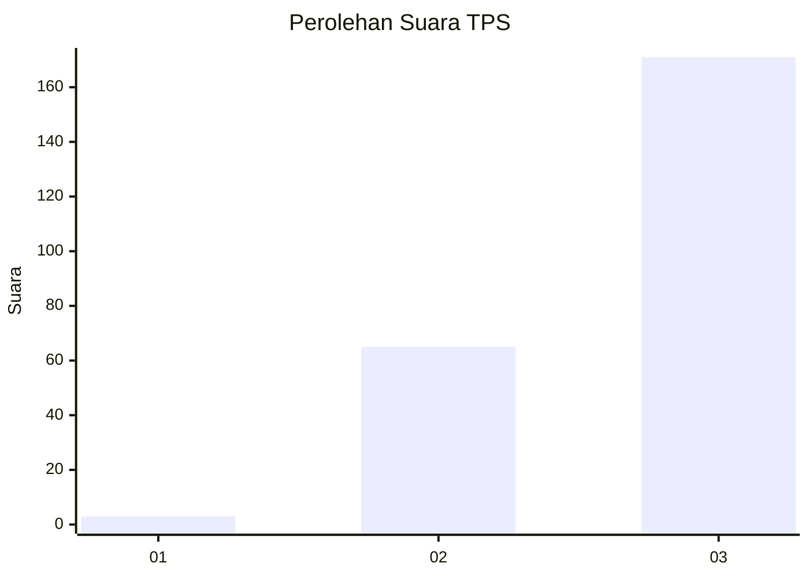
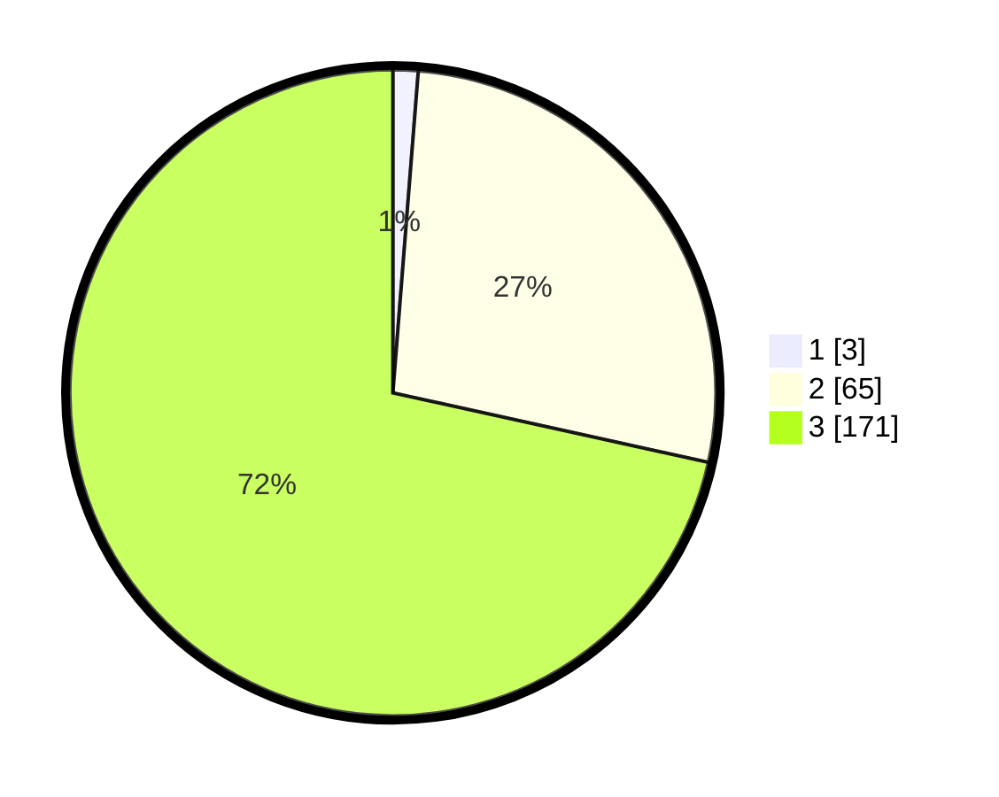

# Hasil

## Grafik

## Tabel

| No. | Nama Paslon    | Suara | Suara (raw) | Persentase |
|:--- |:-------------- | -----:| -----------:| ----------:|
| 1   | ANIES MUHAIMIN | 3     | [3][p-1]    | 1,26       |
| 2   | PRABOWO GIBRAN | 65    | [65][p-2]   | 27,20      |
| 3   | GANJAR MAHFUD  | 171   | [171][p-3]  | 71,55      |

[p-1]: https://github.com/gigit-pemilu/pemilu-2024-51-bali/blob/main/pilpres/hitung-suara/sub/51-bali/sub/02-tabanan/sub/05-tabanan/sub/2005-dauh-peken/sub/012-tps/sub/paslon-1.txt
[p-2]: https://github.com/gigit-pemilu/pemilu-2024-51-bali/blob/main/pilpres/hitung-suara/sub/51-bali/sub/02-tabanan/sub/05-tabanan/sub/2005-dauh-peken/sub/012-tps/sub/paslon-2.txt
[p-3]: https://github.com/gigit-pemilu/pemilu-2024-51-bali/blob/main/pilpres/hitung-suara/sub/51-bali/sub/02-tabanan/sub/05-tabanan/sub/2005-dauh-peken/sub/012-tps/sub/paslon-3.txt

## Foto C Plano

https://sirekap-obj-formc.kpu.go.id/d86c/pemilu/ppwp/51/02/05/20/05/5102052005012-20240214-223024--75c57b13-70cf-4251-941d-d9851ec1820d.jpg

https://sirekap-obj-formc.kpu.go.id/d86c/pemilu/ppwp/51/02/05/20/05/5102052005012-20240214-191636--be5f6717-ee91-457e-a7d4-0a5746cfa075.jpg

https://sirekap-obj-formc.kpu.go.id/d86c/pemilu/ppwp/51/02/05/20/05/5102052005012-20240214-191639--08e05063-c43d-4e31-bfdc-8a900350bcf3.jpg

## Metadata

| Key        | Value               |
| ---------- | ------------------- |
| Time Stamp | 2024-02-15 22:30:27 |

