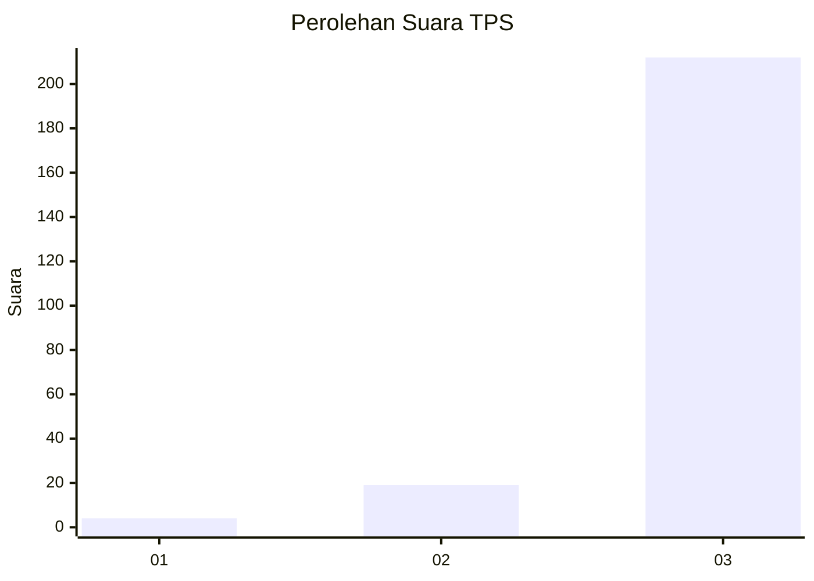
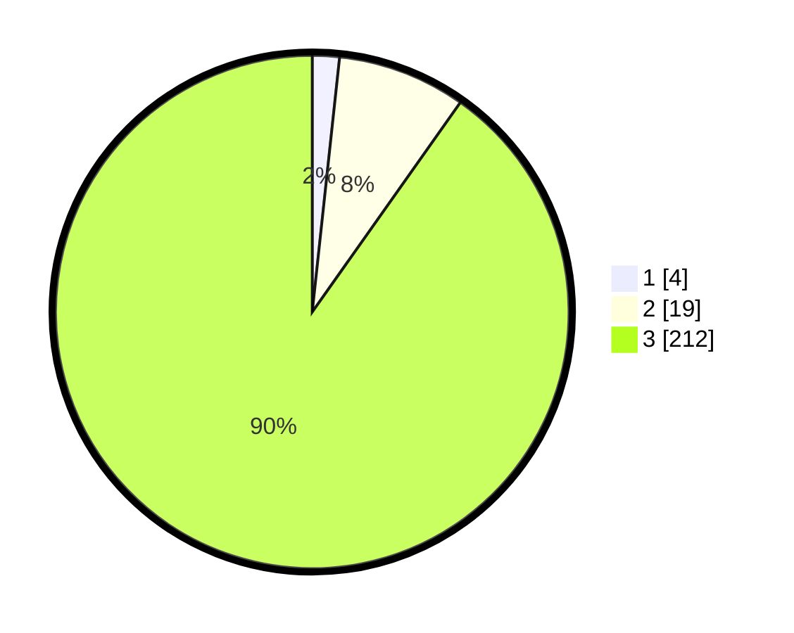

# Hasil

## Grafik

## Tabel

| No. | Nama Paslon    | Suara | Suara (raw) | Persentase |
|:--- |:-------------- | -----:| -----------:| ----------:|
| 1   | ANIES MUHAIMIN | 4     | [4][p-1]    | 1,70       |
| 2   | PRABOWO GIBRAN | 19    | [19][p-2]   | 8,09       |
| 3   | GANJAR MAHFUD  | 212   | [212][p-3]  | 90,21      |

[p-1]: https://github.com/gigit-pemilu/pemilu-2024-51-bali/blob/main/pilpres/hitung-suara/sub/51-bali/sub/02-tabanan/sub/05-tabanan/sub/2005-dauh-peken/sub/013-tps/sub/paslon-1.txt
[p-2]: https://github.com/gigit-pemilu/pemilu-2024-51-bali/blob/main/pilpres/hitung-suara/sub/51-bali/sub/02-tabanan/sub/05-tabanan/sub/2005-dauh-peken/sub/013-tps/sub/paslon-2.txt
[p-3]: https://github.com/gigit-pemilu/pemilu-2024-51-bali/blob/main/pilpres/hitung-suara/sub/51-bali/sub/02-tabanan/sub/05-tabanan/sub/2005-dauh-peken/sub/013-tps/sub/paslon-3.txt

## Foto C Plano

https://sirekap-obj-formc.kpu.go.id/78b4/pemilu/ppwp/51/02/05/20/05/5102052005013-20240214-214153--9c2dc958-00b7-4f12-aeda-75de7f063839.jpg

https://sirekap-obj-formc.kpu.go.id/78b4/pemilu/ppwp/51/02/05/20/05/5102052005013-20240214-214309--ec21b8c3-d800-4b6d-94c7-2ffacda905eb.jpg

https://sirekap-obj-formc.kpu.go.id/78b4/pemilu/ppwp/51/02/05/20/05/5102052005013-20240214-214444--43c43cda-3fd8-4516-90c0-8f07686558eb.jpg

## Metadata

| Key        | Value               |
| ---------- | ------------------- |
| Time Stamp | 2024-02-24 22:31:28 |

