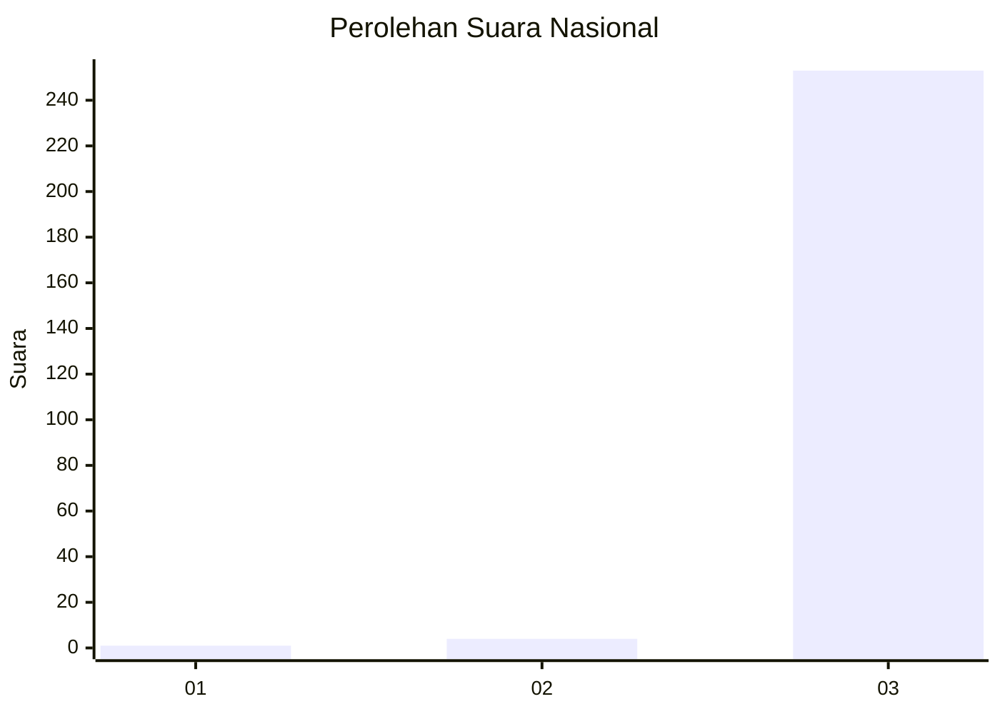
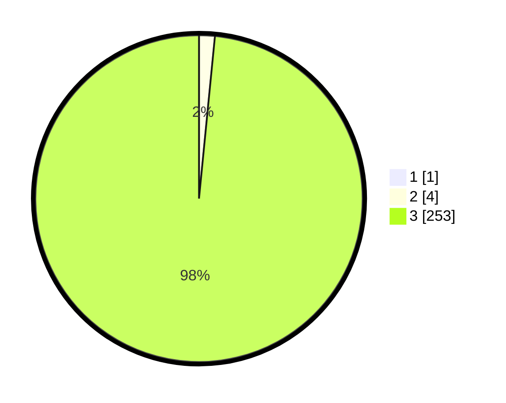

# Hasil

## Grafik

## Tabel

| No. | Nama Paslon    | Suara | Suara (raw) | Persentase |
|:--- |:-------------- | -----:| -----------:| ----------:|
| 1   | ANIES MUHAIMIN | 1     | [1][p-1]    | 0,39       |
| 2   | PRABOWO GIBRAN | 4     | [4][p-2]    | 1,55       |
| 3   | GANJAR MAHFUD  | 253   | [253][p-3]  | 98,06      |

[p-1]: https://github.com/gigit-pemilu/pemilu-2024/blob/main/pilpres/hitung-suara/sub/51-bali/sub/02-tabanan/sub/05-tabanan/sub/2005-dauh-peken/sub/014-tps/sub/paslon-1.txt
[p-2]: https://github.com/gigit-pemilu/pemilu-2024/blob/main/pilpres/hitung-suara/sub/51-bali/sub/02-tabanan/sub/05-tabanan/sub/2005-dauh-peken/sub/014-tps/sub/paslon-2.txt
[p-3]: https://github.com/gigit-pemilu/pemilu-2024/blob/main/pilpres/hitung-suara/sub/51-bali/sub/02-tabanan/sub/05-tabanan/sub/2005-dauh-peken/sub/014-tps/sub/paslon-3.txt

## Foto C Plano

https://sirekap-obj-formc.kpu.go.id/7f37/pemilu/ppwp/51/02/05/20/05/5102052005014-20240214-141009--ea43455f-c0a4-4f7c-9540-5f31846dd5ae.jpg

https://sirekap-obj-formc.kpu.go.id/7f37/pemilu/ppwp/51/02/05/20/05/5102052005014-20240214-141151--fa2cc482-9484-4fb3-a5ed-0323c9068710.jpg

https://sirekap-obj-formc.kpu.go.id/7f37/pemilu/ppwp/51/02/05/20/05/5102052005014-20240214-184707--657b5074-bbe2-4f91-96c9-d3bf812883ef.jpg

## Metadata

| Key        | Value               |
| ---------- | ------------------- |
| Time Stamp | 2024-02-14 21:46:01 |

## DATA PEMILIH TETAP

Jumlah pemilih dalam DPT: **263**.
 * L: **126**.
 * P: **137**.

## DATA PENGGUNA HAK PILIH

Jumlah pengguna hak pilih dalam DPT: **263**.
 * L: **126**.
 * P: **137**.

Jumlah pengguna hak pilih dalam DPTb: **3**.
 * L: **2**.
 * P: **1**.

Jumlah pengguna hak pilih dalam DPK: **0**.
 * L: **0**.
 * P: **0**.

Jumlah pengguna hak pilih: **266**.
 * L: **128**.
 * P: **138**.

## JUMLAH SUARA SAH DAN TIDAK SAH

JUMLAH SELURUH SUARA SAH: **258**.

JUMLAH SUARA TIDAK SAH: **8**.

JUMLAH SELURUH SUARA SAH DAN SUARA TIDAK SAH: **266**.

