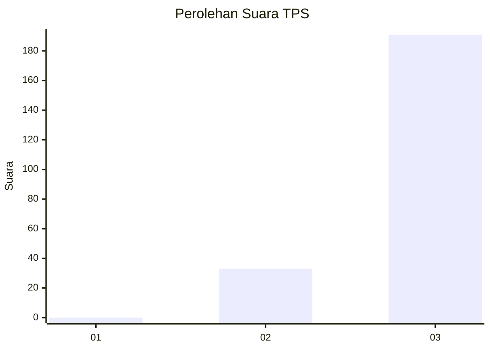
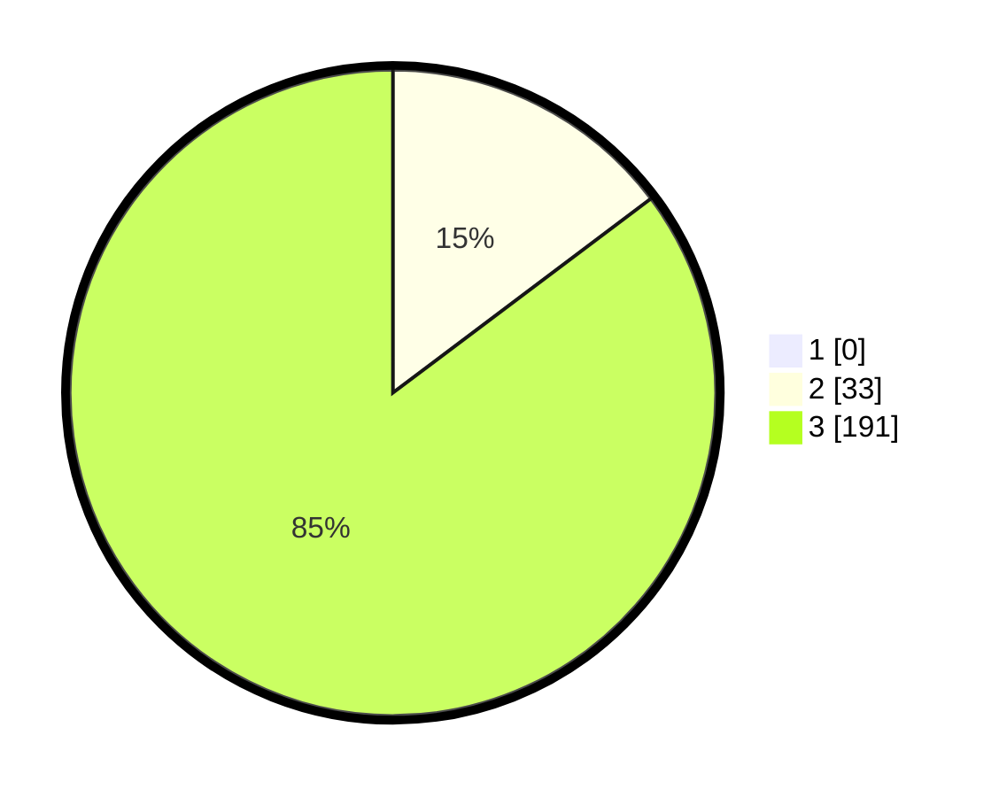

# Hasil

## Grafik

## Tabel

| No. | Nama Paslon    | Suara | Suara (raw) | Persentase |
|:--- |:-------------- | -----:| -----------:| ----------:|
| 1   | ANIES MUHAIMIN | 0     | [0][p-1]    | 0,00       |
| 2   | PRABOWO GIBRAN | 33    | [33][p-2]   | 14,73      |
| 3   | GANJAR MAHFUD  | 191   | [191][p-3]  | 85,27      |

[p-1]: https://github.com/gigit-pemilu/pemilu-2024-51-bali/blob/main/pilpres/hitung-suara/sub/51-bali/sub/02-tabanan/sub/05-tabanan/sub/2005-dauh-peken/sub/016-tps/sub/paslon-1.txt
[p-2]: https://github.com/gigit-pemilu/pemilu-2024-51-bali/blob/main/pilpres/hitung-suara/sub/51-bali/sub/02-tabanan/sub/05-tabanan/sub/2005-dauh-peken/sub/016-tps/sub/paslon-2.txt
[p-3]: https://github.com/gigit-pemilu/pemilu-2024-51-bali/blob/main/pilpres/hitung-suara/sub/51-bali/sub/02-tabanan/sub/05-tabanan/sub/2005-dauh-peken/sub/016-tps/sub/paslon-3.txt

## Foto C Plano

https://sirekap-obj-formc.kpu.go.id/dba5/pemilu/ppwp/51/02/05/20/05/5102052005016-20240214-225419--43d050fa-f84f-46ec-b9f3-0ea088fb1765.jpg

https://sirekap-obj-formc.kpu.go.id/dba5/pemilu/ppwp/51/02/05/20/05/5102052005016-20240214-225518--884c42dc-aed2-4a1c-ac70-1702063e545c.jpg

https://sirekap-obj-formc.kpu.go.id/dba5/pemilu/ppwp/51/02/05/20/05/5102052005016-20240214-225632--8c3bf2a5-34fe-4315-a1fd-8b82e2dae2c0.jpg

## Metadata

| Key        | Value               |
| ---------- | ------------------- |
| Time Stamp | 2024-02-24 22:31:28 |

