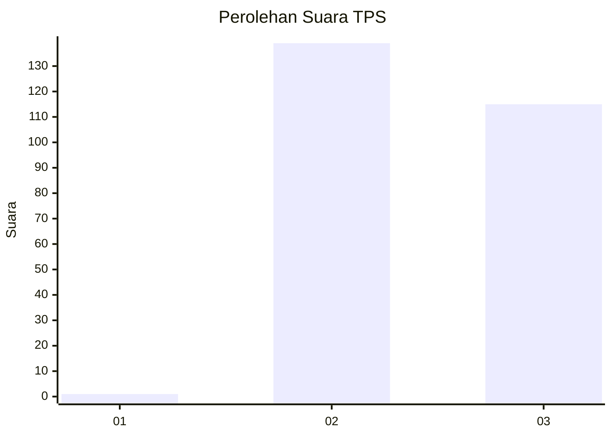
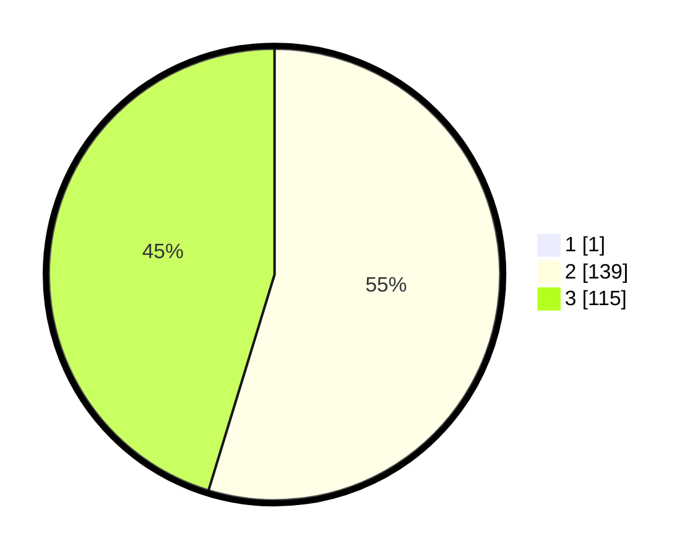

# Hasil

## Grafik

## Tabel

| No. | Nama Paslon    | Suara | Suara (raw) | Persentase |
|:--- |:-------------- | -----:| -----------:| ----------:|
| 1   | ANIES MUHAIMIN | 1     | [1][p-1]    | 0,39       |
| 2   | PRABOWO GIBRAN | 139   | [139][p-2]  | 54,51      |
| 3   | GANJAR MAHFUD  | 115   | [115][p-3]  | 45,10      |

[p-1]: https://github.com/gigit-pemilu/pemilu-2024-51-bali/blob/main/pilpres/hitung-suara/sub/51-bali/sub/02-tabanan/sub/05-tabanan/sub/2005-dauh-peken/sub/026-tps/sub/paslon-1.txt
[p-2]: https://github.com/gigit-pemilu/pemilu-2024-51-bali/blob/main/pilpres/hitung-suara/sub/51-bali/sub/02-tabanan/sub/05-tabanan/sub/2005-dauh-peken/sub/026-tps/sub/paslon-2.txt
[p-3]: https://github.com/gigit-pemilu/pemilu-2024-51-bali/blob/main/pilpres/hitung-suara/sub/51-bali/sub/02-tabanan/sub/05-tabanan/sub/2005-dauh-peken/sub/026-tps/sub/paslon-3.txt

## Foto C Plano

https://sirekap-obj-formc.kpu.go.id/2398/pemilu/ppwp/51/02/05/20/05/5102052005026-20240214-202116--6ba94a2d-b65f-40d3-819d-96adcd6e7131.jpg

https://sirekap-obj-formc.kpu.go.id/2398/pemilu/ppwp/51/02/05/20/05/5102052005026-20240214-202237--c3cf2166-53d4-4a4e-8912-6e61d11eae5d.jpg

https://sirekap-obj-formc.kpu.go.id/2398/pemilu/ppwp/51/02/05/20/05/5102052005026-20240214-202343--8c60c94a-15d7-48e4-b847-bfbe61b906de.jpg

## Metadata

| Key        | Value               |
| ---------- | ------------------- |
| Time Stamp | 2024-02-24 22:31:28 |

