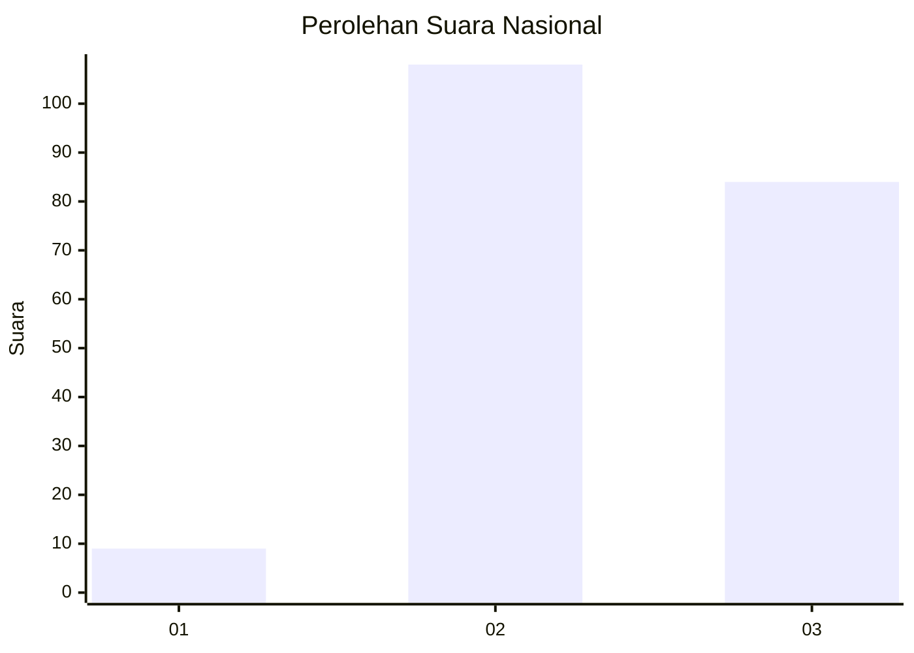
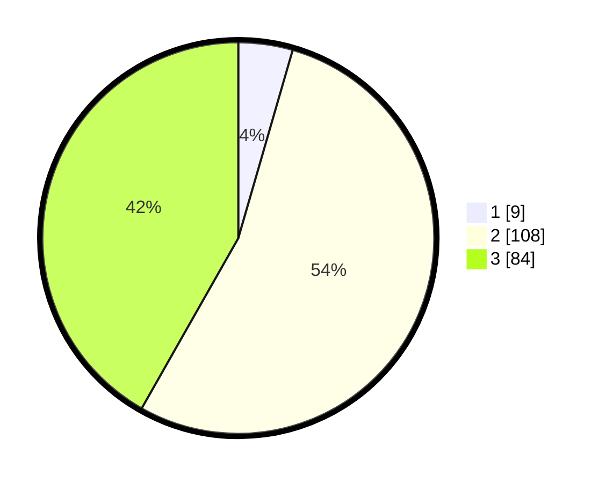

# Hasil

## Grafik

## Tabel

| No. | Nama Paslon    | Suara | Suara (raw) | Persentase |
|:--- |:-------------- | -----:| -----------:| ----------:|
| 1   | ANIES MUHAIMIN | 9     | [9][p-1]    | 4,48       |
| 2   | PRABOWO GIBRAN | 108   | [108][p-2]  | 53,73      |
| 3   | GANJAR MAHFUD  | 84    | [84][p-3]   | 41,79      |

[p-1]: https://github.com/gigit-pemilu/pemilu-2024/blob/main/pilpres/hitung-suara/sub/51-bali/sub/02-tabanan/sub/05-tabanan/sub/2005-dauh-peken/sub/027-tps/sub/paslon-1.txt
[p-2]: https://github.com/gigit-pemilu/pemilu-2024/blob/main/pilpres/hitung-suara/sub/51-bali/sub/02-tabanan/sub/05-tabanan/sub/2005-dauh-peken/sub/027-tps/sub/paslon-2.txt
[p-3]: https://github.com/gigit-pemilu/pemilu-2024/blob/main/pilpres/hitung-suara/sub/51-bali/sub/02-tabanan/sub/05-tabanan/sub/2005-dauh-peken/sub/027-tps/sub/paslon-3.txt

## Foto C Plano

https://sirekap-obj-formc.kpu.go.id/ad36/pemilu/ppwp/51/02/05/20/05/5102052005027-20240214-141246--3fdee58d-03dc-46b6-9ccf-b13b38acddd6.jpg

https://sirekap-obj-formc.kpu.go.id/ad36/pemilu/ppwp/51/02/05/20/05/5102052005027-20240214-141309--c01bd72f-444f-488f-be10-cb4083899546.jpg

https://sirekap-obj-formc.kpu.go.id/ad36/pemilu/ppwp/51/02/05/20/05/5102052005027-20240214-195950--760f2209-6f26-4609-8a24-d5ab9ca0f69f.jpg

## Metadata

| Key        | Value               |
| ---------- | ------------------- |
| Time Stamp | 2024-02-15 00:41:44 |

## DATA PEMILIH TETAP

Jumlah pemilih dalam DPT: **280**.
 * L: **153**.
 * P: **127**.

## DATA PENGGUNA HAK PILIH

Jumlah pengguna hak pilih dalam DPT: **206**.
 * L: **114**.
 * P: **92**.

Jumlah pengguna hak pilih dalam DPTb: **0**.
 * L: **0**.
 * P: **0**.

Jumlah pengguna hak pilih dalam DPK: **0**.
 * L: **0**.
 * P: **0**.

Jumlah pengguna hak pilih: **206**.
 * L: **114**.
 * P: **92**.

## JUMLAH SUARA SAH DAN TIDAK SAH

JUMLAH SELURUH SUARA SAH: **201**.

JUMLAH SUARA TIDAK SAH: **5**.

JUMLAH SELURUH SUARA SAH DAN SUARA TIDAK SAH: **206**.

