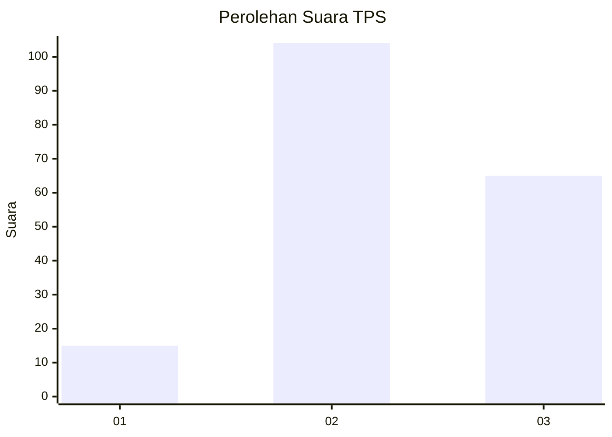
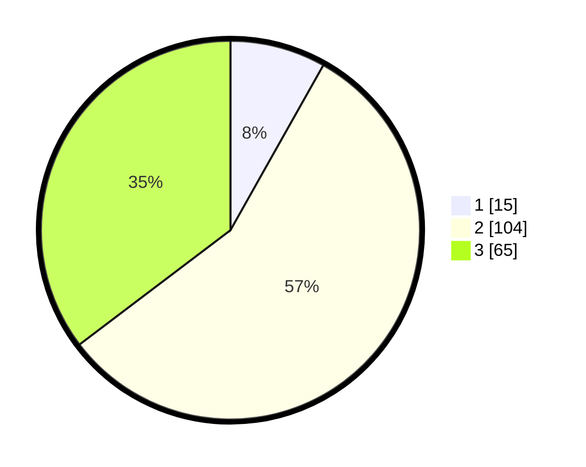

# Hasil

## Grafik

## Tabel

| No. | Nama Paslon    | Suara | Suara (raw) | Persentase |
|:--- |:-------------- | -----:| -----------:| ----------:|
| 1   | ANIES MUHAIMIN | 15    | [15][p-1]   | 8,15       |
| 2   | PRABOWO GIBRAN | 104   | [104][p-2]  | 56,52      |
| 3   | GANJAR MAHFUD  | 65    | [65][p-3]   | 35,33      |

[p-1]: https://github.com/gigit-pemilu/pemilu-2024-51-bali/blob/main/pilpres/hitung-suara/sub/51-bali/sub/02-tabanan/sub/05-tabanan/sub/2005-dauh-peken/sub/031-tps/sub/paslon-1.txt
[p-2]: https://github.com/gigit-pemilu/pemilu-2024-51-bali/blob/main/pilpres/hitung-suara/sub/51-bali/sub/02-tabanan/sub/05-tabanan/sub/2005-dauh-peken/sub/031-tps/sub/paslon-2.txt
[p-3]: https://github.com/gigit-pemilu/pemilu-2024-51-bali/blob/main/pilpres/hitung-suara/sub/51-bali/sub/02-tabanan/sub/05-tabanan/sub/2005-dauh-peken/sub/031-tps/sub/paslon-3.txt

## Foto C Plano

https://sirekap-obj-formc.kpu.go.id/f18b/pemilu/ppwp/51/02/05/20/05/5102052005031-20240214-222227--0cce498a-367e-4e13-aaaa-e450b1fb728f.jpg

https://sirekap-obj-formc.kpu.go.id/f18b/pemilu/ppwp/51/02/05/20/05/5102052005031-20240214-222246--cf2746a2-0cbf-4a6e-bb14-5d5d2567733a.jpg

https://sirekap-obj-formc.kpu.go.id/f18b/pemilu/ppwp/51/02/05/20/05/5102052005031-20240214-222303--2efbdfcb-8276-40ec-a2aa-5e0ec12a8e1c.jpg

## Metadata

| Key        | Value               |
| ---------- | ------------------- |
| Time Stamp | 2024-02-15 22:30:27 |

