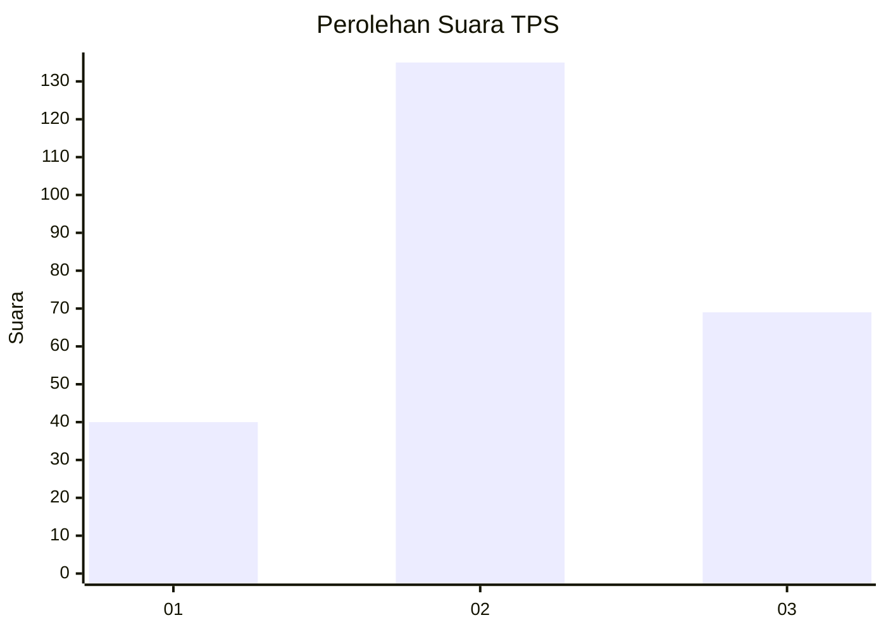
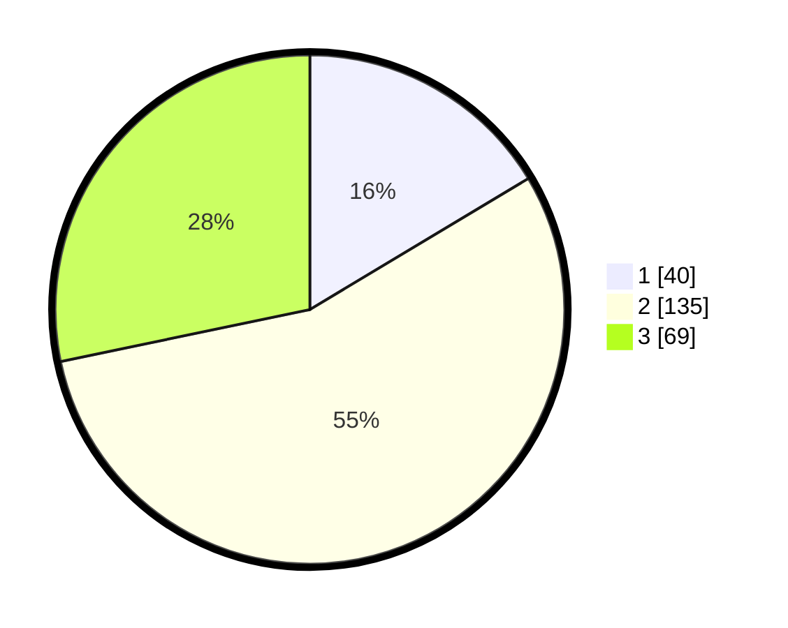

# Hasil

## Grafik

## Tabel

| No. | Nama Paslon    | Suara | Suara (raw) | Persentase |
|:--- |:-------------- | -----:| -----------:| ----------:|
| 1   | ANIES MUHAIMIN | 40    | [40][p-1]   | 16,39      |
| 2   | PRABOWO GIBRAN | 135   | [135][p-2]  | 55,33      |
| 3   | GANJAR MAHFUD  | 69    | [69][p-3]   | 28,28      |

[p-1]: https://github.com/gigit-pemilu/pemilu-2024-51-bali/blob/main/pilpres/hitung-suara/sub/51-bali/sub/02-tabanan/sub/05-tabanan/sub/2005-dauh-peken/sub/033-tps/sub/paslon-1.txt
[p-2]: https://github.com/gigit-pemilu/pemilu-2024-51-bali/blob/main/pilpres/hitung-suara/sub/51-bali/sub/02-tabanan/sub/05-tabanan/sub/2005-dauh-peken/sub/033-tps/sub/paslon-2.txt
[p-3]: https://github.com/gigit-pemilu/pemilu-2024-51-bali/blob/main/pilpres/hitung-suara/sub/51-bali/sub/02-tabanan/sub/05-tabanan/sub/2005-dauh-peken/sub/033-tps/sub/paslon-3.txt

## Foto C Plano

https://sirekap-obj-formc.kpu.go.id/dfa6/pemilu/ppwp/51/02/05/20/05/5102052005033-20240216-142919--dd65495c-0071-4d17-9439-d066650e4a43.jpg

https://sirekap-obj-formc.kpu.go.id/dfa6/pemilu/ppwp/51/02/05/20/05/5102052005033-20240216-142920--821c453f-f741-4d64-aa62-0c3894ca8c24.jpg

https://sirekap-obj-formc.kpu.go.id/dfa6/pemilu/ppwp/51/02/05/20/05/5102052005033-20240216-142919--823f5f61-3512-4462-9e63-643aa2dd77d5.jpg

## Metadata

| Key        | Value               |
| ---------- | ------------------- |
| Time Stamp | 2024-02-21 23:00:00 |

## DATA PEMILIH TETAP

Jumlah pemilih dalam DPT: **290**.
 * L: **146**.
 * P: **144**.

## DATA PENGGUNA HAK PILIH

Jumlah pengguna hak pilih dalam DPT: **0**.
 * L: **0**.
 * P: **0**.

Jumlah pengguna hak pilih dalam DPTb: **0**.
 * L: **0**.
 * P: **0**.

Jumlah pengguna hak pilih dalam DPK: **0**.
 * L: **0**.
 * P: **0**.

Jumlah pengguna hak pilih: **0**.
 * L: **0**.
 * P: **0**.

## JUMLAH SUARA SAH DAN TIDAK SAH

JUMLAH SELURUH SUARA SAH: **244**.

JUMLAH SUARA TIDAK SAH: **2**.

JUMLAH SELURUH SUARA SAH DAN SUARA TIDAK SAH: **2**.

