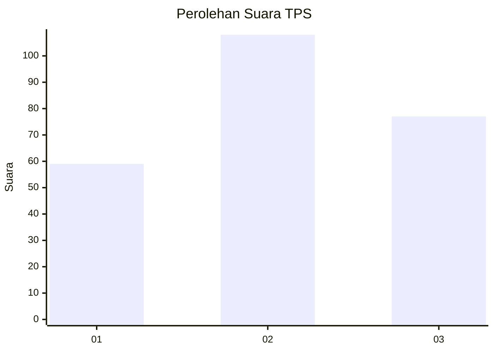
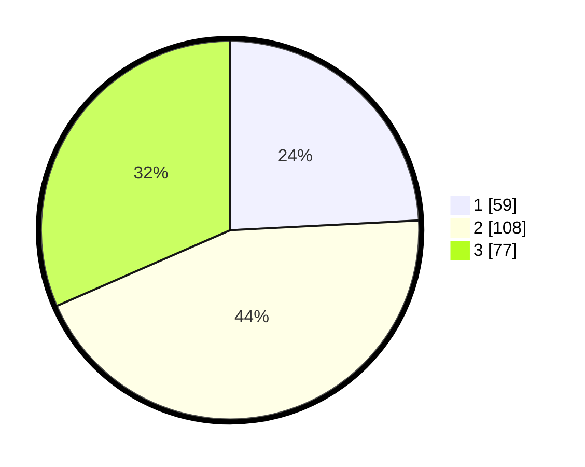

# Hasil

## Grafik

## Tabel

| No. | Nama Paslon    | Suara | Suara (raw) | Persentase |
|:--- |:-------------- | -----:| -----------:| ----------:|
| 1   | ANIES MUHAIMIN | 59    | [59][p-1]   | 24,18      |
| 2   | PRABOWO GIBRAN | 108   | [108][p-2]  | 44,26      |
| 3   | GANJAR MAHFUD  | 77    | [77][p-3]   | 31,56      |

[p-1]: https://github.com/gigit-pemilu/pemilu-2024-51-bali/blob/main/pilpres/hitung-suara/sub/51-bali/sub/02-tabanan/sub/05-tabanan/sub/2005-dauh-peken/sub/034-tps/sub/paslon-1.txt
[p-2]: https://github.com/gigit-pemilu/pemilu-2024-51-bali/blob/main/pilpres/hitung-suara/sub/51-bali/sub/02-tabanan/sub/05-tabanan/sub/2005-dauh-peken/sub/034-tps/sub/paslon-2.txt
[p-3]: https://github.com/gigit-pemilu/pemilu-2024-51-bali/blob/main/pilpres/hitung-suara/sub/51-bali/sub/02-tabanan/sub/05-tabanan/sub/2005-dauh-peken/sub/034-tps/sub/paslon-3.txt

## Foto C Plano

https://sirekap-obj-formc.kpu.go.id/c9e8/pemilu/ppwp/51/02/05/20/05/5102052005034-20240214-195243--abe7dad9-8585-403a-bcd3-69e633f7258f.jpg

https://sirekap-obj-formc.kpu.go.id/c9e8/pemilu/ppwp/51/02/05/20/05/5102052005034-20240214-195438--9b1da3f0-af0e-4b1a-a8ce-e6a6f9b0351e.jpg

https://sirekap-obj-formc.kpu.go.id/c9e8/pemilu/ppwp/51/02/05/20/05/5102052005034-20240214-195521--b435ff3f-1566-412a-ba99-cb49e94eae1d.jpg

## Metadata

| Key        | Value               |
| ---------- | ------------------- |
| Time Stamp | 2024-02-14 21:46:01 |

## DATA PEMILIH TETAP

Jumlah pemilih dalam DPT: **293**.
 * L: **145**.
 * P: **148**.

## DATA PENGGUNA HAK PILIH

Jumlah pengguna hak pilih dalam DPT: **244**.
 * L: **125**.
 * P: **119**.

Jumlah pengguna hak pilih dalam DPTb: **1**.
 * L: **0**.
 * P: **1**.

Jumlah pengguna hak pilih dalam DPK: **0**.
 * L: **0**.
 * P: **0**.

Jumlah pengguna hak pilih: **245**.
 * L: **125**.
 * P: **120**.

## JUMLAH SUARA SAH DAN TIDAK SAH

JUMLAH SELURUH SUARA SAH: **244**.

JUMLAH SUARA TIDAK SAH: **1**.

JUMLAH SELURUH SUARA SAH DAN SUARA TIDAK SAH: **245**.

