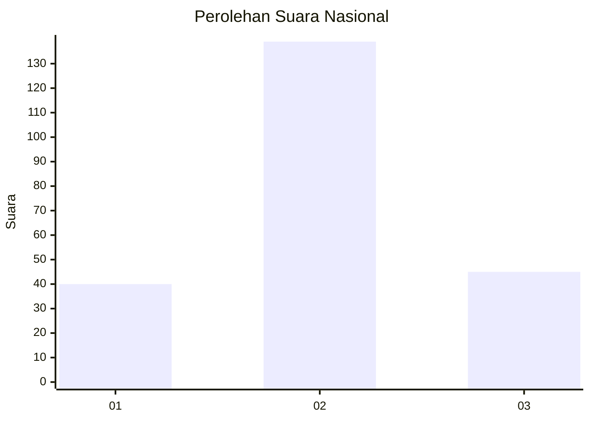
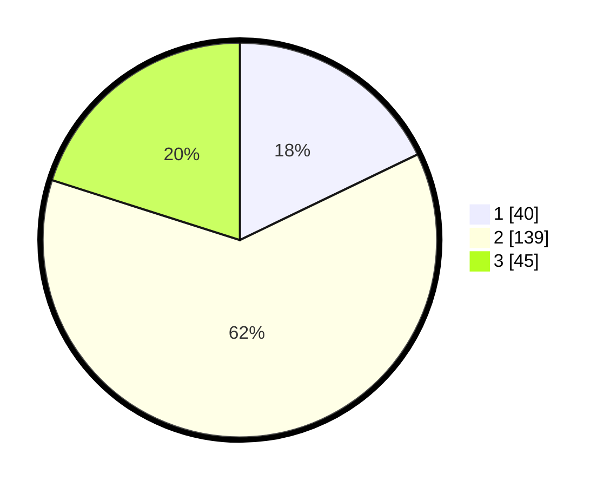

# Hasil

## Grafik

## Tabel

| No. | Nama Paslon    | Suara | Suara (raw) | Persentase |
|:--- |:-------------- | -----:| -----------:| ----------:|
| 1   | ANIES MUHAIMIN | 40    | [40][p-1]   | 17,86      |
| 2   | PRABOWO GIBRAN | 139   | [139][p-2]  | 62,05      |
| 3   | GANJAR MAHFUD  | 45    | [45][p-3]   | 20,09      |

[p-1]: https://github.com/gigit-pemilu/pemilu-2024/blob/main/pilpres/hitung-suara/sub/51-bali/sub/02-tabanan/sub/05-tabanan/sub/2005-dauh-peken/sub/036-tps/sub/paslon-1.txt
[p-2]: https://github.com/gigit-pemilu/pemilu-2024/blob/main/pilpres/hitung-suara/sub/51-bali/sub/02-tabanan/sub/05-tabanan/sub/2005-dauh-peken/sub/036-tps/sub/paslon-2.txt
[p-3]: https://github.com/gigit-pemilu/pemilu-2024/blob/main/pilpres/hitung-suara/sub/51-bali/sub/02-tabanan/sub/05-tabanan/sub/2005-dauh-peken/sub/036-tps/sub/paslon-3.txt

## Foto C Plano

https://sirekap-obj-formc.kpu.go.id/c540/pemilu/ppwp/51/02/05/20/05/5102052005036-20240215-235503--cd51e597-bac2-4996-914b-187c9b1d8234.jpg

https://sirekap-obj-formc.kpu.go.id/c540/pemilu/ppwp/51/02/05/20/05/5102052005036-20240215-235509--4736e04b-ff81-4fa8-8894-4d076af8795f.jpg

https://sirekap-obj-formc.kpu.go.id/c540/pemilu/ppwp/51/02/05/20/05/5102052005036-20240216-155233--f2e80d4c-a5a7-4eba-9aa6-45bff86ba997.jpg

## Metadata

| Key        | Value               |
| ---------- | ------------------- |
| Time Stamp | 2024-02-16 16:25:10 |

## DATA PEMILIH TETAP

Jumlah pemilih dalam DPT: **291**.
 * L: **145**.
 * P: **145**.

## DATA PENGGUNA HAK PILIH

Jumlah pengguna hak pilih dalam DPT: **223**.
 * L: **108**.
 * P: **115**.

Jumlah pengguna hak pilih dalam DPTb: **1**.
 * L: **1**.
 * P: **0**.

Jumlah pengguna hak pilih dalam DPK: **3**.
 * L: **2**.
 * P: **1**.

Jumlah pengguna hak pilih: **227**.
 * L: **111**.
 * P: **116**.

## JUMLAH SUARA SAH DAN TIDAK SAH

JUMLAH SELURUH SUARA SAH: **224**.

JUMLAH SUARA TIDAK SAH: **3**.

JUMLAH SELURUH SUARA SAH DAN SUARA TIDAK SAH: **227**.

