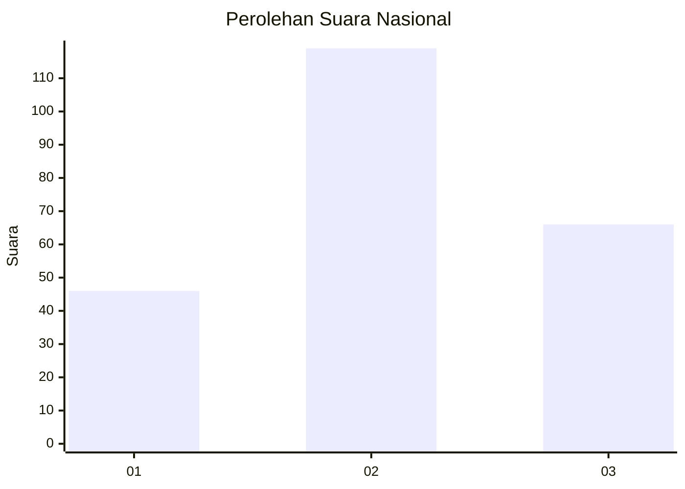
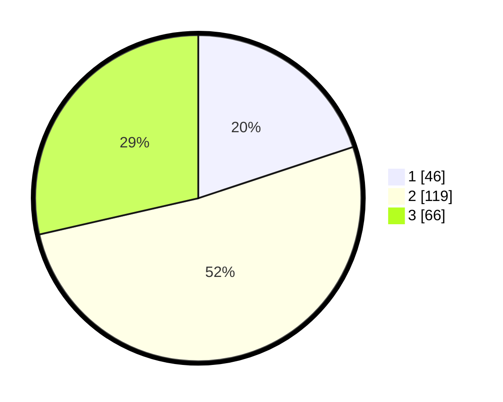

# Hasil

## Grafik

## Tabel

| No. | Nama Paslon    | Suara | Suara (raw) | Persentase |
|:--- |:-------------- | -----:| -----------:| ----------:|
| 1   | ANIES MUHAIMIN | 46    | [46][p-1]   | 19,91      |
| 2   | PRABOWO GIBRAN | 119   | [119][p-2]  | 51,52      |
| 3   | GANJAR MAHFUD  | 66    | [66][p-3]   | 28,57      |

[p-1]: https://github.com/gigit-pemilu/pemilu-2024/blob/main/pilpres/hitung-suara/sub/51-bali/sub/02-tabanan/sub/05-tabanan/sub/2005-dauh-peken/sub/037-tps/sub/paslon-1.txt
[p-2]: https://github.com/gigit-pemilu/pemilu-2024/blob/main/pilpres/hitung-suara/sub/51-bali/sub/02-tabanan/sub/05-tabanan/sub/2005-dauh-peken/sub/037-tps/sub/paslon-2.txt
[p-3]: https://github.com/gigit-pemilu/pemilu-2024/blob/main/pilpres/hitung-suara/sub/51-bali/sub/02-tabanan/sub/05-tabanan/sub/2005-dauh-peken/sub/037-tps/sub/paslon-3.txt

## Foto C Plano

https://sirekap-obj-formc.kpu.go.id/acad/pemilu/ppwp/51/02/05/20/05/5102052005037-20240214-212427--5998b1b8-3d49-494a-a631-46a61973b0bf.jpg

https://sirekap-obj-formc.kpu.go.id/acad/pemilu/ppwp/51/02/05/20/05/5102052005037-20240214-194532--e5cf4301-8fd1-424f-9180-1d6a264c929d.jpg

https://sirekap-obj-formc.kpu.go.id/acad/pemilu/ppwp/51/02/05/20/05/5102052005037-20240214-194538--36e58d72-8084-44da-979a-8959dcf38108.jpg

## Metadata

| Key        | Value               |
| ---------- | ------------------- |
| Time Stamp | 2024-02-15 22:30:27 |

