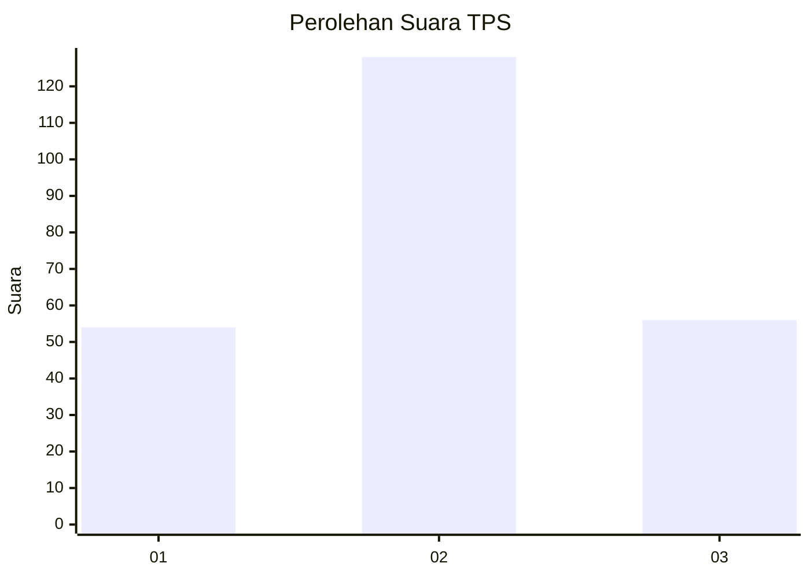
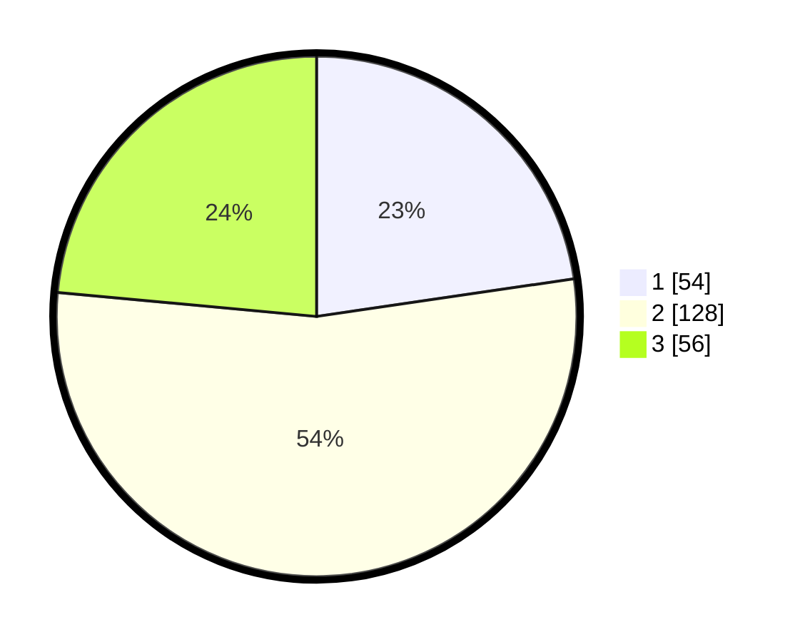

# Hasil

## Grafik

## Tabel

| No. | Nama Paslon    | Suara | Suara (raw) | Persentase |
|:--- |:-------------- | -----:| -----------:| ----------:|
| 1   | ANIES MUHAIMIN | 54    | [54][p-1]   | 22,69      |
| 2   | PRABOWO GIBRAN | 128   | [128][p-2]  | 53,78      |
| 3   | GANJAR MAHFUD  | 56    | [56][p-3]   | 23,53      |

[p-1]: https://github.com/gigit-pemilu/pemilu-2024-51-bali/blob/main/pilpres/hitung-suara/sub/51-bali/sub/02-tabanan/sub/05-tabanan/sub/2005-dauh-peken/sub/038-tps/sub/paslon-1.txt
[p-2]: https://github.com/gigit-pemilu/pemilu-2024-51-bali/blob/main/pilpres/hitung-suara/sub/51-bali/sub/02-tabanan/sub/05-tabanan/sub/2005-dauh-peken/sub/038-tps/sub/paslon-2.txt
[p-3]: https://github.com/gigit-pemilu/pemilu-2024-51-bali/blob/main/pilpres/hitung-suara/sub/51-bali/sub/02-tabanan/sub/05-tabanan/sub/2005-dauh-peken/sub/038-tps/sub/paslon-3.txt

## Foto C Plano

https://sirekap-obj-formc.kpu.go.id/ef5c/pemilu/ppwp/51/02/05/20/05/5102052005038-20240214-185919--e0b916e7-9641-484b-ab87-ceb85292f22d.jpg

https://sirekap-obj-formc.kpu.go.id/ef5c/pemilu/ppwp/51/02/05/20/05/5102052005038-20240214-185134--6fafff18-b8c2-415a-bc02-da0554f01ce6.jpg

https://sirekap-obj-formc.kpu.go.id/ef5c/pemilu/ppwp/51/02/05/20/05/5102052005038-20240214-190001--adea9f6a-46cb-49aa-a2a0-0fe948bf27fe.jpg

## Metadata

| Key        | Value               |
| ---------- | ------------------- |
| Time Stamp | 2024-02-15 22:30:27 |

## DATA PEMILIH TETAP

Jumlah pemilih dalam DPT: **278**.
 * L: **143**.
 * P: **135**.

## DATA PENGGUNA HAK PILIH

Jumlah pengguna hak pilih dalam DPT: **238**.
 * L: **123**.
 * P: **115**.

Jumlah pengguna hak pilih dalam DPTb: **0**.
 * L: **0**.
 * P: **0**.

Jumlah pengguna hak pilih dalam DPK: **4**.
 * L: **3**.
 * P: **1**.

Jumlah pengguna hak pilih: **242**.
 * L: **126**.
 * P: **116**.

## JUMLAH SUARA SAH DAN TIDAK SAH

JUMLAH SELURUH SUARA SAH: **238**.

JUMLAH SUARA TIDAK SAH: **4**.

JUMLAH SELURUH SUARA SAH DAN SUARA TIDAK SAH: **242**.

