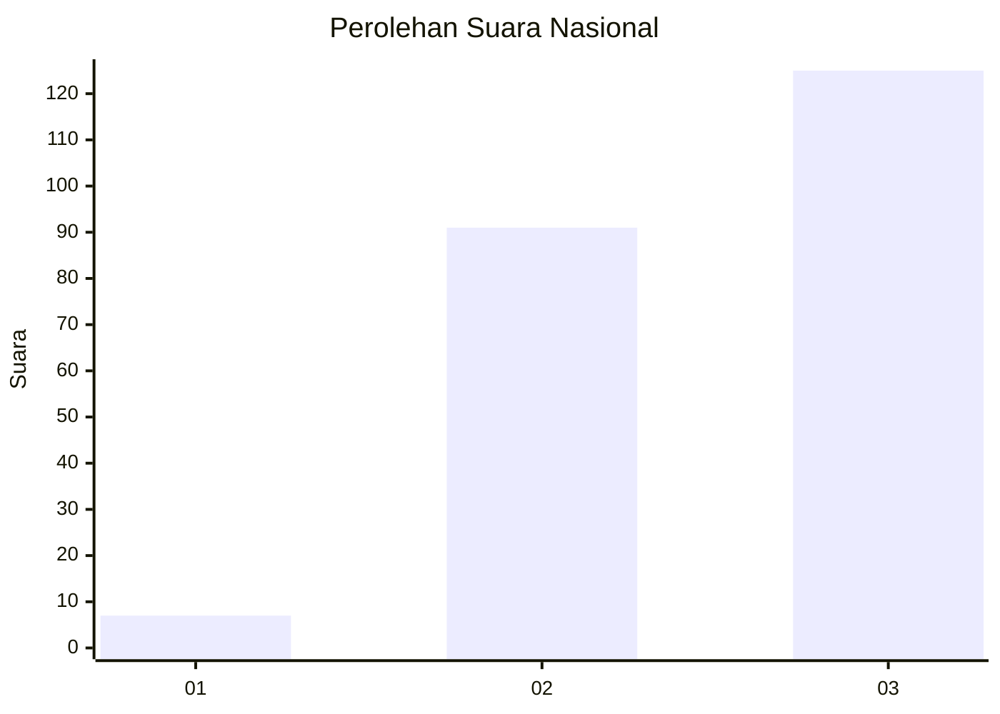
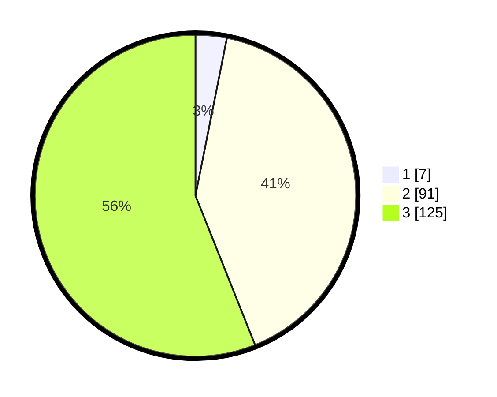

# Hasil

## Grafik

## Tabel

| No. | Nama Paslon    | Suara | Suara (raw) | Persentase |
|:--- |:-------------- | -----:| -----------:| ----------:|
| 1   | ANIES MUHAIMIN | 7     | [7][p-1]    | 3,14       |
| 2   | PRABOWO GIBRAN | 91    | [91][p-2]   | 40,81      |
| 3   | GANJAR MAHFUD  | 125   | [125][p-3]  | 56,05      |

[p-1]: https://github.com/gigit-pemilu/pemilu-2024/blob/main/pilpres/hitung-suara/sub/51-bali/sub/02-tabanan/sub/05-tabanan/sub/2006-dajan-peken/sub/001-tps/sub/paslon-1.txt
[p-2]: https://github.com/gigit-pemilu/pemilu-2024/blob/main/pilpres/hitung-suara/sub/51-bali/sub/02-tabanan/sub/05-tabanan/sub/2006-dajan-peken/sub/001-tps/sub/paslon-2.txt
[p-3]: https://github.com/gigit-pemilu/pemilu-2024/blob/main/pilpres/hitung-suara/sub/51-bali/sub/02-tabanan/sub/05-tabanan/sub/2006-dajan-peken/sub/001-tps/sub/paslon-3.txt

## Foto C Plano

https://sirekap-obj-formc.kpu.go.id/23c9/pemilu/ppwp/51/02/05/20/06/5102052006001-20240216-004013--98dd9ed2-184d-415b-9d5e-cdece10deb2a.jpg

https://sirekap-obj-formc.kpu.go.id/23c9/pemilu/ppwp/51/02/05/20/06/5102052006001-20240216-004016--f7fba36f-203c-45f5-995f-b8a99f89a5ce.jpg

https://sirekap-obj-formc.kpu.go.id/23c9/pemilu/ppwp/51/02/05/20/06/5102052006001-20240216-004015--9fbb74a4-3e8b-4005-b7d2-a5129aa74c14.jpg

## Metadata

| Key        | Value               |
| ---------- | ------------------- |
| Time Stamp | 2024-02-16 10:30:29 |

## DATA PEMILIH TETAP

Jumlah pemilih dalam DPT: **242**.
 * L: **128**.
 * P: **114**.

## DATA PENGGUNA HAK PILIH

Jumlah pengguna hak pilih dalam DPT: **210**.
 * L: **99**.
 * P: **111**.

Jumlah pengguna hak pilih dalam DPTb: **4**.
 * L: **2**.
 * P: **2**.

Jumlah pengguna hak pilih dalam DPK: **12**.
 * L: **6**.
 * P: **6**.

Jumlah pengguna hak pilih: **226**.
 * L: **107**.
 * P: **119**.

## JUMLAH SUARA SAH DAN TIDAK SAH

JUMLAH SELURUH SUARA SAH: **223**.

JUMLAH SUARA TIDAK SAH: **3**.

JUMLAH SELURUH SUARA SAH DAN SUARA TIDAK SAH: **226**.

