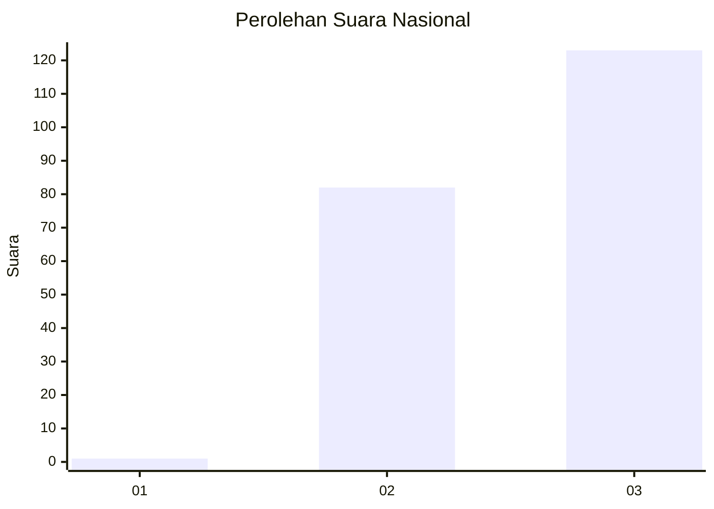
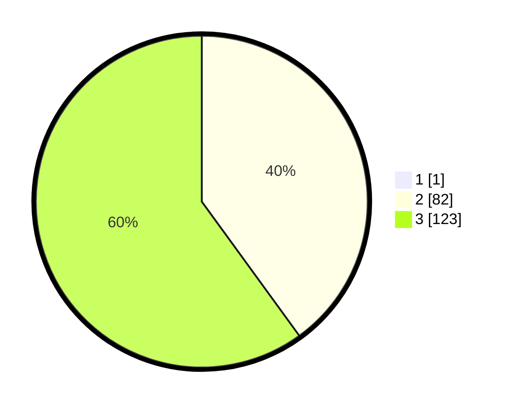

# Hasil

## Grafik

## Tabel

| No. | Nama Paslon    | Suara | Suara (raw) | Persentase |
|:--- |:-------------- | -----:| -----------:| ----------:|
| 1   | ANIES MUHAIMIN | 1     | [1][p-1]    | 0,49       |
| 2   | PRABOWO GIBRAN | 82    | [82][p-2]   | 39,81      |
| 3   | GANJAR MAHFUD  | 123   | [123][p-3]  | 59,71      |

[p-1]: https://github.com/gigit-pemilu/pemilu-2024/blob/main/pilpres/hitung-suara/sub/51-bali/sub/02-tabanan/sub/05-tabanan/sub/2006-dajan-peken/sub/002-tps/sub/paslon-1.txt
[p-2]: https://github.com/gigit-pemilu/pemilu-2024/blob/main/pilpres/hitung-suara/sub/51-bali/sub/02-tabanan/sub/05-tabanan/sub/2006-dajan-peken/sub/002-tps/sub/paslon-2.txt
[p-3]: https://github.com/gigit-pemilu/pemilu-2024/blob/main/pilpres/hitung-suara/sub/51-bali/sub/02-tabanan/sub/05-tabanan/sub/2006-dajan-peken/sub/002-tps/sub/paslon-3.txt

## Foto C Plano

https://sirekap-obj-formc.kpu.go.id/90ed/pemilu/ppwp/51/02/05/20/06/5102052006002-20240214-201603--bb42d8bf-0064-4d04-b0d5-26056e7ad0f0.jpg

https://sirekap-obj-formc.kpu.go.id/90ed/pemilu/ppwp/51/02/05/20/06/5102052006002-20240214-201644--bb2b5d7e-38c6-4b86-ad74-3c4fc8a2893c.jpg

https://sirekap-obj-formc.kpu.go.id/90ed/pemilu/ppwp/51/02/05/20/06/5102052006002-20240214-212534--8ec3a6c9-6186-424a-ab58-585a9e354db6.jpg

## Metadata

| Key        | Value               |
| ---------- | ------------------- |
| Time Stamp | 2024-02-15 21:30:27 |

## DATA PEMILIH TETAP

Jumlah pemilih dalam DPT: **694**.
 * L: **449**.
 * P: **25**.

## DATA PENGGUNA HAK PILIH

Jumlah pengguna hak pilih dalam DPT: **355**.
 * L: **892**.
 * P: **222**.

Jumlah pengguna hak pilih dalam DPTb: **888**.
 * L: **888**.
 * P: **884**.

Jumlah pengguna hak pilih dalam DPK: **238**.
 * L: **888**.
 * P: **220**.

Jumlah pengguna hak pilih: **267**.
 * L: **895**.
 * P: **699**.

## JUMLAH SUARA SAH DAN TIDAK SAH

JUMLAH SELURUH SUARA SAH: **206**.

JUMLAH SUARA TIDAK SAH: **1**.

JUMLAH SELURUH SUARA SAH DAN SUARA TIDAK SAH: **207**.

