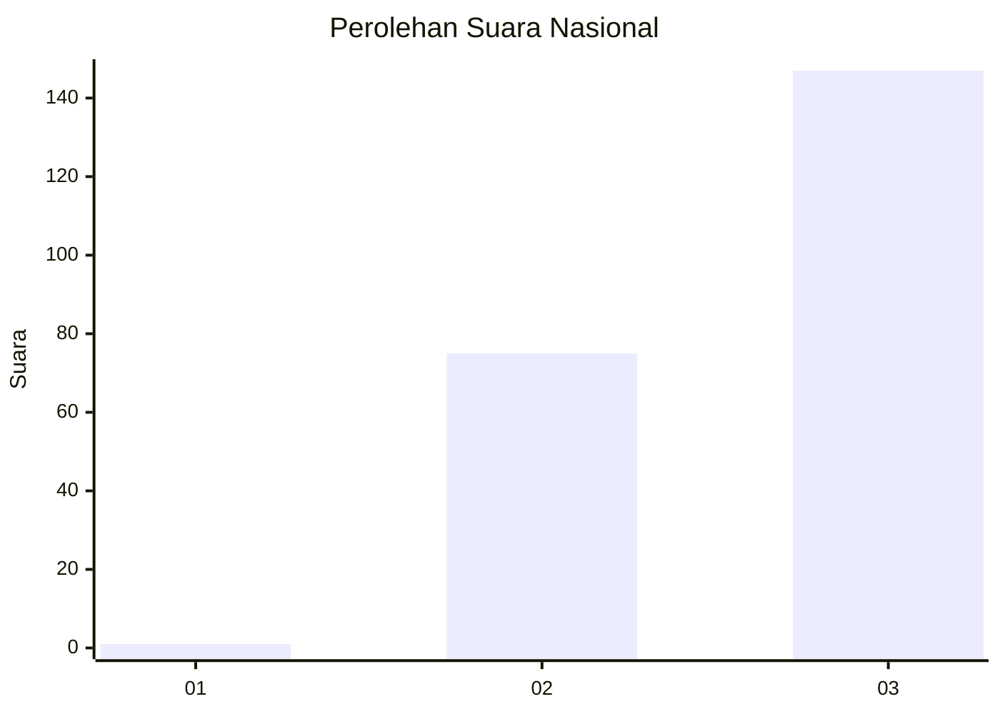
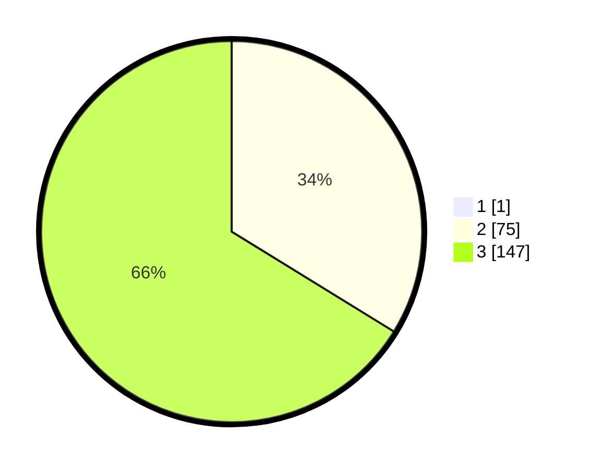

# Hasil

## Grafik

## Tabel

| No. | Nama Paslon    | Suara | Suara (raw) | Persentase |
|:--- |:-------------- | -----:| -----------:| ----------:|
| 1   | ANIES MUHAIMIN | 1     | [1][p-1]    | 0,45       |
| 2   | PRABOWO GIBRAN | 75    | [75][p-2]   | 33,63      |
| 3   | GANJAR MAHFUD  | 147   | [147][p-3]  | 65,92      |

[p-1]: https://github.com/gigit-pemilu/pemilu-2024/blob/main/pilpres/hitung-suara/sub/51-bali/sub/02-tabanan/sub/05-tabanan/sub/2006-dajan-peken/sub/003-tps/sub/paslon-1.txt
[p-2]: https://github.com/gigit-pemilu/pemilu-2024/blob/main/pilpres/hitung-suara/sub/51-bali/sub/02-tabanan/sub/05-tabanan/sub/2006-dajan-peken/sub/003-tps/sub/paslon-2.txt
[p-3]: https://github.com/gigit-pemilu/pemilu-2024/blob/main/pilpres/hitung-suara/sub/51-bali/sub/02-tabanan/sub/05-tabanan/sub/2006-dajan-peken/sub/003-tps/sub/paslon-3.txt

## Foto C Plano

https://sirekap-obj-formc.kpu.go.id/903e/pemilu/ppwp/51/02/05/20/06/5102052006003-20240215-215218--093b07bb-fc0c-4a80-bfaf-174aa2345159.jpg

https://sirekap-obj-formc.kpu.go.id/903e/pemilu/ppwp/51/02/05/20/06/5102052006003-20240215-215221--482f0392-e2d4-419c-bc1e-7e3366a8f5eb.jpg

https://sirekap-obj-formc.kpu.go.id/903e/pemilu/ppwp/51/02/05/20/06/5102052006003-20240215-215219--f2adf739-eadf-4779-ab0b-5727340b41a2.jpg

## Metadata

| Key        | Value               |
| ---------- | ------------------- |
| Time Stamp | 2024-02-15 22:30:27 |

## DATA PEMILIH TETAP

Jumlah pemilih dalam DPT: **251**.
 * L: **123**.
 * P: **128**.

## DATA PENGGUNA HAK PILIH

Jumlah pengguna hak pilih dalam DPT: **219**.
 * L: **109**.
 * P: **110**.

Jumlah pengguna hak pilih dalam DPTb: **6**.
 * L: **2**.
 * P: **4**.

Jumlah pengguna hak pilih dalam DPK: **0**.
 * L: **0**.
 * P: **0**.

Jumlah pengguna hak pilih: **225**.
 * L: **111**.
 * P: **114**.

## JUMLAH SUARA SAH DAN TIDAK SAH

JUMLAH SELURUH SUARA SAH: **223**.

JUMLAH SUARA TIDAK SAH: **2**.

JUMLAH SELURUH SUARA SAH DAN SUARA TIDAK SAH: **225**.

