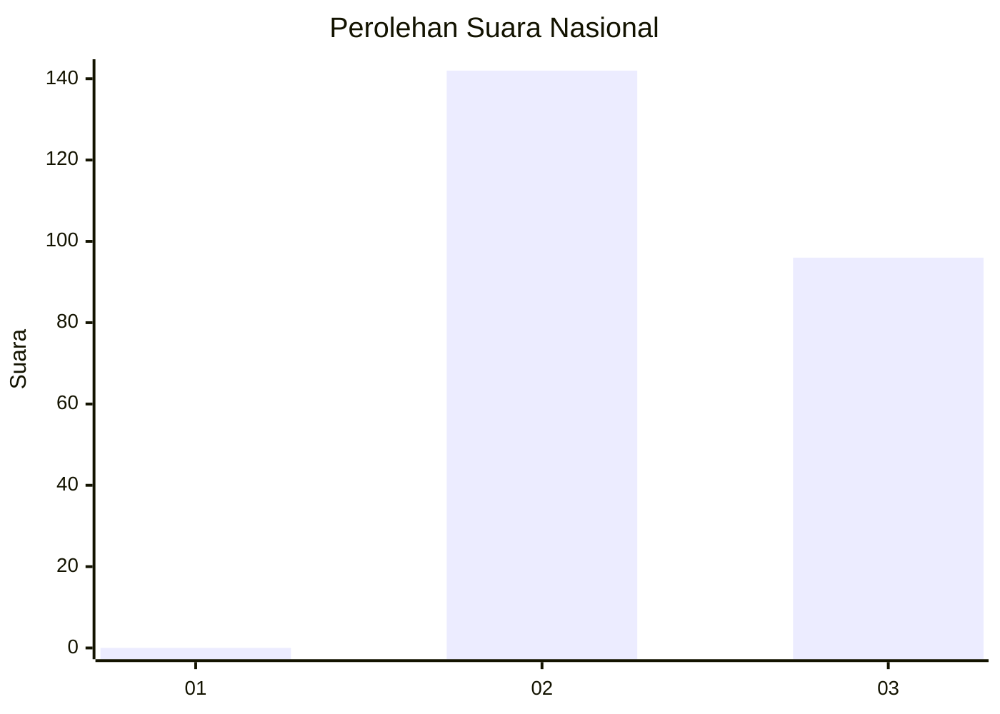
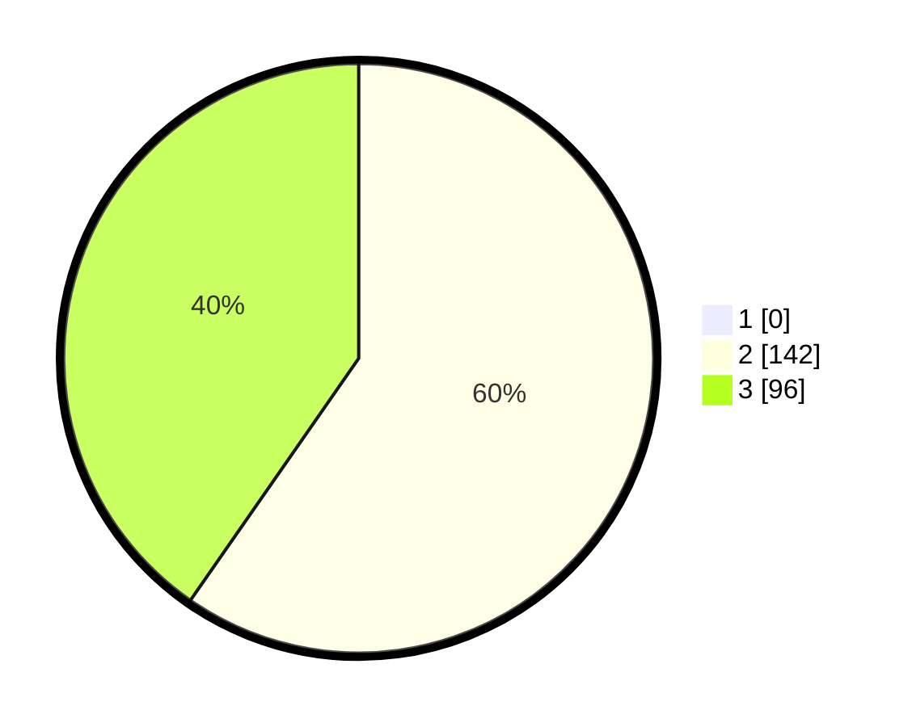

# Hasil

## Grafik

## Tabel

| No. | Nama Paslon    | Suara | Suara (raw) | Persentase |
|:--- |:-------------- | -----:| -----------:| ----------:|
| 1   | ANIES MUHAIMIN | 0     | [0][p-1]    | 0,00       |
| 2   | PRABOWO GIBRAN | 142   | [142][p-2]  | 59,66      |
| 3   | GANJAR MAHFUD  | 96    | [96][p-3]   | 40,34      |

[p-1]: https://github.com/gigit-pemilu/pemilu-2024/blob/main/pilpres/hitung-suara/sub/51-bali/sub/02-tabanan/sub/05-tabanan/sub/2006-dajan-peken/sub/011-tps/sub/paslon-1.txt
[p-2]: https://github.com/gigit-pemilu/pemilu-2024/blob/main/pilpres/hitung-suara/sub/51-bali/sub/02-tabanan/sub/05-tabanan/sub/2006-dajan-peken/sub/011-tps/sub/paslon-2.txt
[p-3]: https://github.com/gigit-pemilu/pemilu-2024/blob/main/pilpres/hitung-suara/sub/51-bali/sub/02-tabanan/sub/05-tabanan/sub/2006-dajan-peken/sub/011-tps/sub/paslon-3.txt

## Foto C Plano

https://sirekap-obj-formc.kpu.go.id/d4d4/pemilu/ppwp/51/02/05/20/06/5102052006011-20240214-225137--331a257a-9fac-4686-b669-7e8820ac4164.jpg

https://sirekap-obj-formc.kpu.go.id/d4d4/pemilu/ppwp/51/02/05/20/06/5102052006011-20240214-225236--81551530-4ab7-4845-9a32-5071d5e6d542.jpg

https://sirekap-obj-formc.kpu.go.id/d4d4/pemilu/ppwp/51/02/05/20/06/5102052006011-20240214-201955--ccae65e1-7dff-4dce-b715-b7025b0cddd8.jpg

## Metadata

| Key        | Value               |
| ---------- | ------------------- |
| Time Stamp | 2024-02-15 12:00:28 |

## DATA PEMILIH TETAP

Jumlah pemilih dalam DPT: **283**.
 * L: **138**.
 * P: **145**.

## DATA PENGGUNA HAK PILIH

Jumlah pengguna hak pilih dalam DPT: **235**.
 * L: **116**.
 * P: **119**.

Jumlah pengguna hak pilih dalam DPTb: **0**.
 * L: **0**.
 * P: **0**.

Jumlah pengguna hak pilih dalam DPK: **3**.
 * L: **0**.
 * P: **3**.

Jumlah pengguna hak pilih: **238**.
 * L: **116**.
 * P: **122**.

## JUMLAH SUARA SAH DAN TIDAK SAH

JUMLAH SELURUH SUARA SAH: **238**.

JUMLAH SUARA TIDAK SAH: **0**.

JUMLAH SELURUH SUARA SAH DAN SUARA TIDAK SAH: **238**.

