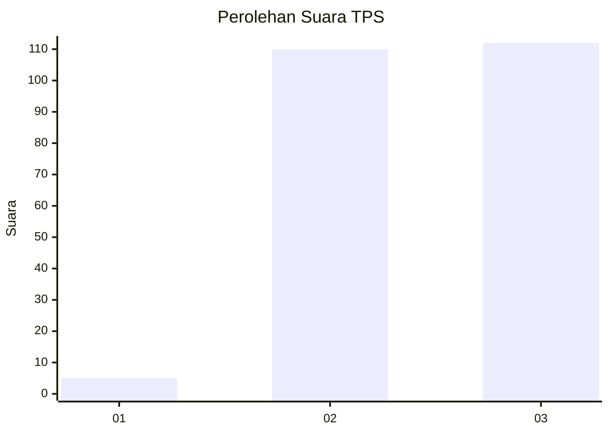
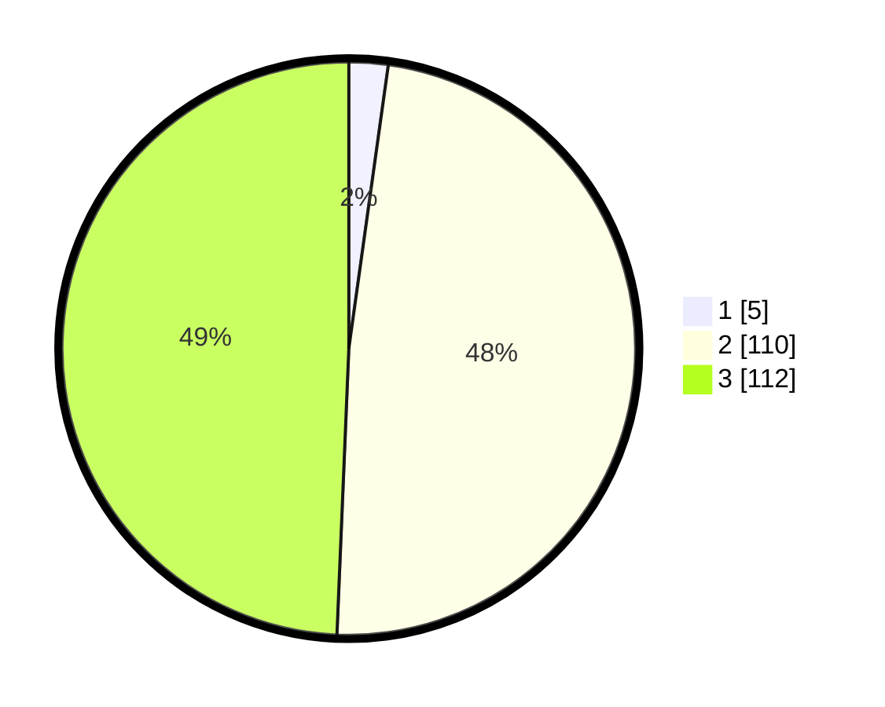

# Hasil

## Grafik

## Tabel

| No. | Nama Paslon    | Suara | Suara (raw) | Persentase |
|:--- |:-------------- | -----:| -----------:| ----------:|
| 1   | ANIES MUHAIMIN | 5     | [5][p-1]    | 2,20       |
| 2   | PRABOWO GIBRAN | 110   | [110][p-2]  | 48,46      |
| 3   | GANJAR MAHFUD  | 112   | [112][p-3]  | 49,34      |

[p-1]: https://github.com/gigit-pemilu/pemilu-2024-51-bali/blob/main/pilpres/hitung-suara/sub/51-bali/sub/02-tabanan/sub/05-tabanan/sub/2006-dajan-peken/sub/012-tps/sub/paslon-1.txt
[p-2]: https://github.com/gigit-pemilu/pemilu-2024-51-bali/blob/main/pilpres/hitung-suara/sub/51-bali/sub/02-tabanan/sub/05-tabanan/sub/2006-dajan-peken/sub/012-tps/sub/paslon-2.txt
[p-3]: https://github.com/gigit-pemilu/pemilu-2024-51-bali/blob/main/pilpres/hitung-suara/sub/51-bali/sub/02-tabanan/sub/05-tabanan/sub/2006-dajan-peken/sub/012-tps/sub/paslon-3.txt

## Foto C Plano

https://sirekap-obj-formc.kpu.go.id/63de/pemilu/ppwp/51/02/05/20/06/5102052006012-20240216-171646--05f85ec8-529d-4c2a-aa73-efe1d9cc0641.jpg

https://sirekap-obj-formc.kpu.go.id/63de/pemilu/ppwp/51/02/05/20/06/5102052006012-20240216-172658--1470b1a8-490f-4252-ba56-a341568f719c.jpg

https://sirekap-obj-formc.kpu.go.id/63de/pemilu/ppwp/51/02/05/20/06/5102052006012-20240216-172447--cf6d1e01-4049-4ff0-bfb3-21bd43d3cc39.jpg

## Metadata

| Key        | Value               |
| ---------- | ------------------- |
| Time Stamp | 2024-02-24 22:31:28 |

## DATA PEMILIH TETAP

Jumlah pemilih dalam DPT: **277**.
 * L: **130**.
 * P: **147**.

## DATA PENGGUNA HAK PILIH

Jumlah pengguna hak pilih dalam DPT: **229**.
 * L: **109**.
 * P: **120**.

Jumlah pengguna hak pilih dalam DPTb: **0**.
 * L: **0**.
 * P: **0**.

Jumlah pengguna hak pilih dalam DPK: **4**.
 * L: **1**.
 * P: **3**.

Jumlah pengguna hak pilih: **233**.
 * L: **110**.
 * P: **123**.

## JUMLAH SUARA SAH DAN TIDAK SAH

JUMLAH SELURUH SUARA SAH: **227**.

JUMLAH SUARA TIDAK SAH: **6**.

JUMLAH SELURUH SUARA SAH DAN SUARA TIDAK SAH: **233**.

