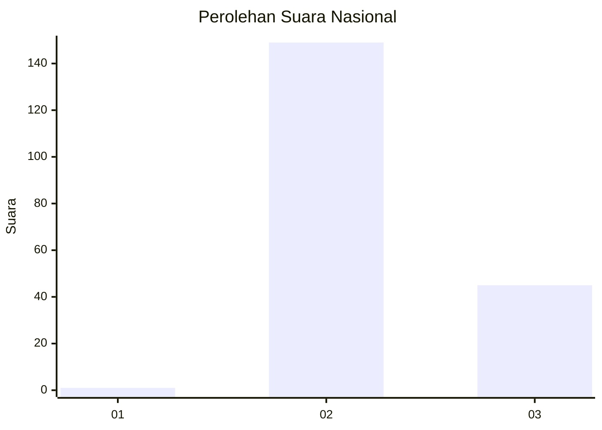
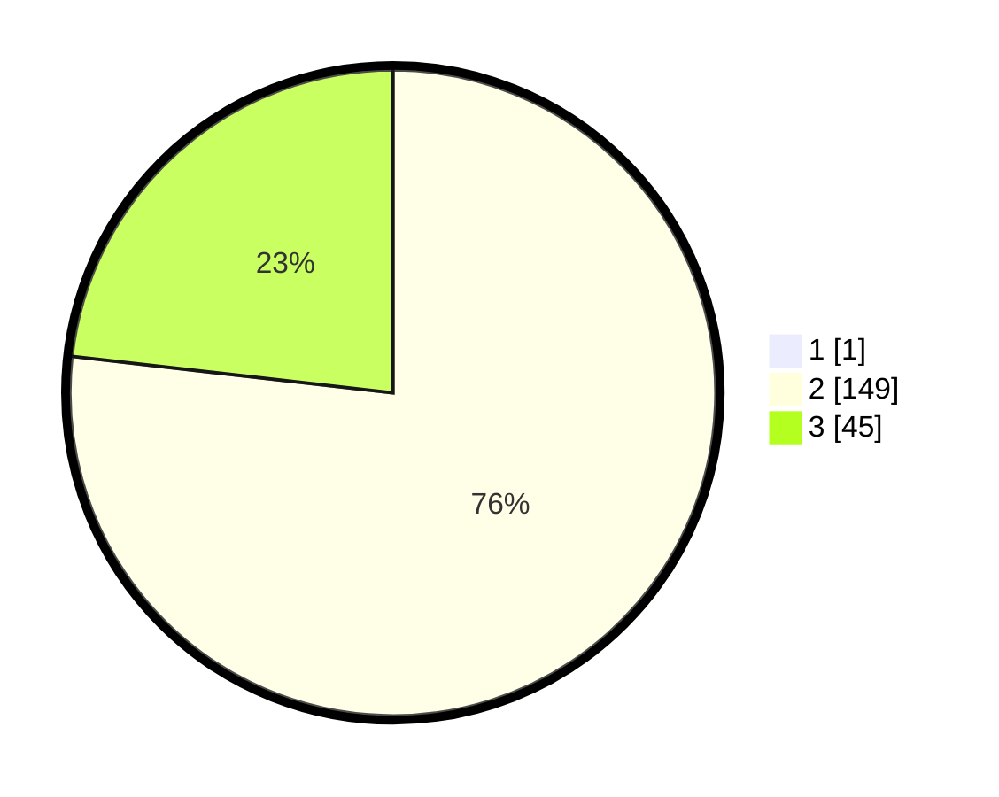

# Hasil

## Grafik

## Tabel

| No. | Nama Paslon    | Suara | Suara (raw) | Persentase |
|:--- |:-------------- | -----:| -----------:| ----------:|
| 1   | ANIES MUHAIMIN | 1     | [1][p-1]    | 0,51       |
| 2   | PRABOWO GIBRAN | 149   | [149][p-2]  | 76,41      |
| 3   | GANJAR MAHFUD  | 45    | [45][p-3]   | 23,08      |

[p-1]: https://github.com/gigit-pemilu/pemilu-2024/blob/main/pilpres/hitung-suara/sub/51-bali/sub/02-tabanan/sub/05-tabanan/sub/2006-dajan-peken/sub/014-tps/sub/paslon-1.txt
[p-2]: https://github.com/gigit-pemilu/pemilu-2024/blob/main/pilpres/hitung-suara/sub/51-bali/sub/02-tabanan/sub/05-tabanan/sub/2006-dajan-peken/sub/014-tps/sub/paslon-2.txt
[p-3]: https://github.com/gigit-pemilu/pemilu-2024/blob/main/pilpres/hitung-suara/sub/51-bali/sub/02-tabanan/sub/05-tabanan/sub/2006-dajan-peken/sub/014-tps/sub/paslon-3.txt

## Foto C Plano

https://sirekap-obj-formc.kpu.go.id/db78/pemilu/ppwp/51/02/05/20/06/5102052006014-20240216-222837--67a320fa-ff2e-4a8c-9f45-733bf358c77c.jpg

https://sirekap-obj-formc.kpu.go.id/db78/pemilu/ppwp/51/02/05/20/06/5102052006014-20240216-222838--26c08637-f51b-4be6-97ed-42e0a7de70e7.jpg

https://sirekap-obj-formc.kpu.go.id/db78/pemilu/ppwp/51/02/05/20/06/5102052006014-20240216-222837--e38c53cd-35a3-470e-aed6-aa1bb99681be.jpg

## Metadata

| Key        | Value               |
| ---------- | ------------------- |
| Time Stamp | 2024-02-21 11:00:00 |

## DATA PEMILIH TETAP

Jumlah pemilih dalam DPT: **232**.
 * L: **118**.
 * P: **114**.

## DATA PENGGUNA HAK PILIH

Jumlah pengguna hak pilih dalam DPT: **192**.
 * L: **102**.
 * P: **90**.

Jumlah pengguna hak pilih dalam DPTb: **5**.
 * L: **5**.
 * P: **0**.

Jumlah pengguna hak pilih dalam DPK: **0**.
 * L: **0**.
 * P: **0**.

Jumlah pengguna hak pilih: **197**.
 * L: **107**.
 * P: **90**.

## JUMLAH SUARA SAH DAN TIDAK SAH

JUMLAH SELURUH SUARA SAH: **195**.

JUMLAH SUARA TIDAK SAH: **2**.

JUMLAH SELURUH SUARA SAH DAN SUARA TIDAK SAH: **197**.

