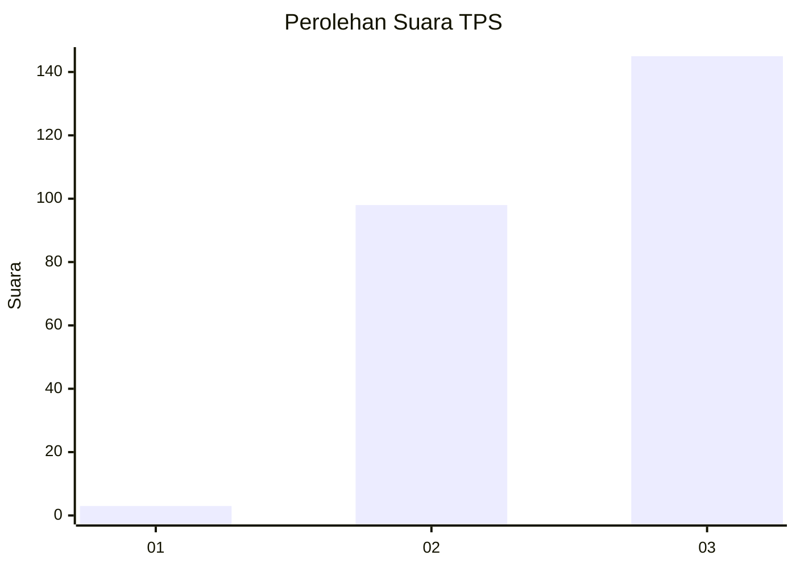
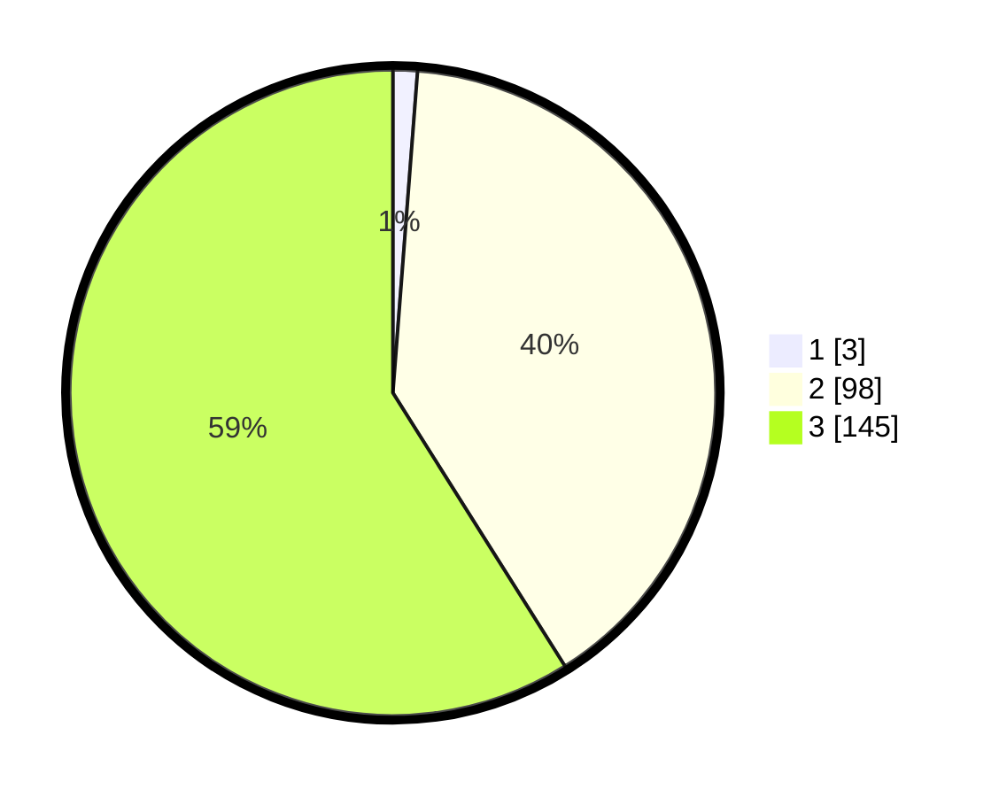

# Hasil

## Grafik

## Tabel

| No. | Nama Paslon    | Suara | Suara (raw) | Persentase |
|:--- |:-------------- | -----:| -----------:| ----------:|
| 1   | ANIES MUHAIMIN | 3     | [3][p-1]    | 1,22       |
| 2   | PRABOWO GIBRAN | 98    | [98][p-2]   | 39,84      |
| 3   | GANJAR MAHFUD  | 145   | [145][p-3]  | 58,94      |

[p-1]: https://github.com/gigit-pemilu/pemilu-2024-51-bali/blob/main/pilpres/hitung-suara/sub/51-bali/sub/02-tabanan/sub/05-tabanan/sub/2006-dajan-peken/sub/015-tps/sub/paslon-1.txt
[p-2]: https://github.com/gigit-pemilu/pemilu-2024-51-bali/blob/main/pilpres/hitung-suara/sub/51-bali/sub/02-tabanan/sub/05-tabanan/sub/2006-dajan-peken/sub/015-tps/sub/paslon-2.txt
[p-3]: https://github.com/gigit-pemilu/pemilu-2024-51-bali/blob/main/pilpres/hitung-suara/sub/51-bali/sub/02-tabanan/sub/05-tabanan/sub/2006-dajan-peken/sub/015-tps/sub/paslon-3.txt

## Foto C Plano

https://sirekap-obj-formc.kpu.go.id/88fd/pemilu/ppwp/51/02/05/20/06/5102052006015-20240216-150351--0dbe7d84-bf88-46c1-b04b-312a8f1ed367.jpg

https://sirekap-obj-formc.kpu.go.id/88fd/pemilu/ppwp/51/02/05/20/06/5102052006015-20240216-150352--117daf69-bf42-4833-b003-beb9f7c73b07.jpg

https://sirekap-obj-formc.kpu.go.id/88fd/pemilu/ppwp/51/02/05/20/06/5102052006015-20240216-150352--04e42b45-9736-4e0a-913d-8ea0e312ad2d.jpg

## Metadata

| Key        | Value               |
| ---------- | ------------------- |
| Time Stamp | 2024-02-26 22:00:00 |

## DATA PEMILIH TETAP

Jumlah pemilih dalam DPT: **298**.
 * L: **144**.
 * P: **154**.

## DATA PENGGUNA HAK PILIH

Jumlah pengguna hak pilih dalam DPT: **248**.
 * L: **122**.
 * P: **126**.

Jumlah pengguna hak pilih dalam DPTb: **3**.
 * L: **1**.
 * P: **2**.

Jumlah pengguna hak pilih dalam DPK: **0**.
 * L: **0**.
 * P: **0**.

Jumlah pengguna hak pilih: **251**.
 * L: **123**.
 * P: **128**.

## JUMLAH SUARA SAH DAN TIDAK SAH

JUMLAH SELURUH SUARA SAH: **246**.

JUMLAH SUARA TIDAK SAH: **5**.

JUMLAH SELURUH SUARA SAH DAN SUARA TIDAK SAH: **251**.

