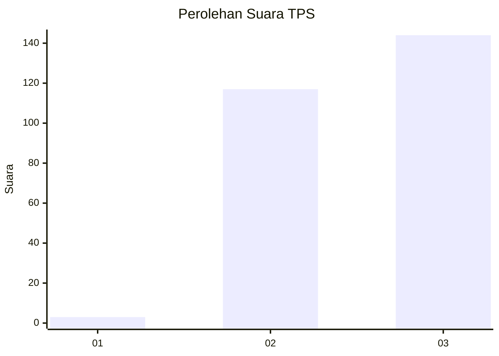
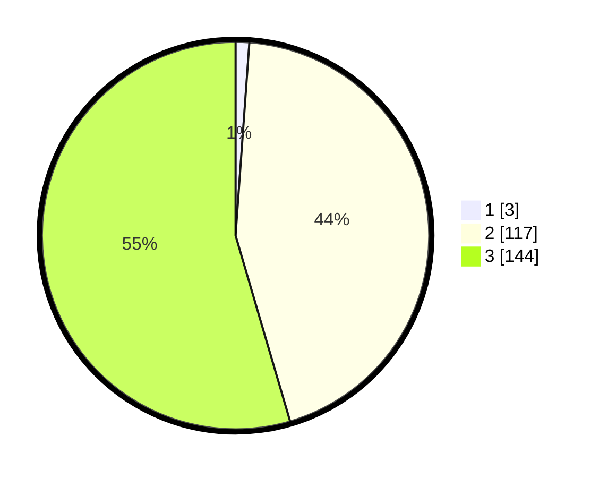

# Hasil

## Grafik

## Tabel

| No. | Nama Paslon    | Suara | Suara (raw) | Persentase |
|:--- |:-------------- | -----:| -----------:| ----------:|
| 1   | ANIES MUHAIMIN | 3     | [3][p-1]    | 1,14       |
| 2   | PRABOWO GIBRAN | 117   | [117][p-2]  | 44,32      |
| 3   | GANJAR MAHFUD  | 144   | [144][p-3]  | 54,55      |

[p-1]: https://github.com/gigit-pemilu/pemilu-2024-51-bali/blob/main/pilpres/hitung-suara/sub/51-bali/sub/02-tabanan/sub/05-tabanan/sub/2006-dajan-peken/sub/019-tps/sub/paslon-1.txt
[p-2]: https://github.com/gigit-pemilu/pemilu-2024-51-bali/blob/main/pilpres/hitung-suara/sub/51-bali/sub/02-tabanan/sub/05-tabanan/sub/2006-dajan-peken/sub/019-tps/sub/paslon-2.txt
[p-3]: https://github.com/gigit-pemilu/pemilu-2024-51-bali/blob/main/pilpres/hitung-suara/sub/51-bali/sub/02-tabanan/sub/05-tabanan/sub/2006-dajan-peken/sub/019-tps/sub/paslon-3.txt

## Foto C Plano

https://sirekap-obj-formc.kpu.go.id/2a50/pemilu/ppwp/51/02/05/20/06/5102052006019-20240215-000523--ad03e063-6c20-452a-a03e-322c2713ed29.jpg

https://sirekap-obj-formc.kpu.go.id/2a50/pemilu/ppwp/51/02/05/20/06/5102052006019-20240215-000536--fe15c272-d0d1-419b-bd9d-e884561c7fae.jpg

https://sirekap-obj-formc.kpu.go.id/2a50/pemilu/ppwp/51/02/05/20/06/5102052006019-20240215-000535--89d1a8ac-b0a9-4f82-bfca-1b1abb25b9a7.jpg

## Metadata

| Key        | Value               |
| ---------- | ------------------- |
| Time Stamp | 2024-02-26 23:00:00 |

