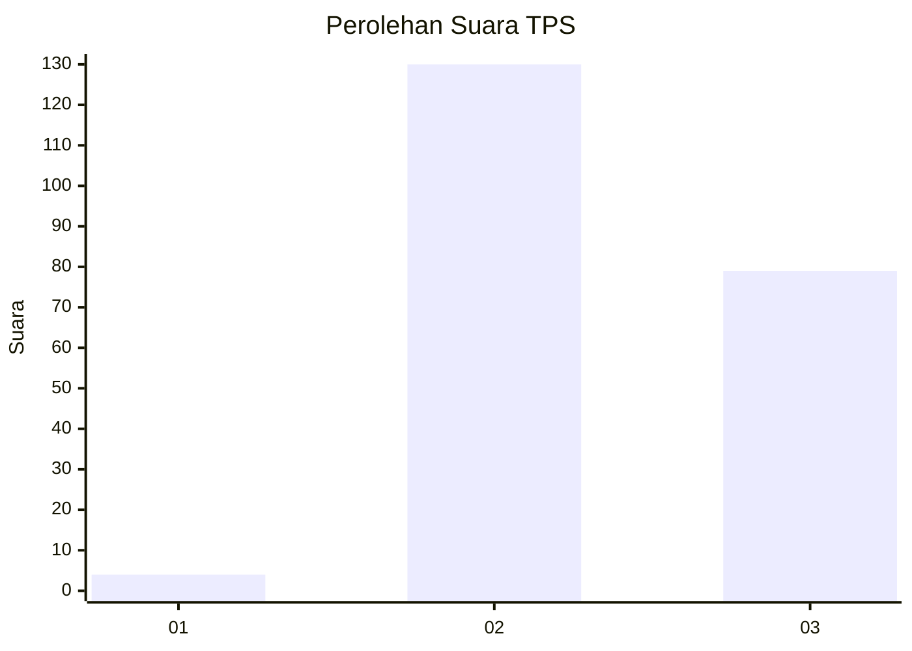
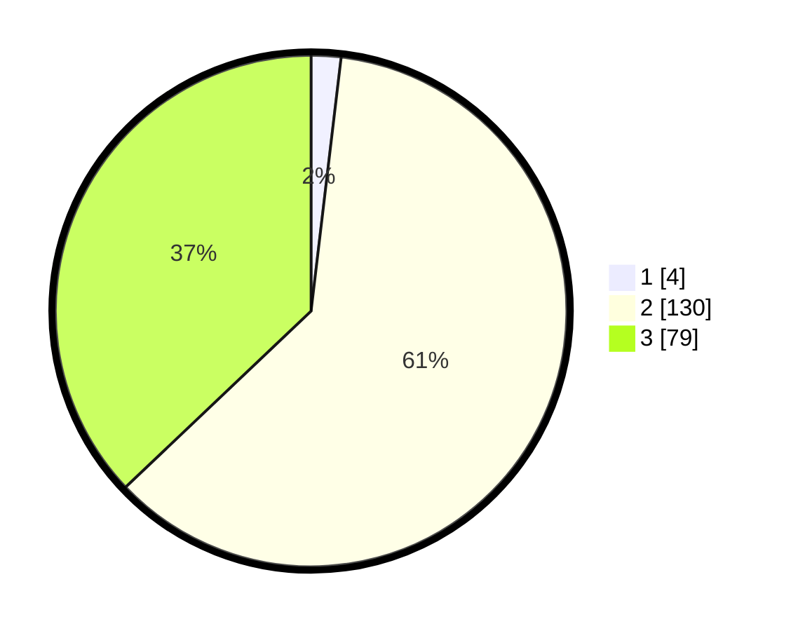

# Hasil

## Grafik

## Tabel

| No. | Nama Paslon    | Suara | Suara (raw) | Persentase |
|:--- |:-------------- | -----:| -----------:| ----------:|
| 1   | ANIES MUHAIMIN | 4     | [4][p-1]    | 1,88       |
| 2   | PRABOWO GIBRAN | 130   | [130][p-2]  | 61,03      |
| 3   | GANJAR MAHFUD  | 79    | [79][p-3]   | 37,09      |

[p-1]: https://github.com/gigit-pemilu/pemilu-2024-51-bali/blob/main/pilpres/hitung-suara/sub/51-bali/sub/02-tabanan/sub/05-tabanan/sub/2006-dajan-peken/sub/020-tps/sub/paslon-1.txt
[p-2]: https://github.com/gigit-pemilu/pemilu-2024-51-bali/blob/main/pilpres/hitung-suara/sub/51-bali/sub/02-tabanan/sub/05-tabanan/sub/2006-dajan-peken/sub/020-tps/sub/paslon-2.txt
[p-3]: https://github.com/gigit-pemilu/pemilu-2024-51-bali/blob/main/pilpres/hitung-suara/sub/51-bali/sub/02-tabanan/sub/05-tabanan/sub/2006-dajan-peken/sub/020-tps/sub/paslon-3.txt

## Foto C Plano

https://sirekap-obj-formc.kpu.go.id/974d/pemilu/ppwp/51/02/05/20/06/5102052006020-20240214-232550--78eafb43-6220-4969-bbcf-f366309d4f25.jpg

https://sirekap-obj-formc.kpu.go.id/974d/pemilu/ppwp/51/02/05/20/06/5102052006020-20240214-232705--3739c365-77a3-4862-80e5-7e9f91129241.jpg

https://sirekap-obj-formc.kpu.go.id/974d/pemilu/ppwp/51/02/05/20/06/5102052006020-20240214-232813--06d63372-9f93-4067-88b5-e9f22a40e67a.jpg

## Metadata

| Key        | Value               |
| ---------- | ------------------- |
| Time Stamp | 2024-02-15 15:00:29 |

## DATA PEMILIH TETAP

Jumlah pemilih dalam DPT: **261**.
 * L: **125**.
 * P: **136**.

## DATA PENGGUNA HAK PILIH

Jumlah pengguna hak pilih dalam DPT: **217**.
 * L: **104**.
 * P: **113**.

Jumlah pengguna hak pilih dalam DPTb: **7**.
 * L: **7**.
 * P: **0**.

Jumlah pengguna hak pilih dalam DPK: **5**.
 * L: **2**.
 * P: **3**.

Jumlah pengguna hak pilih: **229**.
 * L: **113**.
 * P: **116**.

## JUMLAH SUARA SAH DAN TIDAK SAH

JUMLAH SELURUH SUARA SAH: **213**.

JUMLAH SUARA TIDAK SAH: **16**.

JUMLAH SELURUH SUARA SAH DAN SUARA TIDAK SAH: **229**.

