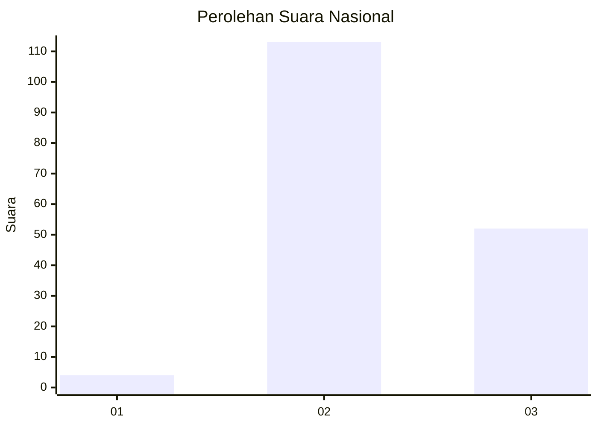
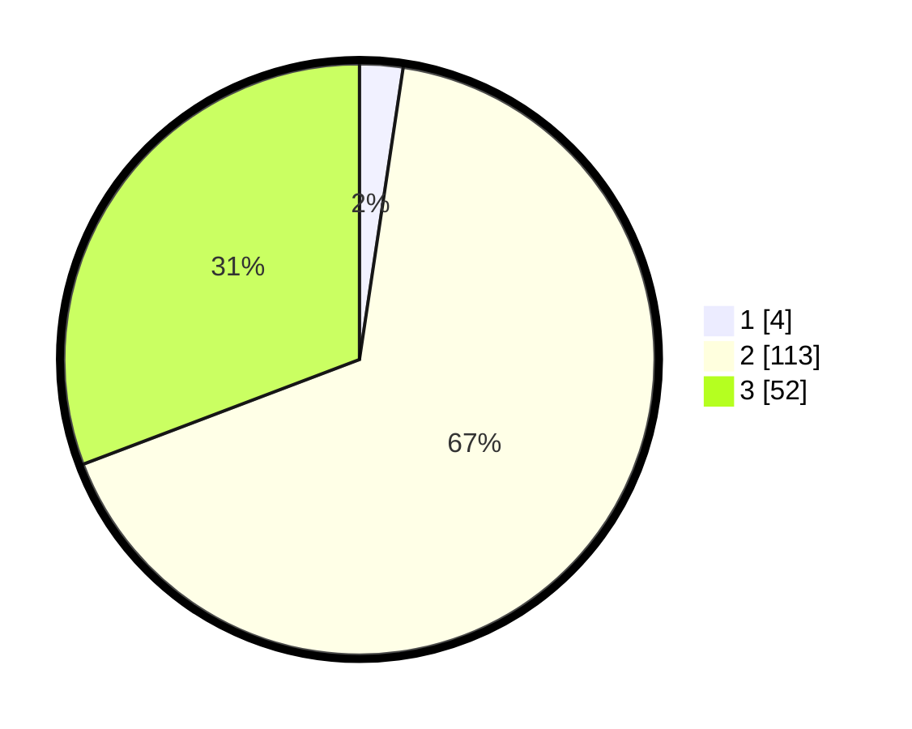

# Hasil

## Grafik

## Tabel

| No. | Nama Paslon    | Suara | Suara (raw) | Persentase |
|:--- |:-------------- | -----:| -----------:| ----------:|
| 1   | ANIES MUHAIMIN | 4     | [4][p-1]    | 2,37       |
| 2   | PRABOWO GIBRAN | 113   | [113][p-2]  | 66,86      |
| 3   | GANJAR MAHFUD  | 52    | [52][p-3]   | 30,77      |

[p-1]: https://github.com/gigit-pemilu/pemilu-2024/blob/main/pilpres/hitung-suara/sub/51-bali/sub/02-tabanan/sub/05-tabanan/sub/2006-dajan-peken/sub/024-tps/sub/paslon-1.txt
[p-2]: https://github.com/gigit-pemilu/pemilu-2024/blob/main/pilpres/hitung-suara/sub/51-bali/sub/02-tabanan/sub/05-tabanan/sub/2006-dajan-peken/sub/024-tps/sub/paslon-2.txt
[p-3]: https://github.com/gigit-pemilu/pemilu-2024/blob/main/pilpres/hitung-suara/sub/51-bali/sub/02-tabanan/sub/05-tabanan/sub/2006-dajan-peken/sub/024-tps/sub/paslon-3.txt

## Foto C Plano

https://sirekap-obj-formc.kpu.go.id/a0e1/pemilu/ppwp/51/02/05/20/06/5102052006024-20240216-052903--697709a8-fc1d-4d05-b81d-64236498b9c1.jpg

https://sirekap-obj-formc.kpu.go.id/a0e1/pemilu/ppwp/51/02/05/20/06/5102052006024-20240216-052905--510cad0b-8d90-4d6f-be33-a0b063e64864.jpg

https://sirekap-obj-formc.kpu.go.id/a0e1/pemilu/ppwp/51/02/05/20/06/5102052006024-20240216-052904--c5444153-41d3-4143-8ae7-63910e64b247.jpg

## Metadata

| Key        | Value               |
| ---------- | ------------------- |
| Time Stamp | 2024-02-16 10:30:29 |

## DATA PEMILIH TETAP

Jumlah pemilih dalam DPT: **214**.
 * L: **108**.
 * P: **106**.

## DATA PENGGUNA HAK PILIH

Jumlah pengguna hak pilih dalam DPT: **175**.
 * L: **88**.
 * P: **87**.

Jumlah pengguna hak pilih dalam DPTb: **0**.
 * L: **0**.
 * P: **0**.

Jumlah pengguna hak pilih dalam DPK: **0**.
 * L: **0**.
 * P: **0**.

Jumlah pengguna hak pilih: **175**.
 * L: **88**.
 * P: **87**.

## JUMLAH SUARA SAH DAN TIDAK SAH

JUMLAH SELURUH SUARA SAH: **169**.

JUMLAH SUARA TIDAK SAH: **6**.

JUMLAH SELURUH SUARA SAH DAN SUARA TIDAK SAH: **175**.

