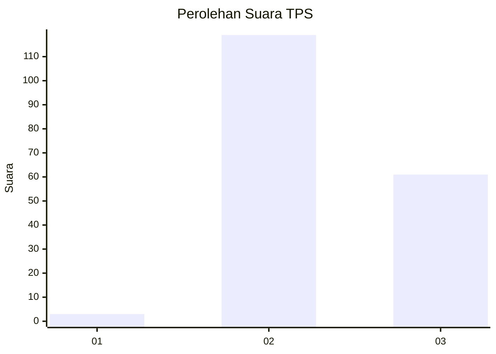
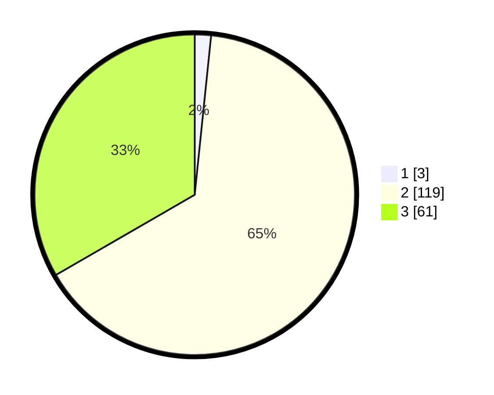

# Hasil

## Grafik

## Tabel

| No. | Nama Paslon    | Suara | Suara (raw) | Persentase |
|:--- |:-------------- | -----:| -----------:| ----------:|
| 1   | ANIES MUHAIMIN | 3     | [3][p-1]    | 1,64       |
| 2   | PRABOWO GIBRAN | 119   | [119][p-2]  | 65,03      |
| 3   | GANJAR MAHFUD  | 61    | [61][p-3]   | 33,33      |

[p-1]: https://github.com/gigit-pemilu/pemilu-2024-51-bali/blob/main/pilpres/hitung-suara/sub/51-bali/sub/02-tabanan/sub/05-tabanan/sub/2006-dajan-peken/sub/025-tps/sub/paslon-1.txt
[p-2]: https://github.com/gigit-pemilu/pemilu-2024-51-bali/blob/main/pilpres/hitung-suara/sub/51-bali/sub/02-tabanan/sub/05-tabanan/sub/2006-dajan-peken/sub/025-tps/sub/paslon-2.txt
[p-3]: https://github.com/gigit-pemilu/pemilu-2024-51-bali/blob/main/pilpres/hitung-suara/sub/51-bali/sub/02-tabanan/sub/05-tabanan/sub/2006-dajan-peken/sub/025-tps/sub/paslon-3.txt

## Foto C Plano

https://sirekap-obj-formc.kpu.go.id/9299/pemilu/ppwp/51/02/05/20/06/5102052006025-20240214-220903--3e4797af-8a1e-4559-bacd-8aac69c79401.jpg

https://sirekap-obj-formc.kpu.go.id/9299/pemilu/ppwp/51/02/05/20/06/5102052006025-20240214-221009--ffb5c706-8ae4-431b-89f8-1b1e215189f5.jpg

https://sirekap-obj-formc.kpu.go.id/9299/pemilu/ppwp/51/02/05/20/06/5102052006025-20240214-221021--19871f96-06f1-408d-a619-1243cd155e6c.jpg

## Metadata

| Key        | Value               |
| ---------- | ------------------- |
| Time Stamp | 2024-02-15 22:30:27 |

