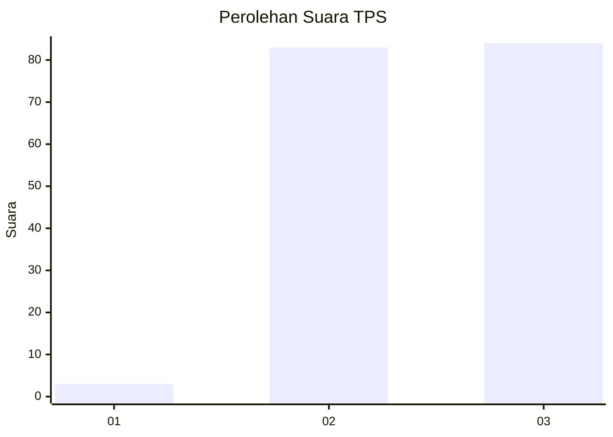
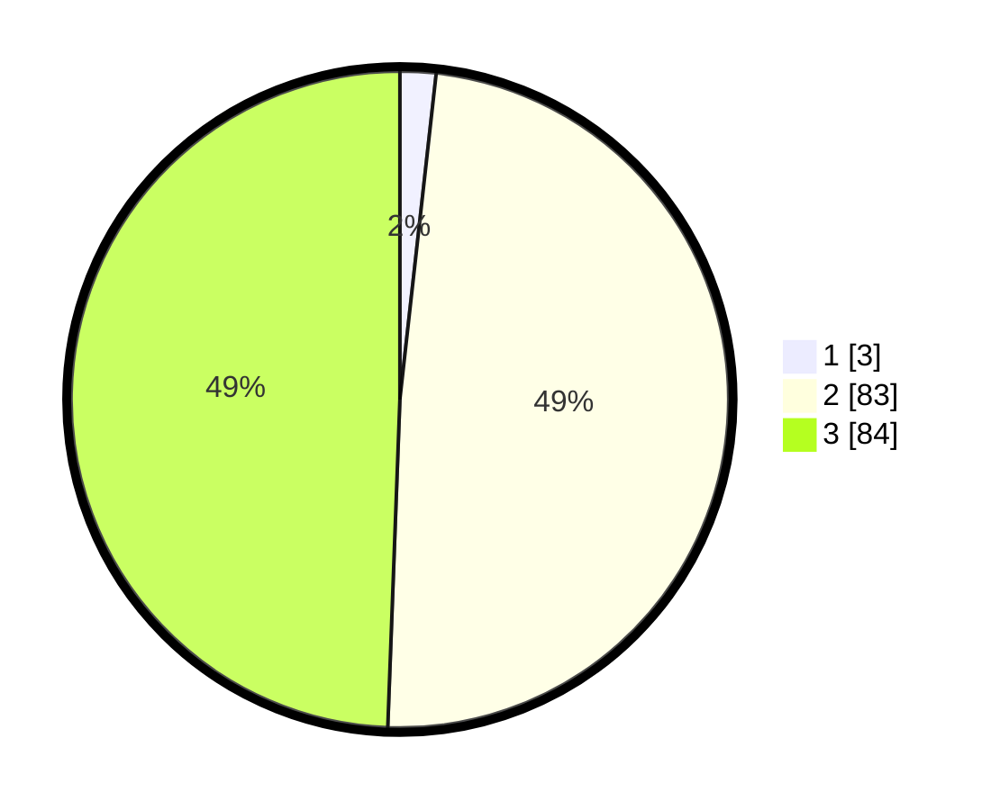

# Hasil

## Grafik

## Tabel

| No. | Nama Paslon    | Suara | Suara (raw) | Persentase |
|:--- |:-------------- | -----:| -----------:| ----------:|
| 1   | ANIES MUHAIMIN | 3     | [3][p-1]    | 1,76       |
| 2   | PRABOWO GIBRAN | 83    | [83][p-2]   | 48,82      |
| 3   | GANJAR MAHFUD  | 84    | [84][p-3]   | 49,41      |

[p-1]: https://github.com/gigit-pemilu/pemilu-2024-51-bali/blob/main/pilpres/hitung-suara/sub/51-bali/sub/02-tabanan/sub/05-tabanan/sub/2006-dajan-peken/sub/028-tps/sub/paslon-1.txt
[p-2]: https://github.com/gigit-pemilu/pemilu-2024-51-bali/blob/main/pilpres/hitung-suara/sub/51-bali/sub/02-tabanan/sub/05-tabanan/sub/2006-dajan-peken/sub/028-tps/sub/paslon-2.txt
[p-3]: https://github.com/gigit-pemilu/pemilu-2024-51-bali/blob/main/pilpres/hitung-suara/sub/51-bali/sub/02-tabanan/sub/05-tabanan/sub/2006-dajan-peken/sub/028-tps/sub/paslon-3.txt

## Foto C Plano

https://sirekap-obj-formc.kpu.go.id/d2e2/pemilu/ppwp/51/02/05/20/06/5102052006028-20240214-195000--9b627770-c89c-4d34-86a3-175eea9f1de6.jpg

https://sirekap-obj-formc.kpu.go.id/d2e2/pemilu/ppwp/51/02/05/20/06/5102052006028-20240214-195304--64cc6964-4100-4fc9-8f43-92b70a6e9be1.jpg

https://sirekap-obj-formc.kpu.go.id/d2e2/pemilu/ppwp/51/02/05/20/06/5102052006028-20240214-195505--7f3e47e8-d5ec-4913-9360-97fdb7d35201.jpg

## Metadata

| Key        | Value               |
| ---------- | ------------------- |
| Time Stamp | 2024-02-15 22:30:27 |

## DATA PEMILIH TETAP

Jumlah pemilih dalam DPT: **221**.
 * L: **509**.
 * P: **112**.

## DATA PENGGUNA HAK PILIH

Jumlah pengguna hak pilih dalam DPT: **171**.
 * L: **82**.
 * P: **74**.

Jumlah pengguna hak pilih dalam DPTb: **7**.
 * L: **7**.
 * P: **0**.

Jumlah pengguna hak pilih dalam DPK: **0**.
 * L: **0**.
 * P: **0**.

Jumlah pengguna hak pilih: **174**.
 * L: **75**.
 * P: **44**.

## JUMLAH SUARA SAH DAN TIDAK SAH

JUMLAH SELURUH SUARA SAH: **170**.

JUMLAH SUARA TIDAK SAH: **4**.

JUMLAH SELURUH SUARA SAH DAN SUARA TIDAK SAH: **174**.

