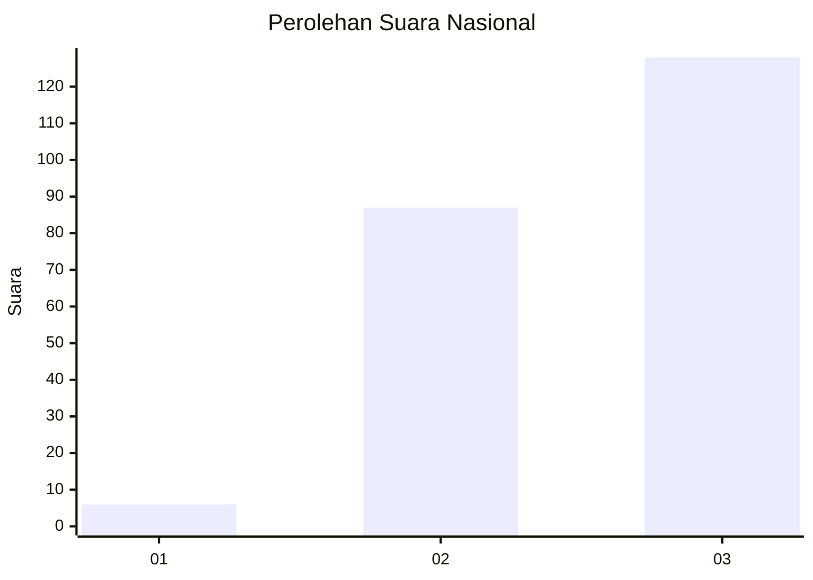
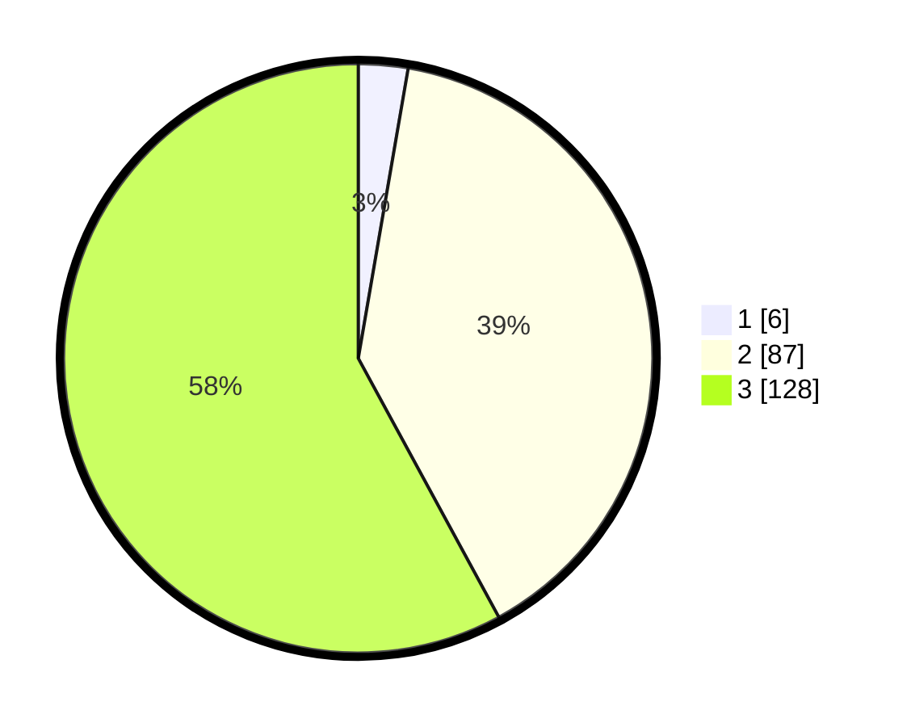

# Hasil

## Grafik

## Tabel

| No. | Nama Paslon    | Suara | Suara (raw) | Persentase |
|:--- |:-------------- | -----:| -----------:| ----------:|
| 1   | ANIES MUHAIMIN | 6     | [6][p-1]    | 2,71       |
| 2   | PRABOWO GIBRAN | 87    | [87][p-2]   | 39,37      |
| 3   | GANJAR MAHFUD  | 128   | [128][p-3]  | 57,92      |

[p-1]: https://github.com/gigit-pemilu/pemilu-2024/blob/main/pilpres/hitung-suara/sub/51-bali/sub/02-tabanan/sub/05-tabanan/sub/2006-dajan-peken/sub/029-tps/sub/paslon-1.txt
[p-2]: https://github.com/gigit-pemilu/pemilu-2024/blob/main/pilpres/hitung-suara/sub/51-bali/sub/02-tabanan/sub/05-tabanan/sub/2006-dajan-peken/sub/029-tps/sub/paslon-2.txt
[p-3]: https://github.com/gigit-pemilu/pemilu-2024/blob/main/pilpres/hitung-suara/sub/51-bali/sub/02-tabanan/sub/05-tabanan/sub/2006-dajan-peken/sub/029-tps/sub/paslon-3.txt

## Foto C Plano

https://sirekap-obj-formc.kpu.go.id/3e09/pemilu/ppwp/51/02/05/20/06/5102052006029-20240216-190512--be416ec7-e342-40c4-82f0-fe70334a4a5f.jpg

https://sirekap-obj-formc.kpu.go.id/3e09/pemilu/ppwp/51/02/05/20/06/5102052006029-20240216-190513--8723a8d6-5b2e-4640-901a-ec7ba9e79987.jpg

https://sirekap-obj-formc.kpu.go.id/3e09/pemilu/ppwp/51/02/05/20/06/5102052006029-20240216-190513--ebd3ca60-d537-4a03-8761-557f869a2537.jpg

## Metadata

| Key        | Value               |
| ---------- | ------------------- |
| Time Stamp | 2024-02-25 13:00:00 |

## DATA PEMILIH TETAP

Jumlah pemilih dalam DPT: **152**.
 * L: **122**.
 * P: **130**.

## DATA PENGGUNA HAK PILIH

Jumlah pengguna hak pilih dalam DPT: **226**.
 * L: **107**.
 * P: **130**.

Jumlah pengguna hak pilih dalam DPTb: **0**.
 * L: **0**.
 * P: **0**.

Jumlah pengguna hak pilih dalam DPK: **0**.
 * L: **0**.
 * P: **0**.

Jumlah pengguna hak pilih: **226**.
 * L: **107**.
 * P: **119**.

## JUMLAH SUARA SAH DAN TIDAK SAH

JUMLAH SELURUH SUARA SAH: **221**.

JUMLAH SUARA TIDAK SAH: **5**.

JUMLAH SELURUH SUARA SAH DAN SUARA TIDAK SAH: **226**.

