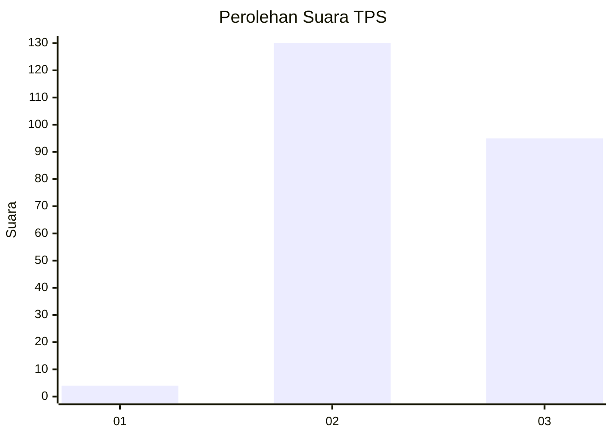
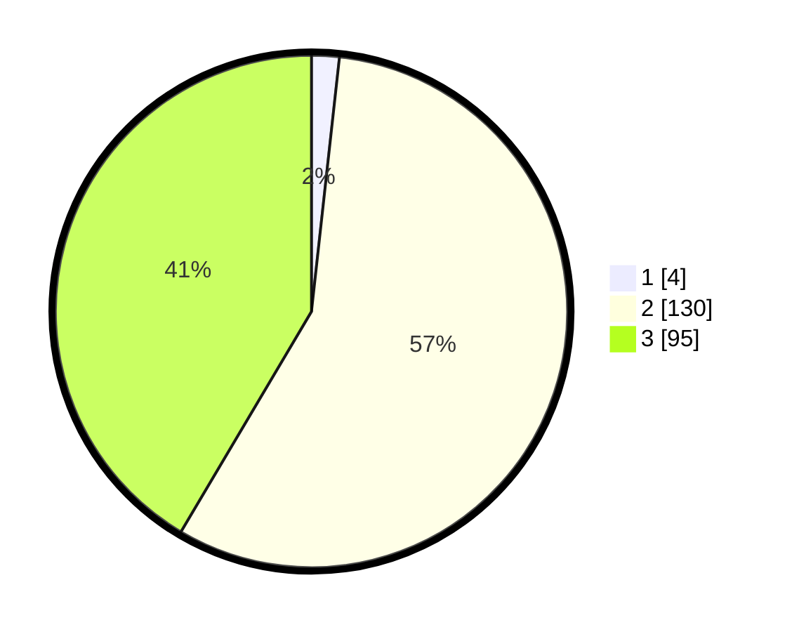

# Hasil

## Grafik

## Tabel

| No. | Nama Paslon    | Suara | Suara (raw) | Persentase |
|:--- |:-------------- | -----:| -----------:| ----------:|
| 1   | ANIES MUHAIMIN | 4     | [4][p-1]    | 1,75       |
| 2   | PRABOWO GIBRAN | 130   | [130][p-2]  | 56,77      |
| 3   | GANJAR MAHFUD  | 95    | [95][p-3]   | 41,48      |

[p-1]: https://github.com/gigit-pemilu/pemilu-2024-51-bali/blob/main/pilpres/hitung-suara/sub/51-bali/sub/02-tabanan/sub/05-tabanan/sub/2007-denbantas/sub/003-tps/sub/paslon-1.txt
[p-2]: https://github.com/gigit-pemilu/pemilu-2024-51-bali/blob/main/pilpres/hitung-suara/sub/51-bali/sub/02-tabanan/sub/05-tabanan/sub/2007-denbantas/sub/003-tps/sub/paslon-2.txt
[p-3]: https://github.com/gigit-pemilu/pemilu-2024-51-bali/blob/main/pilpres/hitung-suara/sub/51-bali/sub/02-tabanan/sub/05-tabanan/sub/2007-denbantas/sub/003-tps/sub/paslon-3.txt

## Foto C Plano

https://sirekap-obj-formc.kpu.go.id/df92/pemilu/ppwp/51/02/05/20/07/5102052007003-20240214-232528--0614fbad-16d4-4dd9-a94c-3fa75099c158.jpg

https://sirekap-obj-formc.kpu.go.id/df92/pemilu/ppwp/51/02/05/20/07/5102052007003-20240214-232735--027f6f5a-d341-4fa5-8899-239e7aa466ed.jpg

https://sirekap-obj-formc.kpu.go.id/df92/pemilu/ppwp/51/02/05/20/07/5102052007003-20240214-232852--ff7503d9-ad9d-44b8-9bbe-c14f684c45fa.jpg

## Metadata

| Key        | Value               |
| ---------- | ------------------- |
| Time Stamp | 2024-02-15 22:30:27 |

