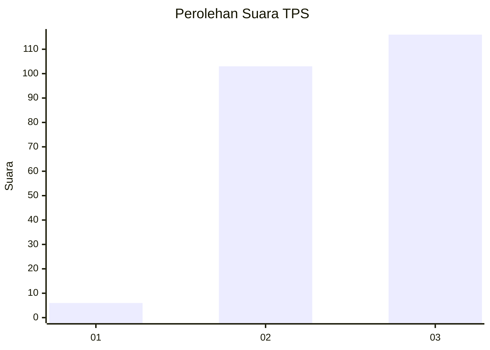
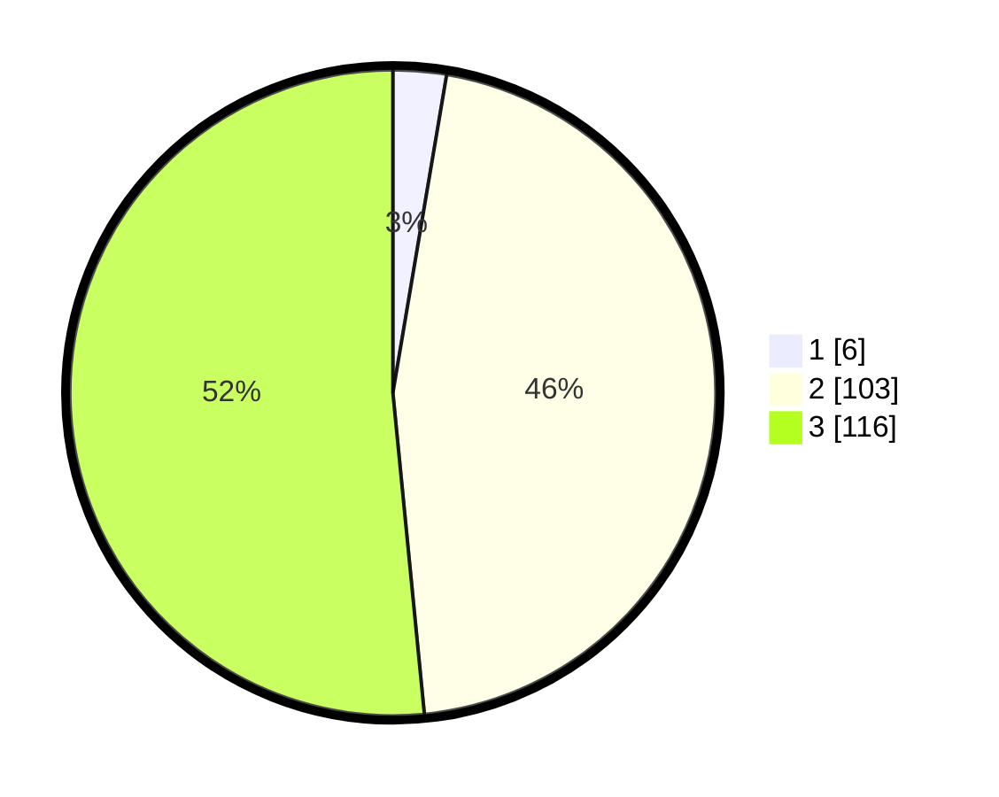

# Hasil

## Grafik

## Tabel

| No. | Nama Paslon    | Suara | Suara (raw) | Persentase |
|:--- |:-------------- | -----:| -----------:| ----------:|
| 1   | ANIES MUHAIMIN | 6     | [6][p-1]    | 2,67       |
| 2   | PRABOWO GIBRAN | 103   | [103][p-2]  | 45,78      |
| 3   | GANJAR MAHFUD  | 116   | [116][p-3]  | 51,56      |

[p-1]: https://github.com/gigit-pemilu/pemilu-2024-51-bali/blob/main/pilpres/hitung-suara/sub/51-bali/sub/02-tabanan/sub/05-tabanan/sub/2007-denbantas/sub/004-tps/sub/paslon-1.txt
[p-2]: https://github.com/gigit-pemilu/pemilu-2024-51-bali/blob/main/pilpres/hitung-suara/sub/51-bali/sub/02-tabanan/sub/05-tabanan/sub/2007-denbantas/sub/004-tps/sub/paslon-2.txt
[p-3]: https://github.com/gigit-pemilu/pemilu-2024-51-bali/blob/main/pilpres/hitung-suara/sub/51-bali/sub/02-tabanan/sub/05-tabanan/sub/2007-denbantas/sub/004-tps/sub/paslon-3.txt

## Foto C Plano

https://sirekap-obj-formc.kpu.go.id/2ac5/pemilu/ppwp/51/02/05/20/07/5102052007004-20240217-200202--2da21c5e-77a8-4b88-be1b-f2295bfee315.jpg

https://sirekap-obj-formc.kpu.go.id/2ac5/pemilu/ppwp/51/02/05/20/07/5102052007004-20240217-200204--7eae1f6b-c1d6-40aa-a462-3495308151a2.jpg

https://sirekap-obj-formc.kpu.go.id/2ac5/pemilu/ppwp/51/02/05/20/07/5102052007004-20240217-200203--c2ee38de-ff8b-4013-bc39-a9109cf7c603.jpg

## Metadata

| Key        | Value               |
| ---------- | ------------------- |
| Time Stamp | 2024-02-24 22:31:28 |

## DATA PEMILIH TETAP

Jumlah pemilih dalam DPT: **249**.
 * L: **127**.
 * P: **122**.

## DATA PENGGUNA HAK PILIH

Jumlah pengguna hak pilih dalam DPT: **221**.
 * L: **108**.
 * P: **113**.

Jumlah pengguna hak pilih dalam DPTb: **3**.
 * L: **1**.
 * P: **2**.

Jumlah pengguna hak pilih dalam DPK: **2**.
 * L: **1**.
 * P: **1**.

Jumlah pengguna hak pilih: **226**.
 * L: **110**.
 * P: **116**.

## JUMLAH SUARA SAH DAN TIDAK SAH

JUMLAH SELURUH SUARA SAH: **0**.

JUMLAH SUARA TIDAK SAH: **0**.

JUMLAH SELURUH SUARA SAH DAN SUARA TIDAK SAH: **0**.

