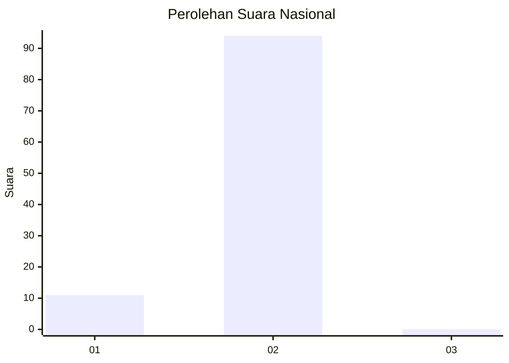
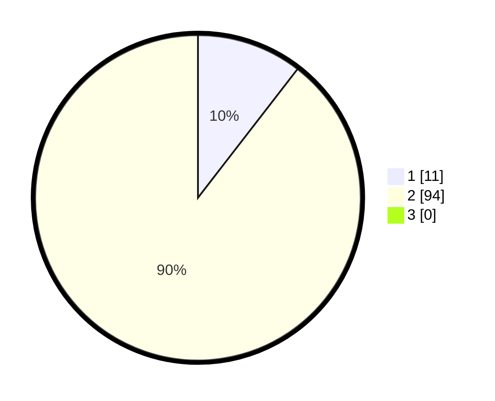

# Hasil

## Grafik

## Tabel

| No. | Nama Paslon    | Suara | Suara (raw) | Persentase |
|:--- |:-------------- | -----:| -----------:| ----------:|
| 1   | ANIES MUHAIMIN | 11    | [11][p-1]   | 10,48      |
| 2   | PRABOWO GIBRAN | 94    | [94][p-2]   | 89,52      |
| 3   | GANJAR MAHFUD  | 0     | [0][p-3]    | 0,00       |

[p-1]: https://github.com/gigit-pemilu/pemilu-2024/blob/main/pilpres/hitung-suara/sub/51-bali/sub/02-tabanan/sub/05-tabanan/sub/2007-denbantas/sub/006-tps/sub/paslon-1.txt
[p-2]: https://github.com/gigit-pemilu/pemilu-2024/blob/main/pilpres/hitung-suara/sub/51-bali/sub/02-tabanan/sub/05-tabanan/sub/2007-denbantas/sub/006-tps/sub/paslon-2.txt
[p-3]: https://github.com/gigit-pemilu/pemilu-2024/blob/main/pilpres/hitung-suara/sub/51-bali/sub/02-tabanan/sub/05-tabanan/sub/2007-denbantas/sub/006-tps/sub/paslon-3.txt

## Foto C Plano

https://sirekap-obj-formc.kpu.go.id/007f/pemilu/ppwp/51/02/05/20/07/5102052007006-20240214-200524--65b69162-0595-4728-985b-c9981c807f22.jpg

https://sirekap-obj-formc.kpu.go.id/007f/pemilu/ppwp/51/02/05/20/07/5102052007006-20240214-200624--f22803e0-99e7-4e54-abec-85b8695f7adc.jpg

https://sirekap-obj-formc.kpu.go.id/007f/pemilu/ppwp/51/02/05/20/07/5102052007006-20240214-200807--14b66ff1-3e1a-42a9-bc92-b8567ab50d80.jpg

## Metadata

| Key        | Value               |
| ---------- | ------------------- |
| Time Stamp | 2024-02-24 22:31:28 |

