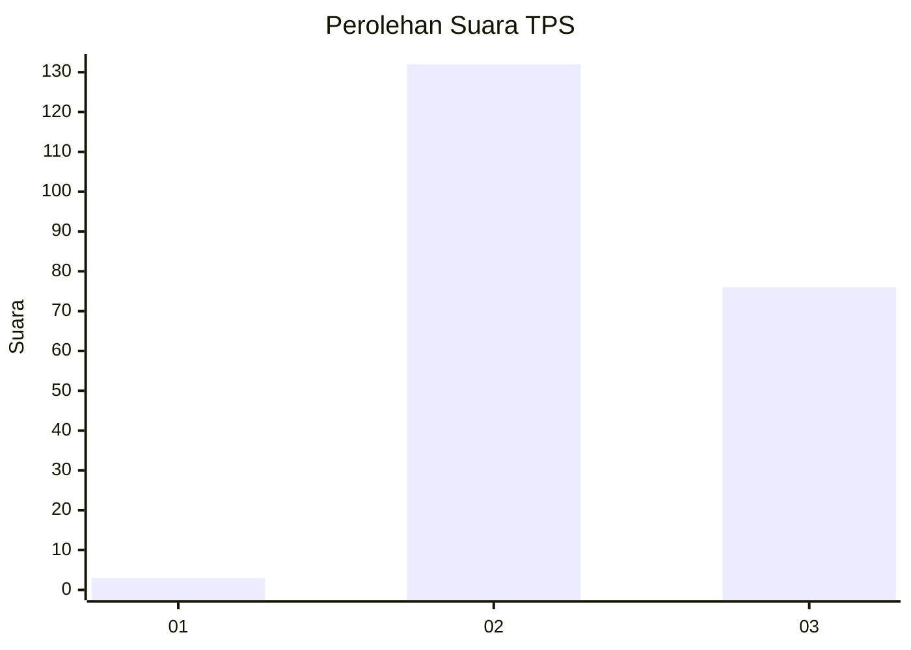
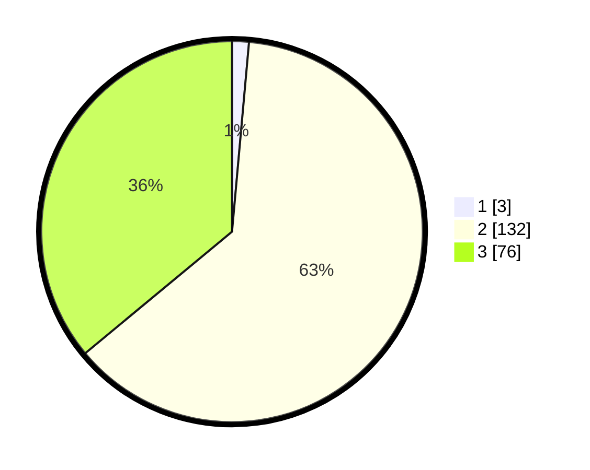

# Hasil

## Grafik

## Tabel

| No. | Nama Paslon    | Suara | Suara (raw) | Persentase |
|:--- |:-------------- | -----:| -----------:| ----------:|
| 1   | ANIES MUHAIMIN | 3     | [3][p-1]    | 1,42       |
| 2   | PRABOWO GIBRAN | 132   | [132][p-2]  | 62,56      |
| 3   | GANJAR MAHFUD  | 76    | [76][p-3]   | 36,02      |

[p-1]: https://github.com/gigit-pemilu/pemilu-2024-51-bali/blob/main/pilpres/hitung-suara/sub/51-bali/sub/02-tabanan/sub/05-tabanan/sub/2007-denbantas/sub/010-tps/sub/paslon-1.txt
[p-2]: https://github.com/gigit-pemilu/pemilu-2024-51-bali/blob/main/pilpres/hitung-suara/sub/51-bali/sub/02-tabanan/sub/05-tabanan/sub/2007-denbantas/sub/010-tps/sub/paslon-2.txt
[p-3]: https://github.com/gigit-pemilu/pemilu-2024-51-bali/blob/main/pilpres/hitung-suara/sub/51-bali/sub/02-tabanan/sub/05-tabanan/sub/2007-denbantas/sub/010-tps/sub/paslon-3.txt

## Foto C Plano

https://sirekap-obj-formc.kpu.go.id/8065/pemilu/ppwp/51/02/05/20/07/5102052007010-20240214-132420--55545aad-fcb7-4992-82b5-06567024916c.jpg

https://sirekap-obj-formc.kpu.go.id/8065/pemilu/ppwp/51/02/05/20/07/5102052007010-20240214-132743--2d17ceaa-0f84-41c6-836c-b08ccf2757ae.jpg

## Metadata

| Key        | Value               |
| ---------- | ------------------- |
| Time Stamp | 2024-02-15 22:30:27 |

