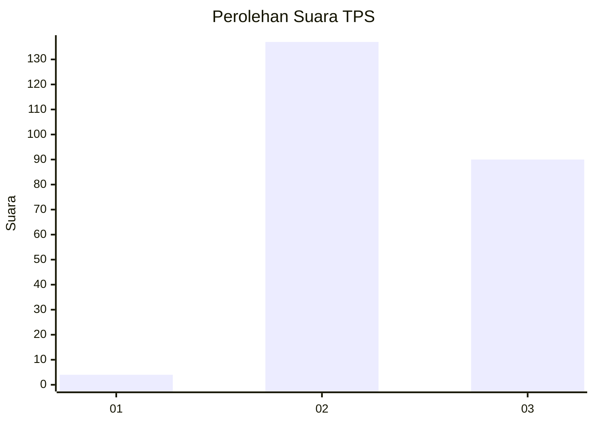
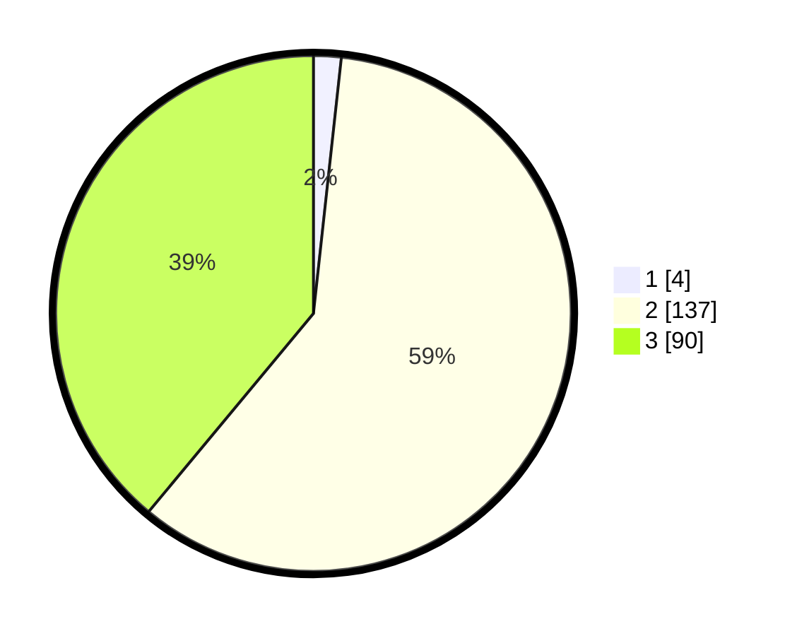

# Hasil

## Grafik

## Tabel

| No. | Nama Paslon    | Suara | Suara (raw) | Persentase |
|:--- |:-------------- | -----:| -----------:| ----------:|
| 1   | ANIES MUHAIMIN | 4     | [4][p-1]    | 1,73       |
| 2   | PRABOWO GIBRAN | 137   | [137][p-2]  | 59,31      |
| 3   | GANJAR MAHFUD  | 90    | [90][p-3]   | 38,96      |

[p-1]: https://github.com/gigit-pemilu/pemilu-2024-51-bali/blob/main/pilpres/hitung-suara/sub/51-bali/sub/02-tabanan/sub/05-tabanan/sub/2007-denbantas/sub/020-tps/sub/paslon-1.txt
[p-2]: https://github.com/gigit-pemilu/pemilu-2024-51-bali/blob/main/pilpres/hitung-suara/sub/51-bali/sub/02-tabanan/sub/05-tabanan/sub/2007-denbantas/sub/020-tps/sub/paslon-2.txt
[p-3]: https://github.com/gigit-pemilu/pemilu-2024-51-bali/blob/main/pilpres/hitung-suara/sub/51-bali/sub/02-tabanan/sub/05-tabanan/sub/2007-denbantas/sub/020-tps/sub/paslon-3.txt

## Foto C Plano

https://sirekap-obj-formc.kpu.go.id/88a1/pemilu/ppwp/51/02/05/20/07/5102052007020-20240214-191001--20ed2ada-9d69-4e81-9147-a6e8b8e6cedf.jpg

https://sirekap-obj-formc.kpu.go.id/88a1/pemilu/ppwp/51/02/05/20/07/5102052007020-20240214-191200--e96a89c8-5a8b-4c80-b5b8-f816193d4e6b.jpg

https://sirekap-obj-formc.kpu.go.id/88a1/pemilu/ppwp/51/02/05/20/07/5102052007020-20240214-191334--00a81f58-a754-46dc-b9c1-2fa3972705f4.jpg

## Metadata

| Key        | Value               |
| ---------- | ------------------- |
| Time Stamp | 2024-02-15 22:30:27 |

