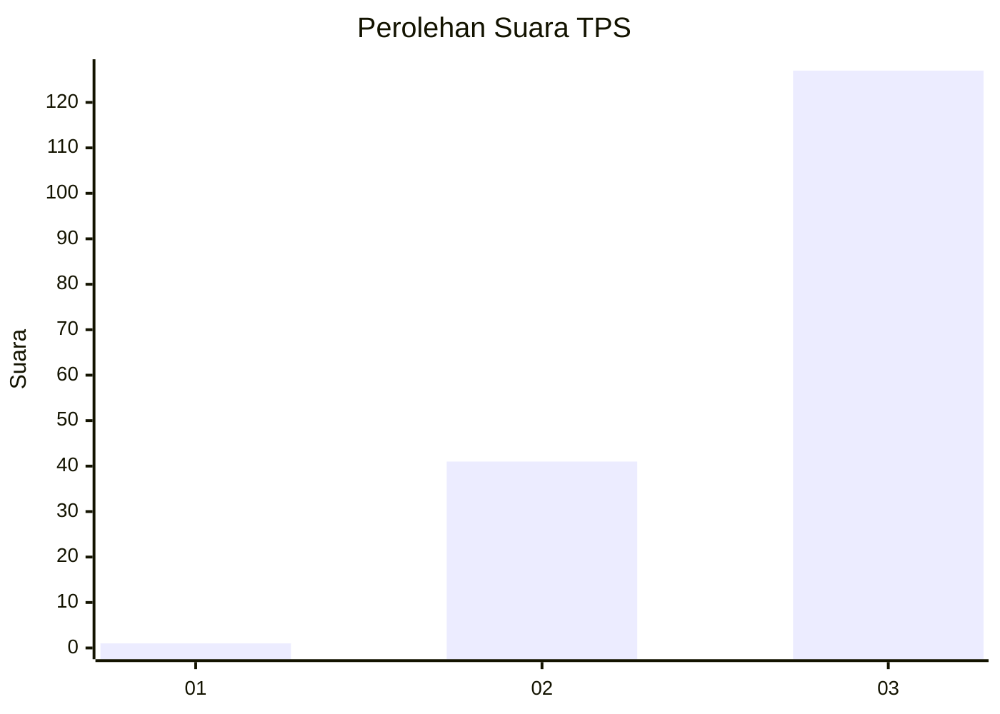
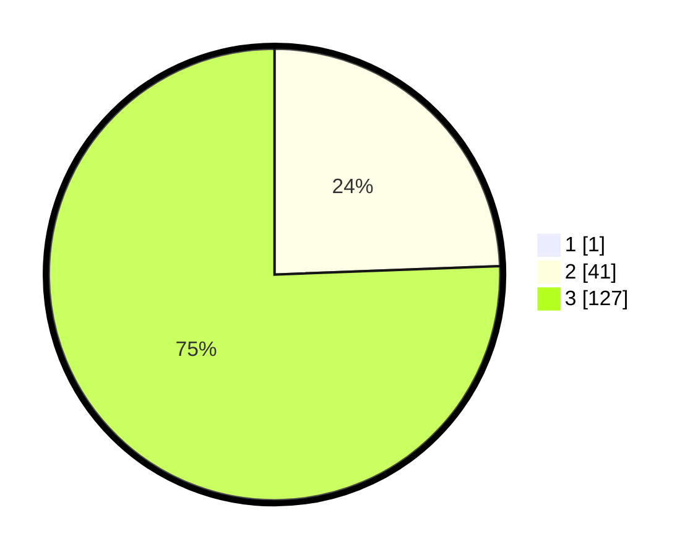

# Hasil

## Grafik

## Tabel

| No. | Nama Paslon    | Suara | Suara (raw) | Persentase |
|:--- |:-------------- | -----:| -----------:| ----------:|
| 1   | ANIES MUHAIMIN | 1     | [1][p-1]    | 0,59       |
| 2   | PRABOWO GIBRAN | 41    | [41][p-2]   | 24,26      |
| 3   | GANJAR MAHFUD  | 127   | [127][p-3]  | 75,15      |

[p-1]: https://github.com/gigit-pemilu/pemilu-2024-51-bali/blob/main/pilpres/hitung-suara/sub/51-bali/sub/02-tabanan/sub/05-tabanan/sub/2008-subamia/sub/002-tps/sub/paslon-1.txt
[p-2]: https://github.com/gigit-pemilu/pemilu-2024-51-bali/blob/main/pilpres/hitung-suara/sub/51-bali/sub/02-tabanan/sub/05-tabanan/sub/2008-subamia/sub/002-tps/sub/paslon-2.txt
[p-3]: https://github.com/gigit-pemilu/pemilu-2024-51-bali/blob/main/pilpres/hitung-suara/sub/51-bali/sub/02-tabanan/sub/05-tabanan/sub/2008-subamia/sub/002-tps/sub/paslon-3.txt

## Foto C Plano

https://sirekap-obj-formc.kpu.go.id/8f40/pemilu/ppwp/51/02/05/20/08/5102052008002-20240217-183947--3d2b1d97-e7aa-41da-851f-a5f524b7593c.jpg

https://sirekap-obj-formc.kpu.go.id/8f40/pemilu/ppwp/51/02/05/20/08/5102052008002-20240217-183949--e7ad7c0e-8fbd-4fc4-b855-784926a0f8c5.jpg

https://sirekap-obj-formc.kpu.go.id/8f40/pemilu/ppwp/51/02/05/20/08/5102052008002-20240217-183948--2ab4475e-2b6f-4cc8-b6a9-7e0c400b9679.jpg

## Metadata

| Key        | Value               |
| ---------- | ------------------- |
| Time Stamp | 2024-02-25 12:00:00 |

## DATA PEMILIH TETAP

Jumlah pemilih dalam DPT: **190**.
 * L: **92**.
 * P: **98**.

## DATA PENGGUNA HAK PILIH

Jumlah pengguna hak pilih dalam DPT: **170**.
 * L: **83**.
 * P: **87**.

Jumlah pengguna hak pilih dalam DPTb: **2**.
 * L: **1**.
 * P: **1**.

Jumlah pengguna hak pilih dalam DPK: **0**.
 * L: **0**.
 * P: **0**.

Jumlah pengguna hak pilih: **172**.
 * L: **84**.
 * P: **88**.

## JUMLAH SUARA SAH DAN TIDAK SAH

JUMLAH SELURUH SUARA SAH: **0**.

JUMLAH SUARA TIDAK SAH: **0**.

JUMLAH SELURUH SUARA SAH DAN SUARA TIDAK SAH: **0**.

