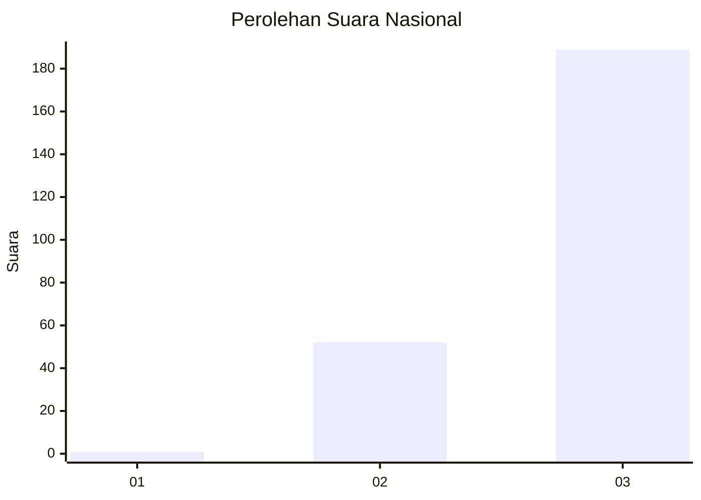
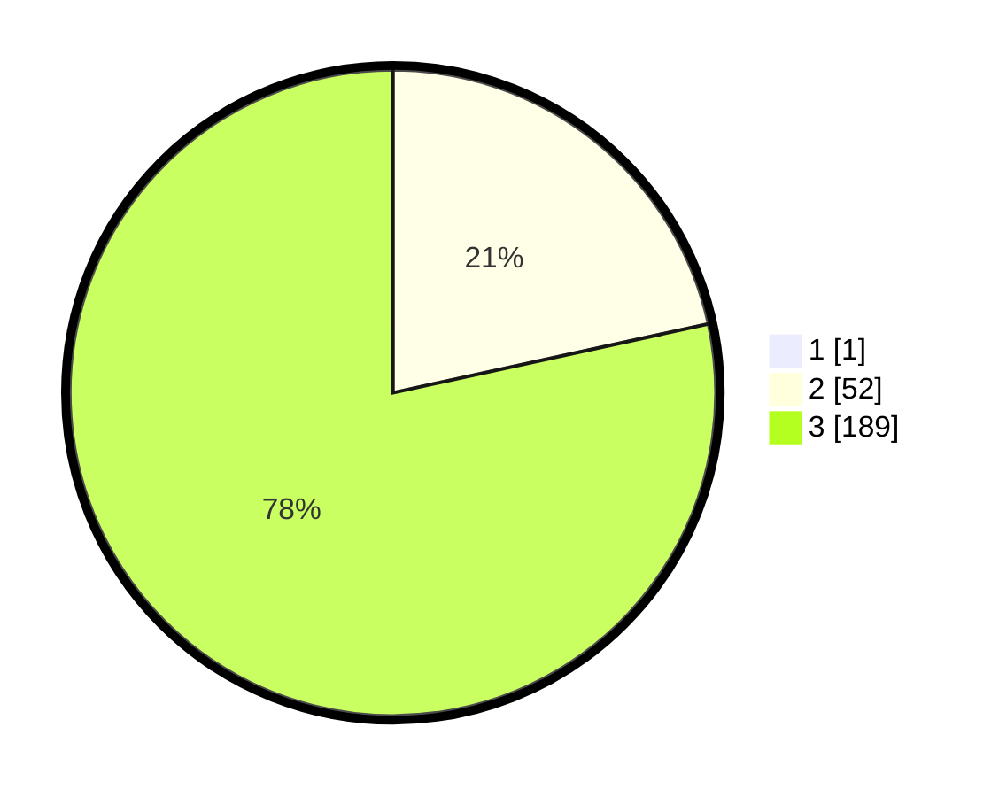

# Hasil

## Grafik

## Tabel

| No. | Nama Paslon    | Suara | Suara (raw) | Persentase |
|:--- |:-------------- | -----:| -----------:| ----------:|
| 1   | ANIES MUHAIMIN | 1     | [1][p-1]    | 0,41       |
| 2   | PRABOWO GIBRAN | 52    | [52][p-2]   | 21,49      |
| 3   | GANJAR MAHFUD  | 189   | [189][p-3]  | 78,10      |

[p-1]: https://github.com/gigit-pemilu/pemilu-2024/blob/main/pilpres/hitung-suara/sub/51-bali/sub/02-tabanan/sub/05-tabanan/sub/2008-subamia/sub/003-tps/sub/paslon-1.txt
[p-2]: https://github.com/gigit-pemilu/pemilu-2024/blob/main/pilpres/hitung-suara/sub/51-bali/sub/02-tabanan/sub/05-tabanan/sub/2008-subamia/sub/003-tps/sub/paslon-2.txt
[p-3]: https://github.com/gigit-pemilu/pemilu-2024/blob/main/pilpres/hitung-suara/sub/51-bali/sub/02-tabanan/sub/05-tabanan/sub/2008-subamia/sub/003-tps/sub/paslon-3.txt

## Foto C Plano

https://sirekap-obj-formc.kpu.go.id/c07d/pemilu/ppwp/51/02/05/20/08/5102052008003-20240216-191550--dad73fd9-e9c1-48a2-ae8d-9acceeccf570.jpg

https://sirekap-obj-formc.kpu.go.id/c07d/pemilu/ppwp/51/02/05/20/08/5102052008003-20240216-191551--9ee3be28-20cf-4967-9971-86ef2b9bf10a.jpg

https://sirekap-obj-formc.kpu.go.id/c07d/pemilu/ppwp/51/02/05/20/08/5102052008003-20240216-191550--4ccddcb0-a088-4b18-bb8b-b9d1e0a21cbf.jpg

## Metadata

| Key        | Value               |
| ---------- | ------------------- |
| Time Stamp | 2024-02-21 17:00:00 |

## DATA PEMILIH TETAP

Jumlah pemilih dalam DPT: **254**.
 * L: **125**.
 * P: **129**.

## DATA PENGGUNA HAK PILIH

Jumlah pengguna hak pilih dalam DPT: **242**.
 * L: **121**.
 * P: **121**.

Jumlah pengguna hak pilih dalam DPTb: **3**.
 * L: **2**.
 * P: **1**.

Jumlah pengguna hak pilih dalam DPK: **0**.
 * L: **0**.
 * P: **0**.

Jumlah pengguna hak pilih: **245**.
 * L: **123**.
 * P: **122**.

## JUMLAH SUARA SAH DAN TIDAK SAH

JUMLAH SELURUH SUARA SAH: **242**.

JUMLAH SUARA TIDAK SAH: **3**.

JUMLAH SELURUH SUARA SAH DAN SUARA TIDAK SAH: **245**.

