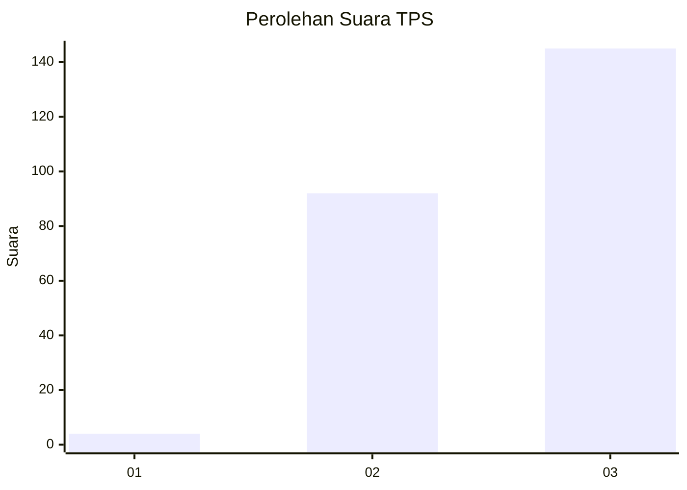
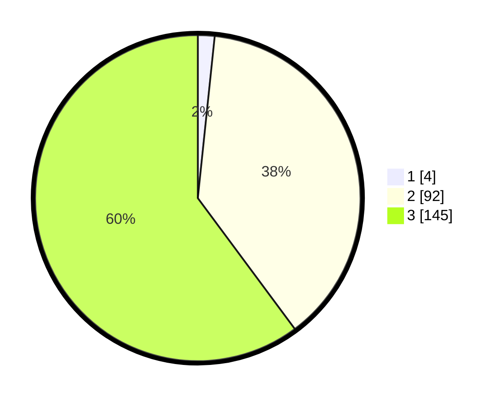

# Hasil

## Grafik

## Tabel

| No. | Nama Paslon    | Suara | Suara (raw) | Persentase |
|:--- |:-------------- | -----:| -----------:| ----------:|
| 1   | ANIES MUHAIMIN | 4     | [4][p-1]    | 1,66       |
| 2   | PRABOWO GIBRAN | 92    | [92][p-2]   | 38,17      |
| 3   | GANJAR MAHFUD  | 145   | [145][p-3]  | 60,17      |

[p-1]: https://github.com/gigit-pemilu/pemilu-2024-51-bali/blob/main/pilpres/hitung-suara/sub/51-bali/sub/02-tabanan/sub/05-tabanan/sub/2008-subamia/sub/004-tps/sub/paslon-1.txt
[p-2]: https://github.com/gigit-pemilu/pemilu-2024-51-bali/blob/main/pilpres/hitung-suara/sub/51-bali/sub/02-tabanan/sub/05-tabanan/sub/2008-subamia/sub/004-tps/sub/paslon-2.txt
[p-3]: https://github.com/gigit-pemilu/pemilu-2024-51-bali/blob/main/pilpres/hitung-suara/sub/51-bali/sub/02-tabanan/sub/05-tabanan/sub/2008-subamia/sub/004-tps/sub/paslon-3.txt

## Foto C Plano

https://sirekap-obj-formc.kpu.go.id/fef1/pemilu/ppwp/51/02/05/20/08/5102052008004-20240216-143034--13ea00a8-02a2-48fc-91cc-d1056e0cda6a.jpg

https://sirekap-obj-formc.kpu.go.id/fef1/pemilu/ppwp/51/02/05/20/08/5102052008004-20240216-143036--73432bc0-2d15-4402-882b-6d54bb4f6785.jpg

https://sirekap-obj-formc.kpu.go.id/fef1/pemilu/ppwp/51/02/05/20/08/5102052008004-20240216-143035--5f94c7fb-22e0-4495-a33a-45aafac42c94.jpg

## Metadata

| Key        | Value               |
| ---------- | ------------------- |
| Time Stamp | 2024-02-22 21:00:00 |

## DATA PEMILIH TETAP

Jumlah pemilih dalam DPT: **278**.
 * L: **133**.
 * P: **145**.

## DATA PENGGUNA HAK PILIH

Jumlah pengguna hak pilih dalam DPT: **246**.
 * L: **124**.
 * P: **122**.

Jumlah pengguna hak pilih dalam DPTb: **3**.
 * L: **1**.
 * P: **2**.

Jumlah pengguna hak pilih dalam DPK: **0**.
 * L: **0**.
 * P: **0**.

Jumlah pengguna hak pilih: **249**.
 * L: **125**.
 * P: **124**.

## JUMLAH SUARA SAH DAN TIDAK SAH

JUMLAH SELURUH SUARA SAH: **241**.

JUMLAH SUARA TIDAK SAH: **8**.

JUMLAH SELURUH SUARA SAH DAN SUARA TIDAK SAH: **249**.

