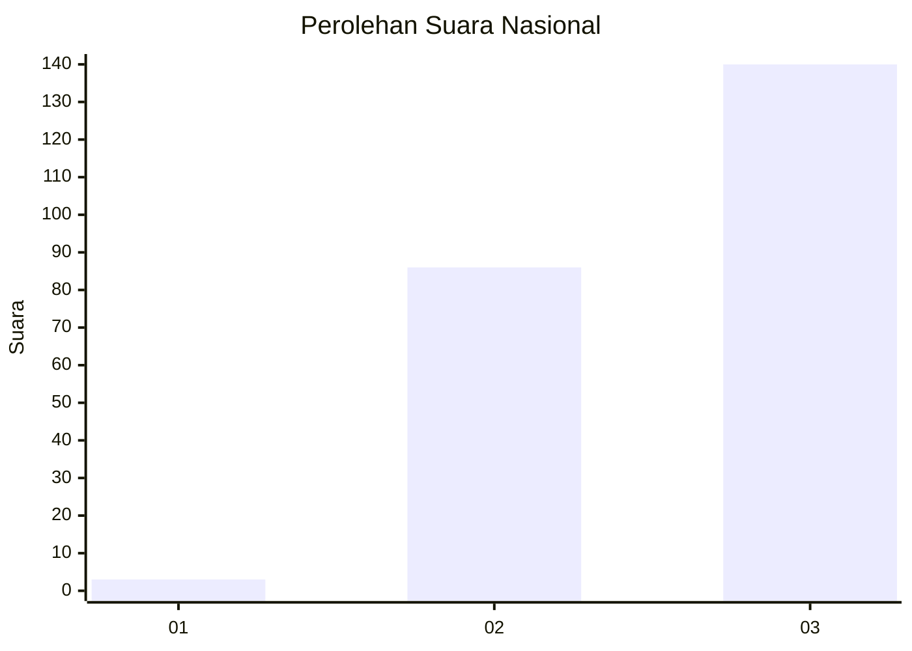
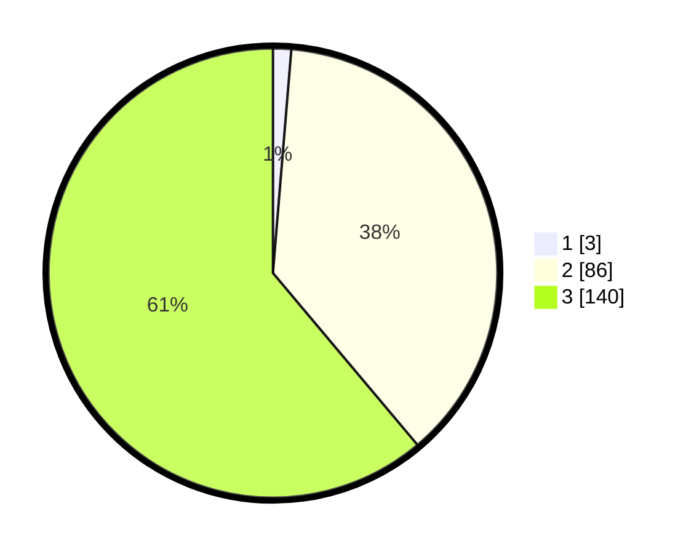

# Hasil

## Grafik

## Tabel

| No. | Nama Paslon    | Suara | Suara (raw) | Persentase |
|:--- |:-------------- | -----:| -----------:| ----------:|
| 1   | ANIES MUHAIMIN | 3     | [3][p-1]    | 1,31       |
| 2   | PRABOWO GIBRAN | 86    | [86][p-2]   | 37,55      |
| 3   | GANJAR MAHFUD  | 140   | [140][p-3]  | 61,14      |

[p-1]: https://github.com/gigit-pemilu/pemilu-2024/blob/main/pilpres/hitung-suara/sub/51-bali/sub/02-tabanan/sub/05-tabanan/sub/2008-subamia/sub/006-tps/sub/paslon-1.txt
[p-2]: https://github.com/gigit-pemilu/pemilu-2024/blob/main/pilpres/hitung-suara/sub/51-bali/sub/02-tabanan/sub/05-tabanan/sub/2008-subamia/sub/006-tps/sub/paslon-2.txt
[p-3]: https://github.com/gigit-pemilu/pemilu-2024/blob/main/pilpres/hitung-suara/sub/51-bali/sub/02-tabanan/sub/05-tabanan/sub/2008-subamia/sub/006-tps/sub/paslon-3.txt

## Foto C Plano

https://sirekap-obj-formc.kpu.go.id/f51c/pemilu/ppwp/51/02/05/20/08/5102052008006-20240216-172307--64005c40-2789-4b79-882b-0bdc0bb21baf.jpg

https://sirekap-obj-formc.kpu.go.id/f51c/pemilu/ppwp/51/02/05/20/08/5102052008006-20240216-172309--33358cd2-d54a-4335-b976-b5021570de14.jpg

https://sirekap-obj-formc.kpu.go.id/f51c/pemilu/ppwp/51/02/05/20/08/5102052008006-20240216-172308--e12f3a24-d6f4-4d6a-9200-752641274523.jpg

## Metadata

| Key        | Value               |
| ---------- | ------------------- |
| Time Stamp | 2024-02-21 15:00:00 |

## DATA PEMILIH TETAP

Jumlah pemilih dalam DPT: **242**.
 * L: **118**.
 * P: **124**.

## DATA PENGGUNA HAK PILIH

Jumlah pengguna hak pilih dalam DPT: **228**.
 * L: **112**.
 * P: **116**.

Jumlah pengguna hak pilih dalam DPTb: **1**.
 * L: **0**.
 * P: **1**.

Jumlah pengguna hak pilih dalam DPK: **4**.
 * L: **2**.
 * P: **2**.

Jumlah pengguna hak pilih: **233**.
 * L: **114**.
 * P: **119**.

## JUMLAH SUARA SAH DAN TIDAK SAH

JUMLAH SELURUH SUARA SAH: **229**.

JUMLAH SUARA TIDAK SAH: **4**.

JUMLAH SELURUH SUARA SAH DAN SUARA TIDAK SAH: **233**.

