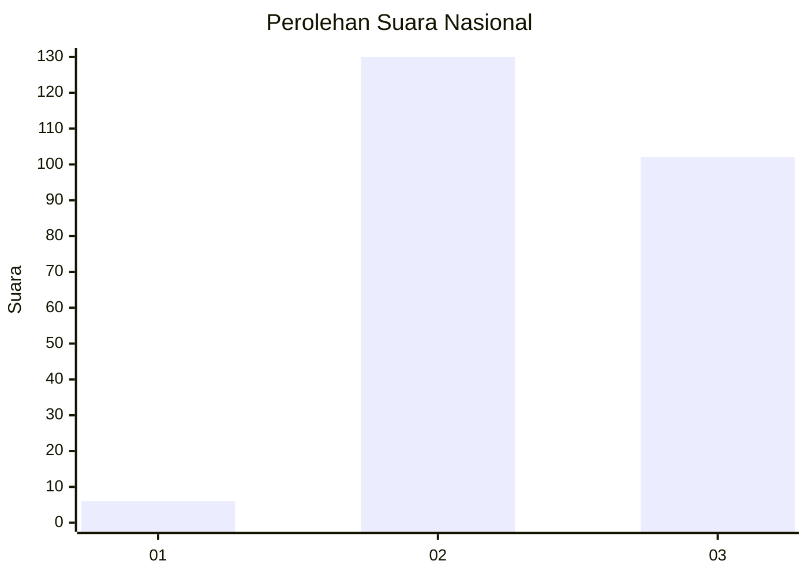
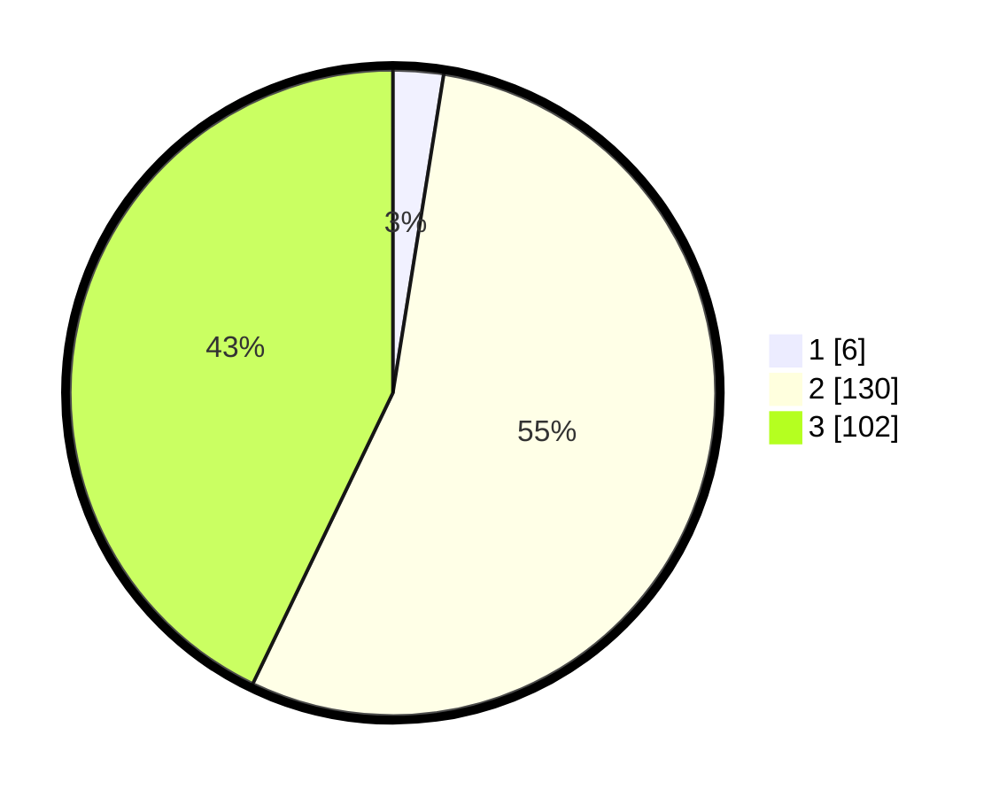

# Hasil

## Grafik

## Tabel

| No. | Nama Paslon    | Suara | Suara (raw) | Persentase |
|:--- |:-------------- | -----:| -----------:| ----------:|
| 1   | ANIES MUHAIMIN | 6     | [6][p-1]    | 2,52       |
| 2   | PRABOWO GIBRAN | 130   | [130][p-2]  | 54,62      |
| 3   | GANJAR MAHFUD  | 102   | [102][p-3]  | 42,86      |

[p-1]: https://github.com/gigit-pemilu/pemilu-2024/blob/main/pilpres/hitung-suara/sub/51-bali/sub/02-tabanan/sub/05-tabanan/sub/2009-wanasari/sub/002-tps/sub/paslon-1.txt
[p-2]: https://github.com/gigit-pemilu/pemilu-2024/blob/main/pilpres/hitung-suara/sub/51-bali/sub/02-tabanan/sub/05-tabanan/sub/2009-wanasari/sub/002-tps/sub/paslon-2.txt
[p-3]: https://github.com/gigit-pemilu/pemilu-2024/blob/main/pilpres/hitung-suara/sub/51-bali/sub/02-tabanan/sub/05-tabanan/sub/2009-wanasari/sub/002-tps/sub/paslon-3.txt

## Foto C Plano

https://sirekap-obj-formc.kpu.go.id/ddfe/pemilu/ppwp/51/02/05/20/09/5102052009002-20240215-005724--1c1784e7-d320-4661-b280-45b7165955e9.jpg

https://sirekap-obj-formc.kpu.go.id/ddfe/pemilu/ppwp/51/02/05/20/09/5102052009002-20240215-005826--11861153-42c7-49e8-be6c-fa1bd24198f9.jpg

https://sirekap-obj-formc.kpu.go.id/ddfe/pemilu/ppwp/51/02/05/20/09/5102052009002-20240215-010016--344ed1dd-5393-4e24-b0c8-0f57a1276c15.jpg

## Metadata

| Key        | Value               |
| ---------- | ------------------- |
| Time Stamp | 2024-02-15 22:30:27 |

