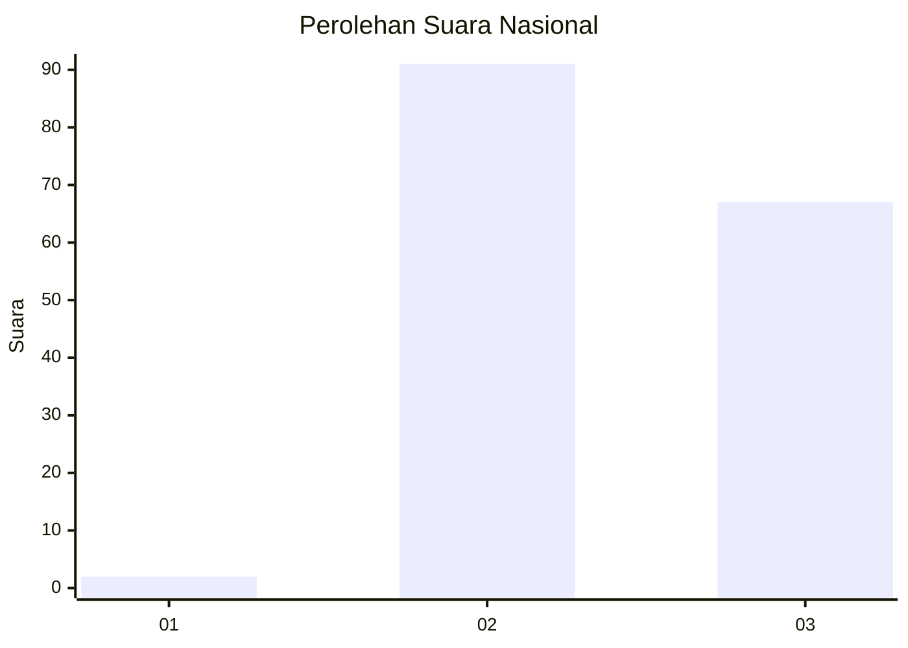
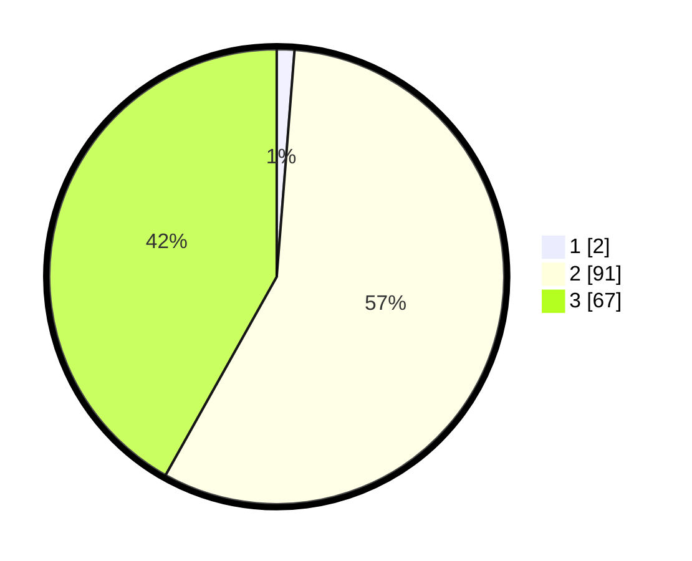

# Hasil

## Grafik

## Tabel

| No. | Nama Paslon    | Suara | Suara (raw) | Persentase |
|:--- |:-------------- | -----:| -----------:| ----------:|
| 1   | ANIES MUHAIMIN | 2     | [2][p-1]    | 1,25       |
| 2   | PRABOWO GIBRAN | 91    | [91][p-2]   | 56,88      |
| 3   | GANJAR MAHFUD  | 67    | [67][p-3]   | 41,88      |

[p-1]: https://github.com/gigit-pemilu/pemilu-2024/blob/main/pilpres/hitung-suara/sub/51-bali/sub/02-tabanan/sub/05-tabanan/sub/2009-wanasari/sub/004-tps/sub/paslon-1.txt
[p-2]: https://github.com/gigit-pemilu/pemilu-2024/blob/main/pilpres/hitung-suara/sub/51-bali/sub/02-tabanan/sub/05-tabanan/sub/2009-wanasari/sub/004-tps/sub/paslon-2.txt
[p-3]: https://github.com/gigit-pemilu/pemilu-2024/blob/main/pilpres/hitung-suara/sub/51-bali/sub/02-tabanan/sub/05-tabanan/sub/2009-wanasari/sub/004-tps/sub/paslon-3.txt

## Foto C Plano

https://sirekap-obj-formc.kpu.go.id/df85/pemilu/ppwp/51/02/05/20/09/5102052009004-20240214-140927--07e30561-2e1c-4d41-847c-9127955b5a64.jpg

https://sirekap-obj-formc.kpu.go.id/df85/pemilu/ppwp/51/02/05/20/09/5102052009004-20240214-141044--558416dc-f1c5-4f3d-bed3-af105effd715.jpg

https://sirekap-obj-formc.kpu.go.id/df85/pemilu/ppwp/51/02/05/20/09/5102052009004-20240214-141233--3fb89ea7-8541-4ac9-b20d-c195c72102c4.jpg

## Metadata

| Key        | Value               |
| ---------- | ------------------- |
| Time Stamp | 2024-02-24 22:31:28 |

