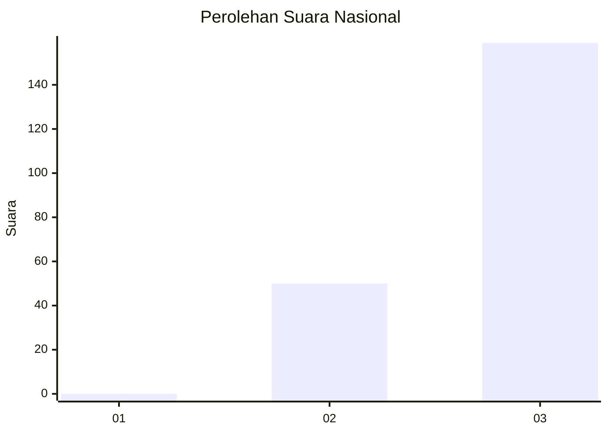
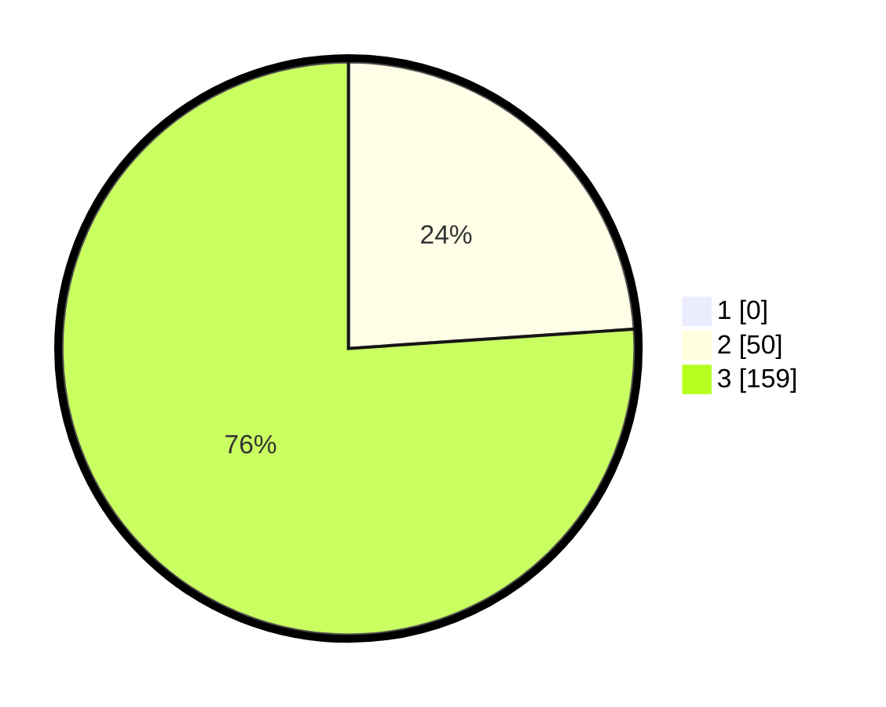

# Hasil

## Grafik

## Tabel

| No. | Nama Paslon    | Suara | Suara (raw) | Persentase |
|:--- |:-------------- | -----:| -----------:| ----------:|
| 1   | ANIES MUHAIMIN | 0     | [0][p-1]    | 0,00       |
| 2   | PRABOWO GIBRAN | 50    | [50][p-2]   | 23,92      |
| 3   | GANJAR MAHFUD  | 159   | [159][p-3]  | 76,08      |

[p-1]: https://github.com/gigit-pemilu/pemilu-2024/blob/main/pilpres/hitung-suara/sub/51-bali/sub/02-tabanan/sub/05-tabanan/sub/2010-tunjuk/sub/001-tps/sub/paslon-1.txt
[p-2]: https://github.com/gigit-pemilu/pemilu-2024/blob/main/pilpres/hitung-suara/sub/51-bali/sub/02-tabanan/sub/05-tabanan/sub/2010-tunjuk/sub/001-tps/sub/paslon-2.txt
[p-3]: https://github.com/gigit-pemilu/pemilu-2024/blob/main/pilpres/hitung-suara/sub/51-bali/sub/02-tabanan/sub/05-tabanan/sub/2010-tunjuk/sub/001-tps/sub/paslon-3.txt

## Foto C Plano

https://sirekap-obj-formc.kpu.go.id/b55f/pemilu/ppwp/51/02/05/20/10/5102052010001-20240215-161933--b6f9e4e8-74fa-49a8-9830-17a023c2ad0e.jpg

https://sirekap-obj-formc.kpu.go.id/b55f/pemilu/ppwp/51/02/05/20/10/5102052010001-20240215-161939--b2fccbdf-44ee-4871-b895-a4192a419333.jpg

https://sirekap-obj-formc.kpu.go.id/b55f/pemilu/ppwp/51/02/05/20/10/5102052010001-20240215-161945--0e2ba0f2-9623-4b6d-9c45-e64b1c4b633b.jpg

## Metadata

| Key        | Value               |
| ---------- | ------------------- |
| Time Stamp | 2024-02-16 21:01:00 |

## DATA PEMILIH TETAP

Jumlah pemilih dalam DPT: **236**.
 * L: **122**.
 * P: **114**.

## DATA PENGGUNA HAK PILIH

Jumlah pengguna hak pilih dalam DPT: **215**.
 * L: **106**.
 * P: **109**.

Jumlah pengguna hak pilih dalam DPTb: **0**.
 * L: **0**.
 * P: **0**.

Jumlah pengguna hak pilih dalam DPK: **0**.
 * L: **0**.
 * P: **0**.

Jumlah pengguna hak pilih: **215**.
 * L: **106**.
 * P: **109**.

## JUMLAH SUARA SAH DAN TIDAK SAH

JUMLAH SELURUH SUARA SAH: **209**.

JUMLAH SUARA TIDAK SAH: **6**.

JUMLAH SELURUH SUARA SAH DAN SUARA TIDAK SAH: **215**.

