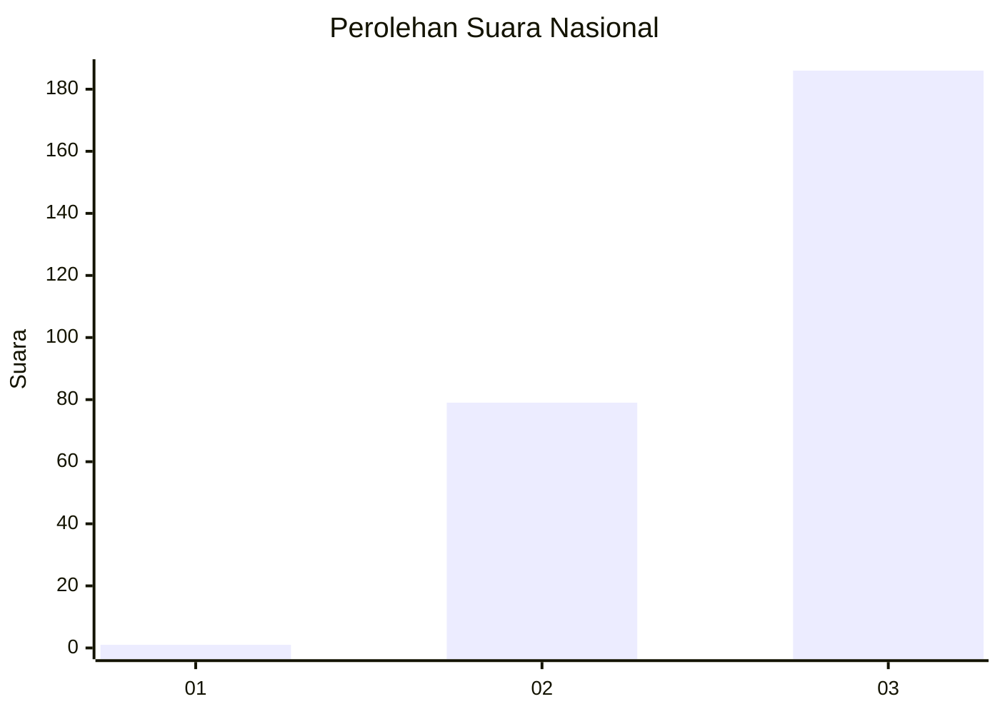
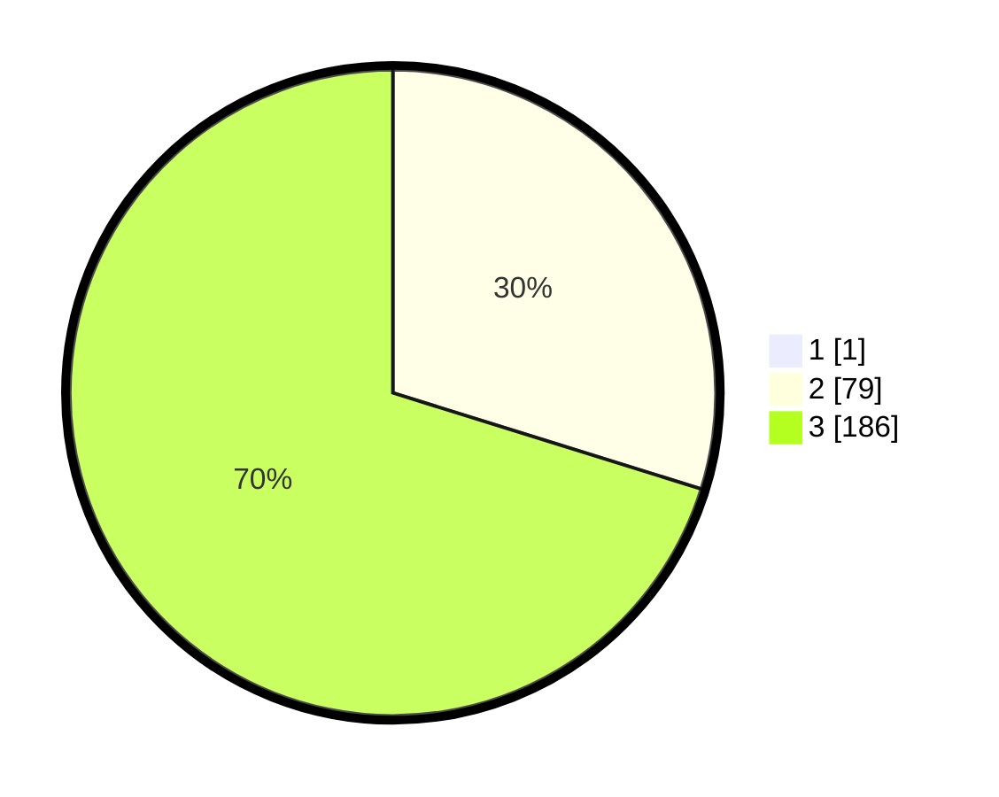

# Hasil

## Grafik

## Tabel

| No. | Nama Paslon    | Suara | Suara (raw) | Persentase |
|:--- |:-------------- | -----:| -----------:| ----------:|
| 1   | ANIES MUHAIMIN | 1     | [1][p-1]    | 0,38       |
| 2   | PRABOWO GIBRAN | 79    | [79][p-2]   | 29,70      |
| 3   | GANJAR MAHFUD  | 186   | [186][p-3]  | 69,92      |

[p-1]: https://github.com/gigit-pemilu/pemilu-2024/blob/main/pilpres/hitung-suara/sub/51-bali/sub/02-tabanan/sub/05-tabanan/sub/2010-tunjuk/sub/003-tps/sub/paslon-1.txt
[p-2]: https://github.com/gigit-pemilu/pemilu-2024/blob/main/pilpres/hitung-suara/sub/51-bali/sub/02-tabanan/sub/05-tabanan/sub/2010-tunjuk/sub/003-tps/sub/paslon-2.txt
[p-3]: https://github.com/gigit-pemilu/pemilu-2024/blob/main/pilpres/hitung-suara/sub/51-bali/sub/02-tabanan/sub/05-tabanan/sub/2010-tunjuk/sub/003-tps/sub/paslon-3.txt

## Foto C Plano

https://sirekap-obj-formc.kpu.go.id/c5fb/pemilu/ppwp/51/02/05/20/10/5102052010003-20240216-053121--8022bb2e-3d4b-4240-a041-b7f55b628a75.jpg

https://sirekap-obj-formc.kpu.go.id/c5fb/pemilu/ppwp/51/02/05/20/10/5102052010003-20240216-053123--b4cfa8c8-da9b-4df1-ac44-16985fdc39fb.jpg

https://sirekap-obj-formc.kpu.go.id/c5fb/pemilu/ppwp/51/02/05/20/10/5102052010003-20240216-053122--8efac923-0ce1-46ac-833b-16508c376cc3.jpg

## Metadata

| Key        | Value               |
| ---------- | ------------------- |
| Time Stamp | 2024-02-16 10:30:29 |

## DATA PEMILIH TETAP

Jumlah pemilih dalam DPT: **287**.
 * L: **148**.
 * P: **139**.

## DATA PENGGUNA HAK PILIH

Jumlah pengguna hak pilih dalam DPT: **262**.
 * L: **132**.
 * P: **130**.

Jumlah pengguna hak pilih dalam DPTb: **4**.
 * L: **1**.
 * P: **3**.

Jumlah pengguna hak pilih dalam DPK: **0**.
 * L: **0**.
 * P: **0**.

Jumlah pengguna hak pilih: **266**.
 * L: **133**.
 * P: **133**.

## JUMLAH SUARA SAH DAN TIDAK SAH

JUMLAH SELURUH SUARA SAH: **266**.

JUMLAH SUARA TIDAK SAH: **0**.

JUMLAH SELURUH SUARA SAH DAN SUARA TIDAK SAH: **266**.

