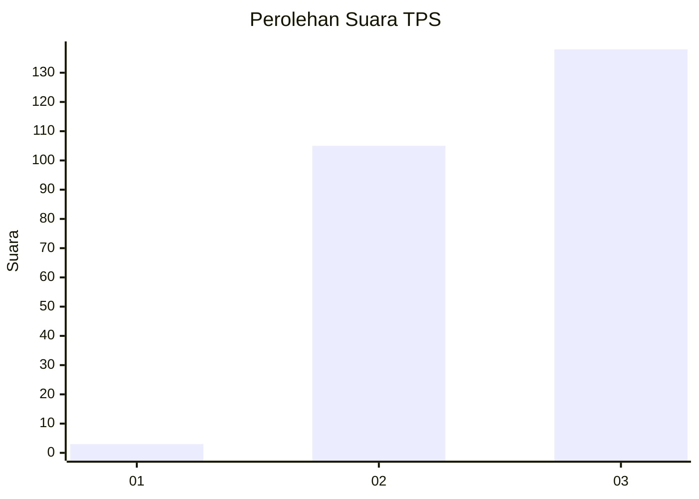
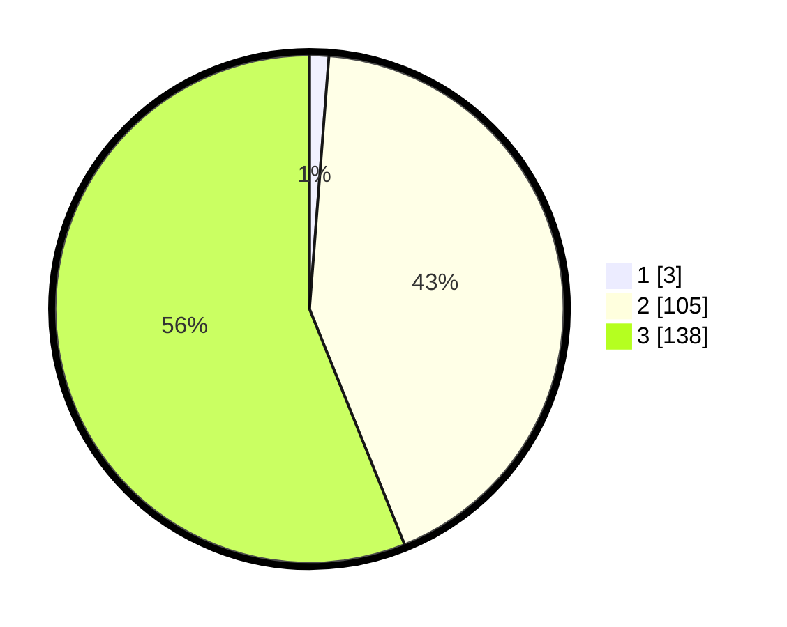

# Hasil

## Grafik

## Tabel

| No. | Nama Paslon    | Suara | Suara (raw) | Persentase |
|:--- |:-------------- | -----:| -----------:| ----------:|
| 1   | ANIES MUHAIMIN | 3     | [3][p-1]    | 1,22       |
| 2   | PRABOWO GIBRAN | 105   | [105][p-2]  | 42,68      |
| 3   | GANJAR MAHFUD  | 138   | [138][p-3]  | 56,10      |

[p-1]: https://github.com/gigit-pemilu/pemilu-2024-51-bali/blob/main/pilpres/hitung-suara/sub/51-bali/sub/02-tabanan/sub/05-tabanan/sub/2010-tunjuk/sub/004-tps/sub/paslon-1.txt
[p-2]: https://github.com/gigit-pemilu/pemilu-2024-51-bali/blob/main/pilpres/hitung-suara/sub/51-bali/sub/02-tabanan/sub/05-tabanan/sub/2010-tunjuk/sub/004-tps/sub/paslon-2.txt
[p-3]: https://github.com/gigit-pemilu/pemilu-2024-51-bali/blob/main/pilpres/hitung-suara/sub/51-bali/sub/02-tabanan/sub/05-tabanan/sub/2010-tunjuk/sub/004-tps/sub/paslon-3.txt

## Foto C Plano

https://sirekap-obj-formc.kpu.go.id/0311/pemilu/ppwp/51/02/05/20/10/5102052010004-20240214-132133--7c43104e-c519-4564-8204-81e7c0d7d99b.jpg

https://sirekap-obj-formc.kpu.go.id/0311/pemilu/ppwp/51/02/05/20/10/5102052010004-20240214-132213--2d97098e-2701-4198-9a12-3ed77a7fd3a0.jpg

https://sirekap-obj-formc.kpu.go.id/0311/pemilu/ppwp/51/02/05/20/10/5102052010004-20240214-132231--466c619b-6721-48c2-9831-ca5a18765e1d.jpg

## Metadata

| Key        | Value               |
| ---------- | ------------------- |
| Time Stamp | 2024-02-14 21:46:01 |

## DATA PEMILIH TETAP

Jumlah pemilih dalam DPT: **286**.
 * L: **144**.
 * P: **142**.

## DATA PENGGUNA HAK PILIH

Jumlah pengguna hak pilih dalam DPT: **251**.
 * L: **124**.
 * P: **127**.

Jumlah pengguna hak pilih dalam DPTb: **2**.
 * L: **1**.
 * P: **1**.

Jumlah pengguna hak pilih dalam DPK: **0**.
 * L: **0**.
 * P: **0**.

Jumlah pengguna hak pilih: **253**.
 * L: **125**.
 * P: **128**.

## JUMLAH SUARA SAH DAN TIDAK SAH

JUMLAH SELURUH SUARA SAH: **246**.

JUMLAH SUARA TIDAK SAH: **7**.

JUMLAH SELURUH SUARA SAH DAN SUARA TIDAK SAH: **253**.

