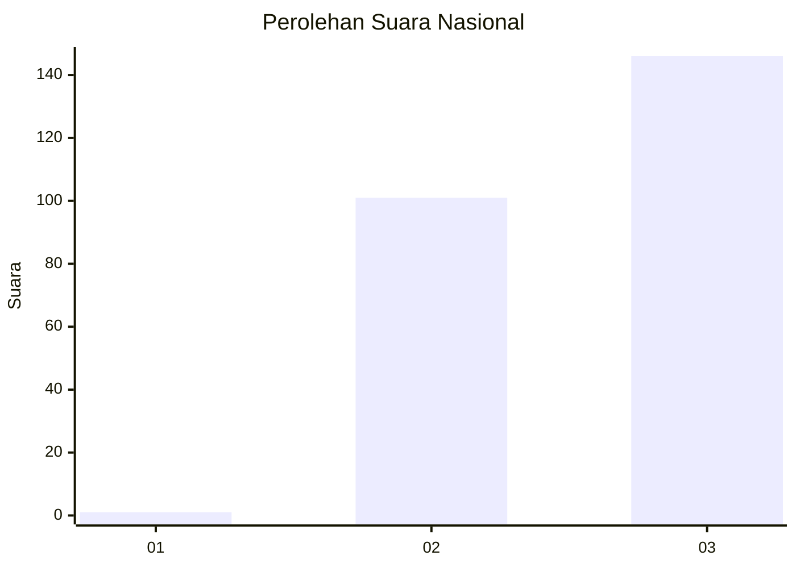
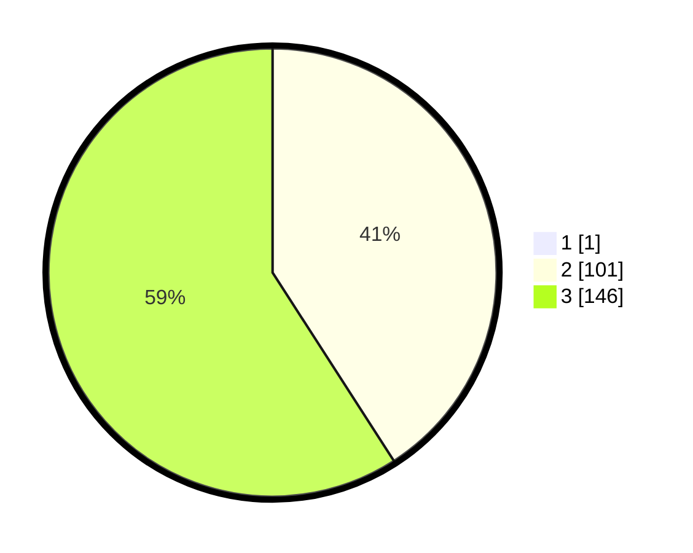

# Hasil

## Grafik

## Tabel

| No. | Nama Paslon    | Suara | Suara (raw) | Persentase |
|:--- |:-------------- | -----:| -----------:| ----------:|
| 1   | ANIES MUHAIMIN | 1     | [1][p-1]    | 0,40       |
| 2   | PRABOWO GIBRAN | 101   | [101][p-2]  | 40,73      |
| 3   | GANJAR MAHFUD  | 146   | [146][p-3]  | 58,87      |

[p-1]: https://github.com/gigit-pemilu/pemilu-2024/blob/main/pilpres/hitung-suara/sub/51-bali/sub/02-tabanan/sub/05-tabanan/sub/2010-tunjuk/sub/005-tps/sub/paslon-1.txt
[p-2]: https://github.com/gigit-pemilu/pemilu-2024/blob/main/pilpres/hitung-suara/sub/51-bali/sub/02-tabanan/sub/05-tabanan/sub/2010-tunjuk/sub/005-tps/sub/paslon-2.txt
[p-3]: https://github.com/gigit-pemilu/pemilu-2024/blob/main/pilpres/hitung-suara/sub/51-bali/sub/02-tabanan/sub/05-tabanan/sub/2010-tunjuk/sub/005-tps/sub/paslon-3.txt

## Foto C Plano

https://sirekap-obj-formc.kpu.go.id/f659/pemilu/ppwp/51/02/05/20/10/5102052010005-20240216-173527--d3480b0f-faaa-4b7f-9255-5d87aeec6f95.jpg

https://sirekap-obj-formc.kpu.go.id/f659/pemilu/ppwp/51/02/05/20/10/5102052010005-20240214-232042--11a4284e-bfb0-4d55-8468-99dcab217fea.jpg

https://sirekap-obj-formc.kpu.go.id/f659/pemilu/ppwp/51/02/05/20/10/5102052010005-20240214-232114--fc5fb703-cc50-436c-a2a4-7b5431a3fcdf.jpg

## Metadata

| Key        | Value               |
| ---------- | ------------------- |
| Time Stamp | 2024-02-16 21:01:00 |

## DATA PEMILIH TETAP

Jumlah pemilih dalam DPT: **278**.
 * L: **136**.
 * P: **142**.

## DATA PENGGUNA HAK PILIH

Jumlah pengguna hak pilih dalam DPT: **248**.
 * L: **121**.
 * P: **127**.

Jumlah pengguna hak pilih dalam DPTb: **2**.
 * L: **1**.
 * P: **1**.

Jumlah pengguna hak pilih dalam DPK: **1**.
 * L: **0**.
 * P: **1**.

Jumlah pengguna hak pilih: **251**.
 * L: **122**.
 * P: **129**.

## JUMLAH SUARA SAH DAN TIDAK SAH

JUMLAH SELURUH SUARA SAH: **248**.

JUMLAH SUARA TIDAK SAH: **3**.

JUMLAH SELURUH SUARA SAH DAN SUARA TIDAK SAH: **251**.

