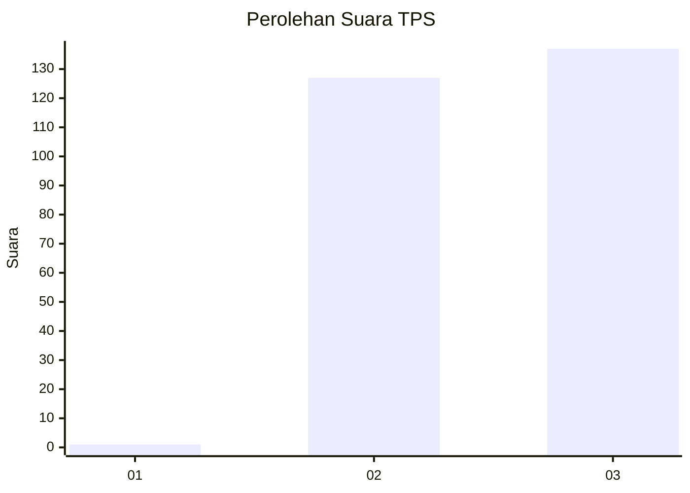
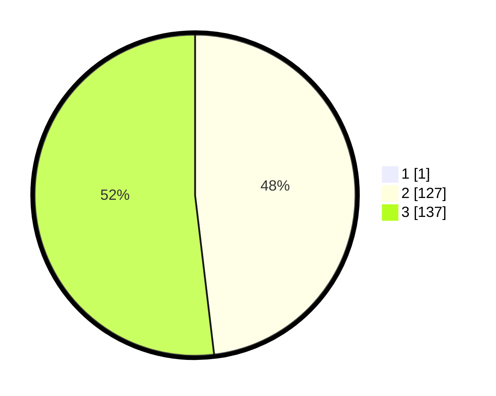

# Hasil

## Grafik

## Tabel

| No. | Nama Paslon    | Suara | Suara (raw) | Persentase |
|:--- |:-------------- | -----:| -----------:| ----------:|
| 1   | ANIES MUHAIMIN | 1     | [1][p-1]    | 0,38       |
| 2   | PRABOWO GIBRAN | 127   | [127][p-2]  | 47,92      |
| 3   | GANJAR MAHFUD  | 137   | [137][p-3]  | 51,70      |

[p-1]: https://github.com/gigit-pemilu/pemilu-2024-51-bali/blob/main/pilpres/hitung-suara/sub/51-bali/sub/02-tabanan/sub/05-tabanan/sub/2010-tunjuk/sub/006-tps/sub/paslon-1.txt
[p-2]: https://github.com/gigit-pemilu/pemilu-2024-51-bali/blob/main/pilpres/hitung-suara/sub/51-bali/sub/02-tabanan/sub/05-tabanan/sub/2010-tunjuk/sub/006-tps/sub/paslon-2.txt
[p-3]: https://github.com/gigit-pemilu/pemilu-2024-51-bali/blob/main/pilpres/hitung-suara/sub/51-bali/sub/02-tabanan/sub/05-tabanan/sub/2010-tunjuk/sub/006-tps/sub/paslon-3.txt

## Foto C Plano

https://sirekap-obj-formc.kpu.go.id/cdcf/pemilu/ppwp/51/02/05/20/10/5102052010006-20240216-015237--cb6d82a8-e904-46cb-8ff2-305b01062ee7.jpg

https://sirekap-obj-formc.kpu.go.id/cdcf/pemilu/ppwp/51/02/05/20/10/5102052010006-20240216-015248--f6f1d2ce-b41f-4e9e-beae-b528453e51a7.jpg

https://sirekap-obj-formc.kpu.go.id/cdcf/pemilu/ppwp/51/02/05/20/10/5102052010006-20240216-015244--4c6c9ae5-5ec1-4901-aa9a-cbeabc3d1ff2.jpg

## Metadata

| Key        | Value               |
| ---------- | ------------------- |
| Time Stamp | 2024-02-16 10:30:29 |

## DATA PEMILIH TETAP

Jumlah pemilih dalam DPT: **293**.
 * L: **143**.
 * P: **150**.

## DATA PENGGUNA HAK PILIH

Jumlah pengguna hak pilih dalam DPT: **267**.
 * L: **127**.
 * P: **140**.

Jumlah pengguna hak pilih dalam DPTb: **0**.
 * L: **0**.
 * P: **0**.

Jumlah pengguna hak pilih dalam DPK: **0**.
 * L: **0**.
 * P: **0**.

Jumlah pengguna hak pilih: **267**.
 * L: **127**.
 * P: **140**.

## JUMLAH SUARA SAH DAN TIDAK SAH

JUMLAH SELURUH SUARA SAH: **265**.

JUMLAH SUARA TIDAK SAH: **2**.

JUMLAH SELURUH SUARA SAH DAN SUARA TIDAK SAH: **267**.

