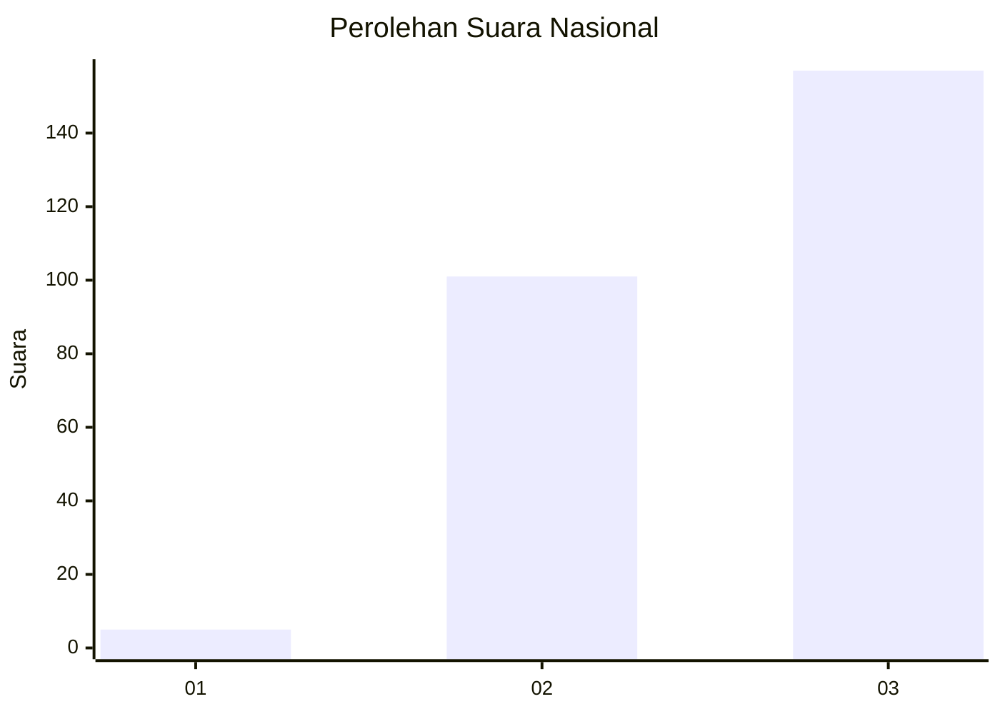
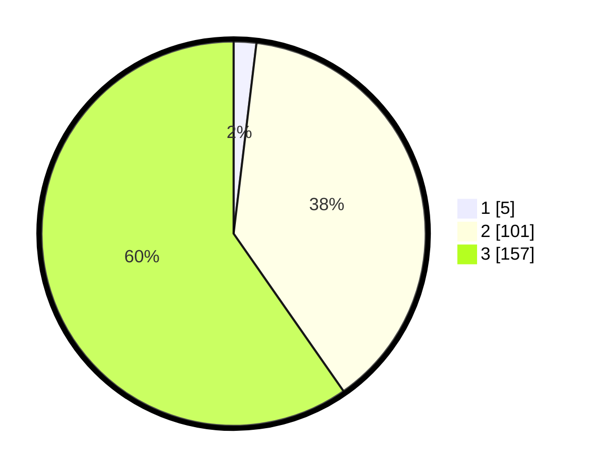

# Hasil

## Grafik

## Tabel

| No. | Nama Paslon    | Suara | Suara (raw) | Persentase |
|:--- |:-------------- | -----:| -----------:| ----------:|
| 1   | ANIES MUHAIMIN | 5     | [5][p-1]    | 1,90       |
| 2   | PRABOWO GIBRAN | 101   | [101][p-2]  | 38,40      |
| 3   | GANJAR MAHFUD  | 157   | [157][p-3]  | 59,70      |

[p-1]: https://github.com/gigit-pemilu/pemilu-2024/blob/main/pilpres/hitung-suara/sub/51-bali/sub/02-tabanan/sub/05-tabanan/sub/2010-tunjuk/sub/008-tps/sub/paslon-1.txt
[p-2]: https://github.com/gigit-pemilu/pemilu-2024/blob/main/pilpres/hitung-suara/sub/51-bali/sub/02-tabanan/sub/05-tabanan/sub/2010-tunjuk/sub/008-tps/sub/paslon-2.txt
[p-3]: https://github.com/gigit-pemilu/pemilu-2024/blob/main/pilpres/hitung-suara/sub/51-bali/sub/02-tabanan/sub/05-tabanan/sub/2010-tunjuk/sub/008-tps/sub/paslon-3.txt

## Foto C Plano

https://sirekap-obj-formc.kpu.go.id/2515/pemilu/ppwp/51/02/05/20/10/5102052010008-20240216-015614--cfe2bca1-1d20-485c-bbe9-2a677e9b81d6.jpg

https://sirekap-obj-formc.kpu.go.id/2515/pemilu/ppwp/51/02/05/20/10/5102052010008-20240216-015615--34f274d4-8955-4285-afc7-8b55c091250e.jpg

https://sirekap-obj-formc.kpu.go.id/2515/pemilu/ppwp/51/02/05/20/10/5102052010008-20240216-015615--7412d13a-f6d1-41a0-8629-609fb7bf83b1.jpg

## Metadata

| Key        | Value               |
| ---------- | ------------------- |
| Time Stamp | 2024-02-16 10:30:29 |

## DATA PEMILIH TETAP

Jumlah pemilih dalam DPT: **284**.
 * L: **141**.
 * P: **143**.

## DATA PENGGUNA HAK PILIH

Jumlah pengguna hak pilih dalam DPT: **263**.
 * L: **134**.
 * P: **129**.

Jumlah pengguna hak pilih dalam DPTb: **2**.
 * L: **0**.
 * P: **2**.

Jumlah pengguna hak pilih dalam DPK: **0**.
 * L: **0**.
 * P: **0**.

Jumlah pengguna hak pilih: **265**.
 * L: **134**.
 * P: **131**.

## JUMLAH SUARA SAH DAN TIDAK SAH

JUMLAH SELURUH SUARA SAH: **263**.

JUMLAH SUARA TIDAK SAH: **2**.

JUMLAH SELURUH SUARA SAH DAN SUARA TIDAK SAH: **265**.

