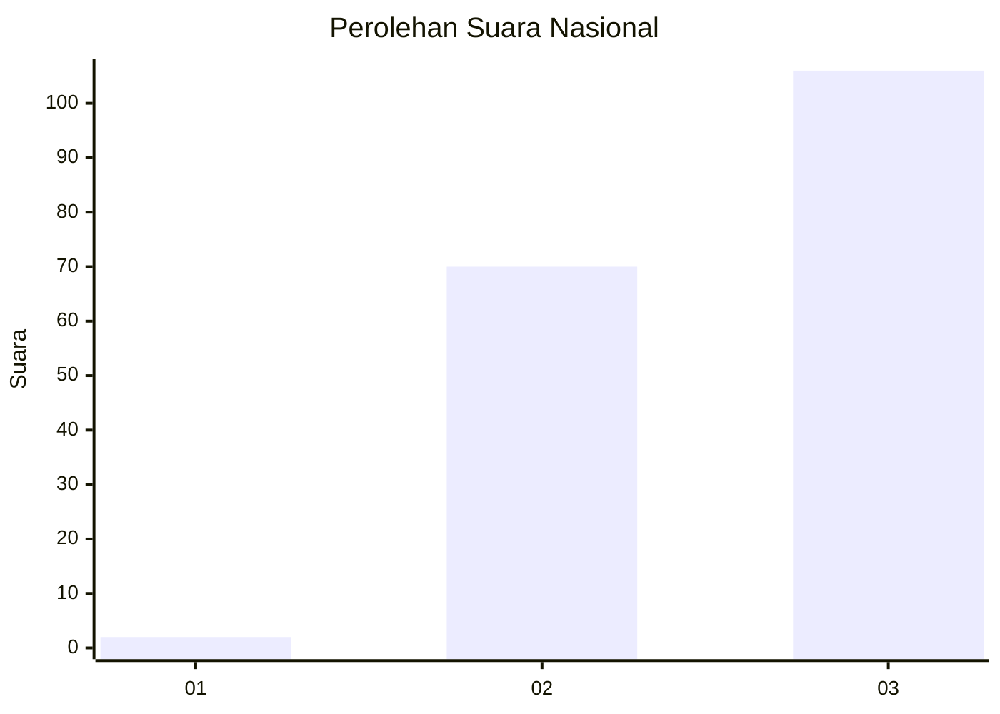
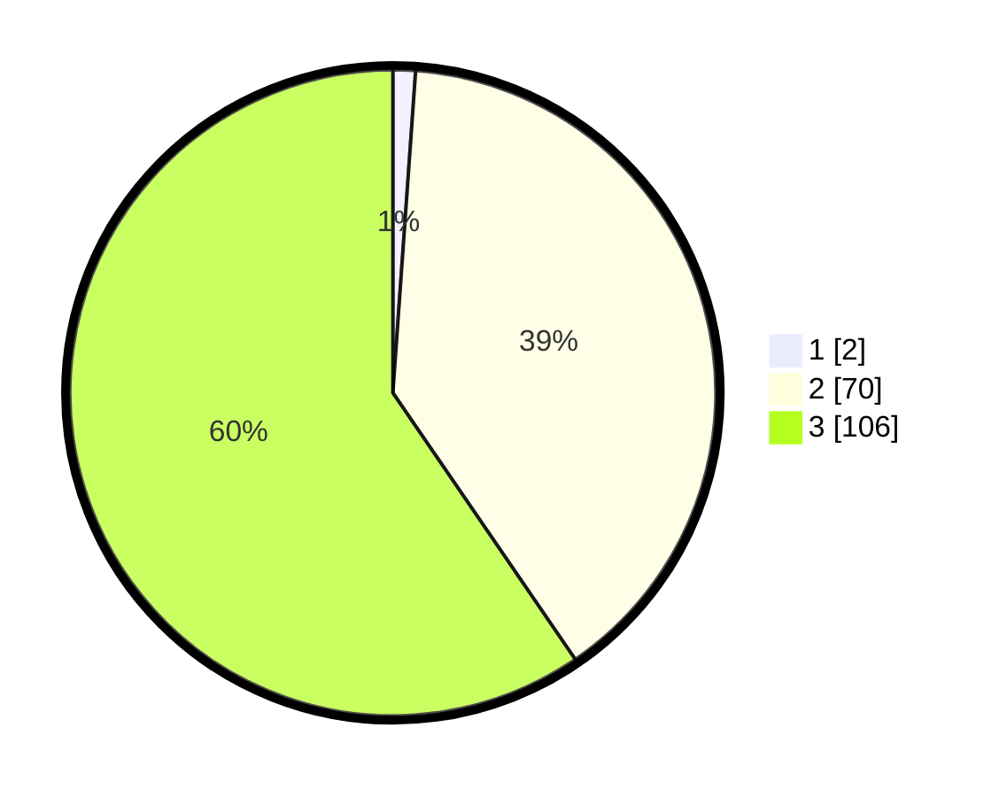

# Hasil

## Grafik

## Tabel

| No. | Nama Paslon    | Suara | Suara (raw) | Persentase |
|:--- |:-------------- | -----:| -----------:| ----------:|
| 1   | ANIES MUHAIMIN | 2     | [2][p-1]    | 1,12       |
| 2   | PRABOWO GIBRAN | 70    | [70][p-2]   | 39,33      |
| 3   | GANJAR MAHFUD  | 106   | [106][p-3]  | 59,55      |

[p-1]: https://github.com/gigit-pemilu/pemilu-2024/blob/main/pilpres/hitung-suara/sub/51-bali/sub/02-tabanan/sub/05-tabanan/sub/2010-tunjuk/sub/011-tps/sub/paslon-1.txt
[p-2]: https://github.com/gigit-pemilu/pemilu-2024/blob/main/pilpres/hitung-suara/sub/51-bali/sub/02-tabanan/sub/05-tabanan/sub/2010-tunjuk/sub/011-tps/sub/paslon-2.txt
[p-3]: https://github.com/gigit-pemilu/pemilu-2024/blob/main/pilpres/hitung-suara/sub/51-bali/sub/02-tabanan/sub/05-tabanan/sub/2010-tunjuk/sub/011-tps/sub/paslon-3.txt

## Foto C Plano

https://sirekap-obj-formc.kpu.go.id/58f3/pemilu/ppwp/51/02/05/20/10/5102052010011-20240214-202837--e39b5c51-367f-4a05-9295-9632c091e229.jpg

https://sirekap-obj-formc.kpu.go.id/58f3/pemilu/ppwp/51/02/05/20/10/5102052010011-20240214-190237--073f0eec-0e0e-46a8-ac6b-8e69bb9423bc.jpg

https://sirekap-obj-formc.kpu.go.id/58f3/pemilu/ppwp/51/02/05/20/10/5102052010011-20240214-190245--5d69d809-657e-4c72-aa1a-d4ec7e033924.jpg

## Metadata

| Key        | Value               |
| ---------- | ------------------- |
| Time Stamp | 2024-02-15 00:41:44 |

## DATA PEMILIH TETAP

Jumlah pemilih dalam DPT: **204**.
 * L: **102**.
 * P: **102**.

## DATA PENGGUNA HAK PILIH

Jumlah pengguna hak pilih dalam DPT: **182**.
 * L: **93**.
 * P: **89**.

Jumlah pengguna hak pilih dalam DPTb: **5**.
 * L: **2**.
 * P: **3**.

Jumlah pengguna hak pilih dalam DPK: **0**.
 * L: **0**.
 * P: **0**.

Jumlah pengguna hak pilih: **187**.
 * L: **95**.
 * P: **92**.

## JUMLAH SUARA SAH DAN TIDAK SAH

JUMLAH SELURUH SUARA SAH: **178**.

JUMLAH SUARA TIDAK SAH: **9**.

JUMLAH SELURUH SUARA SAH DAN SUARA TIDAK SAH: **187**.

