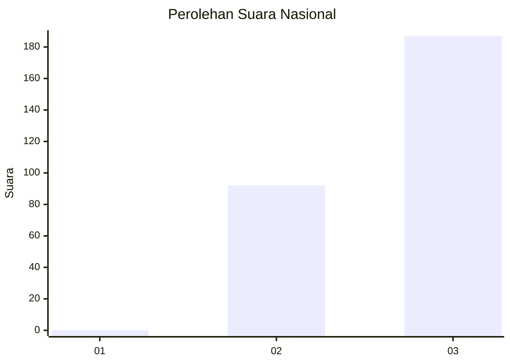
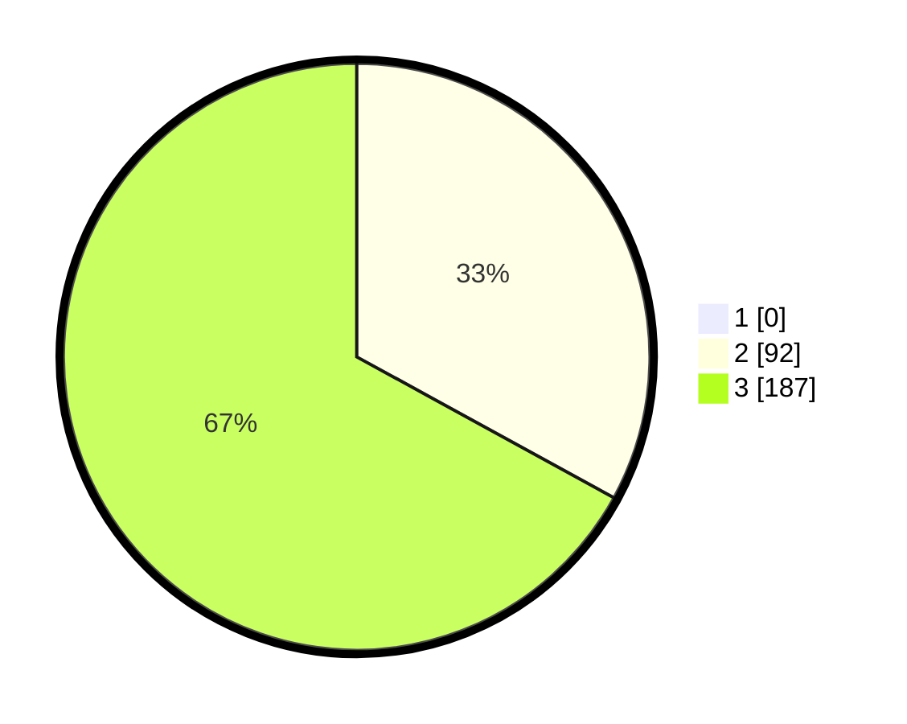

# Hasil

## Grafik

## Tabel

| No. | Nama Paslon    | Suara | Suara (raw) | Persentase |
|:--- |:-------------- | -----:| -----------:| ----------:|
| 1   | ANIES MUHAIMIN | 0     | [0][p-1]    | 0,00       |
| 2   | PRABOWO GIBRAN | 92    | [92][p-2]   | 32,97      |
| 3   | GANJAR MAHFUD  | 187   | [187][p-3]  | 67,03      |

[p-1]: https://github.com/gigit-pemilu/pemilu-2024/blob/main/pilpres/hitung-suara/sub/51-bali/sub/02-tabanan/sub/05-tabanan/sub/2010-tunjuk/sub/015-tps/sub/paslon-1.txt
[p-2]: https://github.com/gigit-pemilu/pemilu-2024/blob/main/pilpres/hitung-suara/sub/51-bali/sub/02-tabanan/sub/05-tabanan/sub/2010-tunjuk/sub/015-tps/sub/paslon-2.txt
[p-3]: https://github.com/gigit-pemilu/pemilu-2024/blob/main/pilpres/hitung-suara/sub/51-bali/sub/02-tabanan/sub/05-tabanan/sub/2010-tunjuk/sub/015-tps/sub/paslon-3.txt

## Foto C Plano

https://sirekap-obj-formc.kpu.go.id/8d5f/pemilu/ppwp/51/02/05/20/10/5102052010015-20240216-030154--c16cc700-7da7-46ec-937e-af8f7fd2c9ee.jpg

https://sirekap-obj-formc.kpu.go.id/8d5f/pemilu/ppwp/51/02/05/20/10/5102052010015-20240216-030158--16ad9475-cdc7-4e1e-ab11-bcd0498e3bff.jpg

https://sirekap-obj-formc.kpu.go.id/8d5f/pemilu/ppwp/51/02/05/20/10/5102052010015-20240216-030156--7825b345-0779-47a0-9a77-ef0a1fca650c.jpg

## Metadata

| Key        | Value               |
| ---------- | ------------------- |
| Time Stamp | 2024-02-16 10:30:29 |

## DATA PEMILIH TETAP

Jumlah pemilih dalam DPT: **298**.
 * L: **141**.
 * P: **157**.

## DATA PENGGUNA HAK PILIH

Jumlah pengguna hak pilih dalam DPT: **279**.
 * L: **133**.
 * P: **146**.

Jumlah pengguna hak pilih dalam DPTb: **2**.
 * L: **1**.
 * P: **1**.

Jumlah pengguna hak pilih dalam DPK: **0**.
 * L: **0**.
 * P: **0**.

Jumlah pengguna hak pilih: **281**.
 * L: **134**.
 * P: **147**.

## JUMLAH SUARA SAH DAN TIDAK SAH

JUMLAH SELURUH SUARA SAH: **279**.

JUMLAH SUARA TIDAK SAH: **2**.

JUMLAH SELURUH SUARA SAH DAN SUARA TIDAK SAH: **281**.

