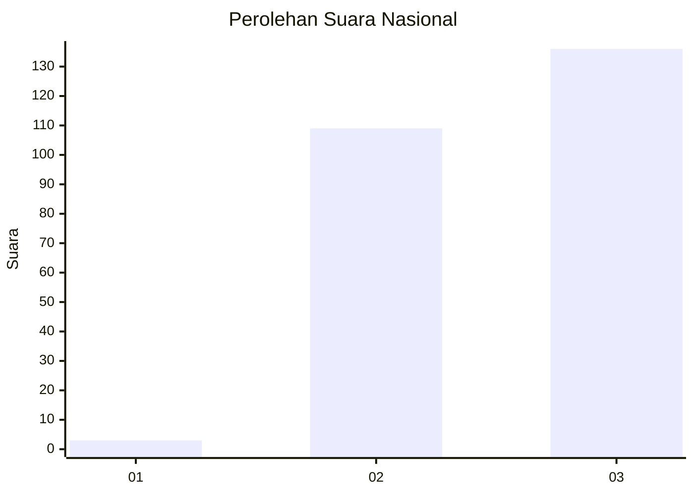
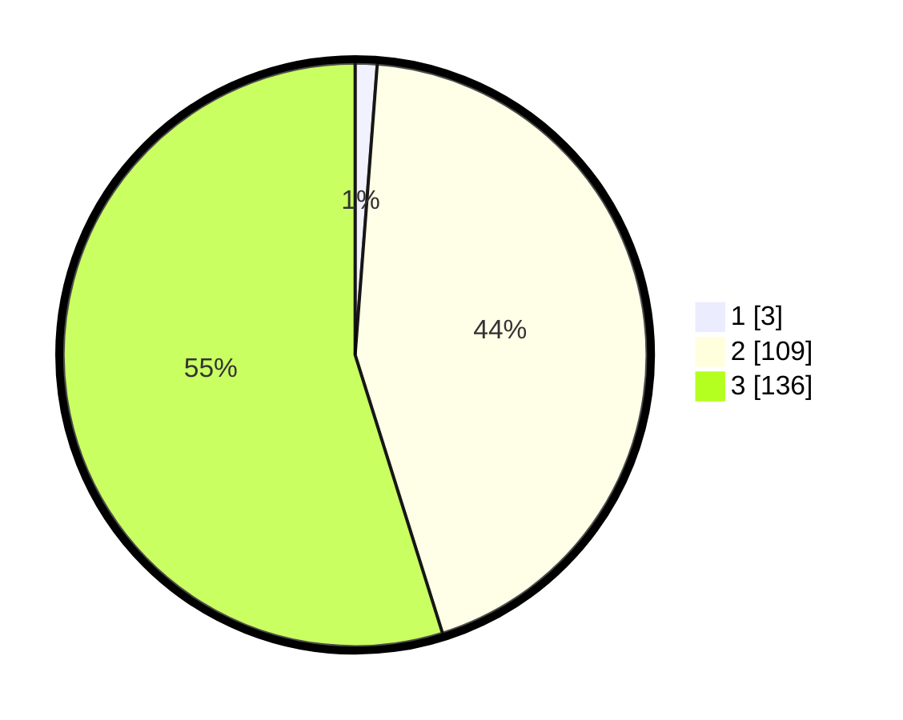

# Hasil

## Grafik

## Tabel

| No. | Nama Paslon    | Suara | Suara (raw) | Persentase |
|:--- |:-------------- | -----:| -----------:| ----------:|
| 1   | ANIES MUHAIMIN | 3     | [3][p-1]    | 1,21       |
| 2   | PRABOWO GIBRAN | 109   | [109][p-2]  | 43,95      |
| 3   | GANJAR MAHFUD  | 136   | [136][p-3]  | 54,84      |

[p-1]: https://github.com/gigit-pemilu/pemilu-2024/blob/main/pilpres/hitung-suara/sub/51-bali/sub/02-tabanan/sub/05-tabanan/sub/2011-buahan/sub/001-tps/sub/paslon-1.txt
[p-2]: https://github.com/gigit-pemilu/pemilu-2024/blob/main/pilpres/hitung-suara/sub/51-bali/sub/02-tabanan/sub/05-tabanan/sub/2011-buahan/sub/001-tps/sub/paslon-2.txt
[p-3]: https://github.com/gigit-pemilu/pemilu-2024/blob/main/pilpres/hitung-suara/sub/51-bali/sub/02-tabanan/sub/05-tabanan/sub/2011-buahan/sub/001-tps/sub/paslon-3.txt

## Foto C Plano

https://sirekap-obj-formc.kpu.go.id/1d61/pemilu/ppwp/51/02/05/20/11/5102052011001-20240216-194548--66023a33-a382-4a9f-a1db-5d9223245405.jpg

https://sirekap-obj-formc.kpu.go.id/1d61/pemilu/ppwp/51/02/05/20/11/5102052011001-20240216-194550--6463719b-9e7c-4c07-85a5-894885f166b7.jpg

https://sirekap-obj-formc.kpu.go.id/1d61/pemilu/ppwp/51/02/05/20/11/5102052011001-20240216-194549--8b9e2bb7-31d0-4902-bfda-ea3312b14231.jpg

## Metadata

| Key        | Value               |
| ---------- | ------------------- |
| Time Stamp | 2024-02-21 12:00:00 |

## DATA PEMILIH TETAP

Jumlah pemilih dalam DPT: **289**.
 * L: **144**.
 * P: **145**.

## DATA PENGGUNA HAK PILIH

Jumlah pengguna hak pilih dalam DPT: **250**.
 * L: **120**.
 * P: **130**.

Jumlah pengguna hak pilih dalam DPTb: **1**.
 * L: **0**.
 * P: **1**.

Jumlah pengguna hak pilih dalam DPK: **1**.
 * L: **1**.
 * P: **0**.

Jumlah pengguna hak pilih: **252**.
 * L: **121**.
 * P: **131**.

## JUMLAH SUARA SAH DAN TIDAK SAH

JUMLAH SELURUH SUARA SAH: **248**.

JUMLAH SUARA TIDAK SAH: **4**.

JUMLAH SELURUH SUARA SAH DAN SUARA TIDAK SAH: **252**.

