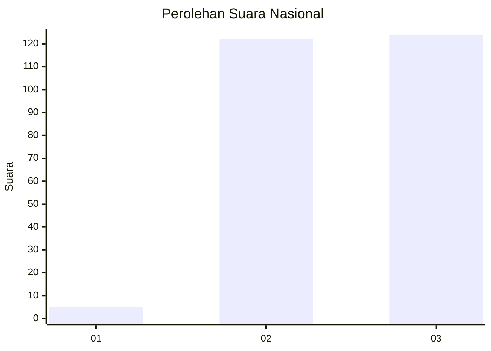
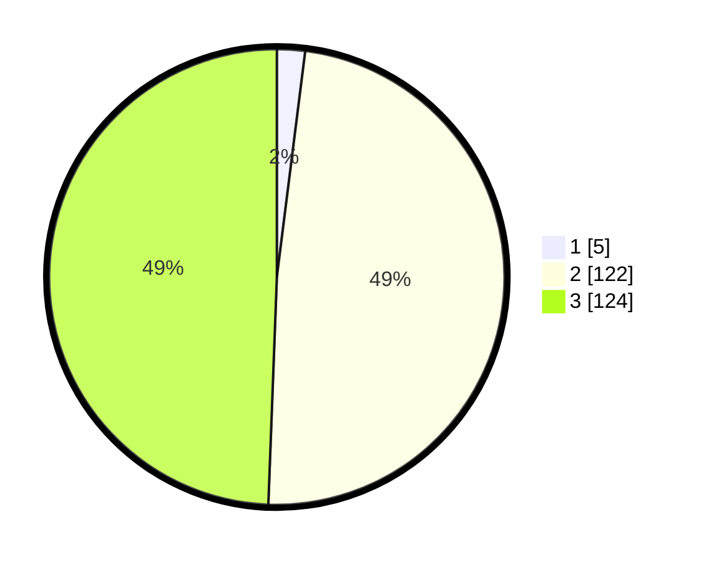

# Hasil

## Grafik

## Tabel

| No. | Nama Paslon    | Suara | Suara (raw) | Persentase |
|:--- |:-------------- | -----:| -----------:| ----------:|
| 1   | ANIES MUHAIMIN | 5     | [5][p-1]    | 1,99       |
| 2   | PRABOWO GIBRAN | 122   | [122][p-2]  | 48,61      |
| 3   | GANJAR MAHFUD  | 124   | [124][p-3]  | 49,40      |

[p-1]: https://github.com/gigit-pemilu/pemilu-2024/blob/main/pilpres/hitung-suara/sub/51-bali/sub/02-tabanan/sub/05-tabanan/sub/2011-buahan/sub/002-tps/sub/paslon-1.txt
[p-2]: https://github.com/gigit-pemilu/pemilu-2024/blob/main/pilpres/hitung-suara/sub/51-bali/sub/02-tabanan/sub/05-tabanan/sub/2011-buahan/sub/002-tps/sub/paslon-2.txt
[p-3]: https://github.com/gigit-pemilu/pemilu-2024/blob/main/pilpres/hitung-suara/sub/51-bali/sub/02-tabanan/sub/05-tabanan/sub/2011-buahan/sub/002-tps/sub/paslon-3.txt

## Foto C Plano

https://sirekap-obj-formc.kpu.go.id/b452/pemilu/ppwp/51/02/05/20/11/5102052011002-20240214-210635--3b0fd262-b762-4937-877b-a8c6d624b97e.jpg

https://sirekap-obj-formc.kpu.go.id/b452/pemilu/ppwp/51/02/05/20/11/5102052011002-20240214-210852--73c24ce7-b06c-4438-872f-33ead77e6c94.jpg

https://sirekap-obj-formc.kpu.go.id/b452/pemilu/ppwp/51/02/05/20/11/5102052011002-20240214-211122--aa81cbbe-3cd3-419b-bb0c-92ea76b0716d.jpg

## Metadata

| Key        | Value               |
| ---------- | ------------------- |
| Time Stamp | 2024-02-15 22:30:27 |

## DATA PEMILIH TETAP

Jumlah pemilih dalam DPT: **281**.
 * L: **143**.
 * P: **138**.

## DATA PENGGUNA HAK PILIH

Jumlah pengguna hak pilih dalam DPT: **252**.
 * L: **129**.
 * P: **123**.

Jumlah pengguna hak pilih dalam DPTb: **4**.
 * L: **4**.
 * P: **0**.

Jumlah pengguna hak pilih dalam DPK: **0**.
 * L: **0**.
 * P: **0**.

Jumlah pengguna hak pilih: **256**.
 * L: **133**.
 * P: **123**.

## JUMLAH SUARA SAH DAN TIDAK SAH

JUMLAH SELURUH SUARA SAH: **251**.

JUMLAH SUARA TIDAK SAH: **5**.

JUMLAH SELURUH SUARA SAH DAN SUARA TIDAK SAH: **256**.

