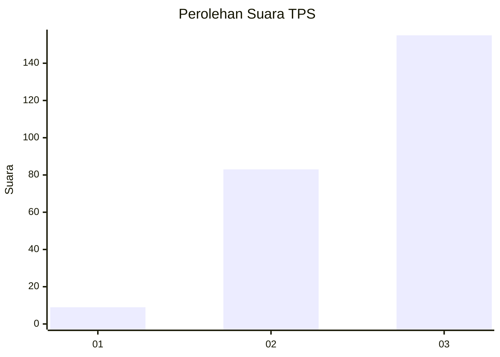
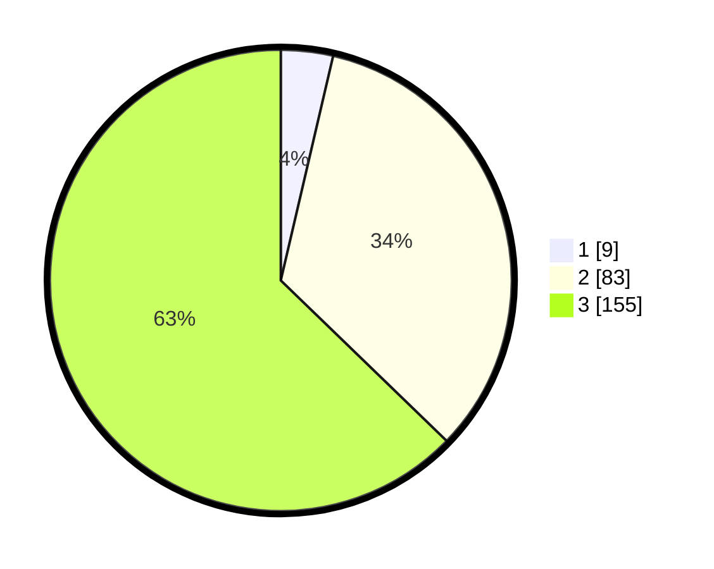

# Hasil

## Grafik

## Tabel

| No. | Nama Paslon    | Suara | Suara (raw) | Persentase |
|:--- |:-------------- | -----:| -----------:| ----------:|
| 1   | ANIES MUHAIMIN | 9     | [9][p-1]    | 3,64       |
| 2   | PRABOWO GIBRAN | 83    | [83][p-2]   | 33,60      |
| 3   | GANJAR MAHFUD  | 155   | [155][p-3]  | 62,75      |

[p-1]: https://github.com/gigit-pemilu/pemilu-2024-51-bali/blob/main/pilpres/hitung-suara/sub/51-bali/sub/02-tabanan/sub/05-tabanan/sub/2011-buahan/sub/004-tps/sub/paslon-1.txt
[p-2]: https://github.com/gigit-pemilu/pemilu-2024-51-bali/blob/main/pilpres/hitung-suara/sub/51-bali/sub/02-tabanan/sub/05-tabanan/sub/2011-buahan/sub/004-tps/sub/paslon-2.txt
[p-3]: https://github.com/gigit-pemilu/pemilu-2024-51-bali/blob/main/pilpres/hitung-suara/sub/51-bali/sub/02-tabanan/sub/05-tabanan/sub/2011-buahan/sub/004-tps/sub/paslon-3.txt

## Foto C Plano

https://sirekap-obj-formc.kpu.go.id/3cab/pemilu/ppwp/51/02/05/20/11/5102052011004-20240215-033828--de1552c3-f35e-40f7-9896-e91e6a9fdb8b.jpg

https://sirekap-obj-formc.kpu.go.id/3cab/pemilu/ppwp/51/02/05/20/11/5102052011004-20240215-034028--10027e85-ad6f-4a99-8ce6-95c1e433ac52.jpg

https://sirekap-obj-formc.kpu.go.id/3cab/pemilu/ppwp/51/02/05/20/11/5102052011004-20240215-034136--6dc6eb03-0b44-4305-a6aa-bd4d3ee04428.jpg

## Metadata

| Key        | Value               |
| ---------- | ------------------- |
| Time Stamp | 2024-02-15 22:30:27 |

